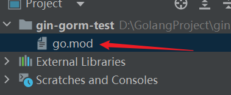

首先给出`Go`语言各环境各版本下载网站：https://go.dev/dl/，如果没挂梯子，也可以访问：https://golang.google.cn/dl/。

在`Windows`系统中，首先确认自己电脑的架构版本，例如系统是`x86-64`版本，则应选择`amd64`版本的安装包。在下载页面中，找到以`.msi`结尾的文件，并进行下载。这里我们选择`go 1.21.2`版本：


下载完成后，双击运行安装程序，按照提示依次点击“下一步”即可。过程中会提示设置`GOROOT`，该目录用于存放`Go`语言的安装文件，建议保持默认路径`C:\Program Files\Go`，无需修改。

安装完成后，使用`go version`命令查看是否安装成功：


由于我们要使用`GoModules`管理项目，有两个环境变量需要特别关注：

```bash
set GO111MODULE=off
set GOPROXY=https://goproxy.io,direct # 国外地址
```

需要将环境变量`GO111MODULE`的值设置为`on`。对于环境变量`GOPROXY`，由于`.io`网站位于国外，为了提高下载速度和稳定性，我们应将其配置为国内镜像网站，设置内容如下：

```sh
go env -w GO111MODULE=on
go env -w GOPROXY=https://goproxy.cn,direct # 国内镜像网站
```

> 注意：`Go 1.16`版本及以后，`GO111MODULE`的默认值已经是`on`。

我们这里再配置一个`GOBIN`环境变量（配置其值为`$GOPATH/bin`）：

```
go env -w GOBIN=C:\Users\userw\go\bin
```

至于`GOPATH`环境变量，我们可以不用改它的目录位置，它有一个默认的安装位置：`C:\Users\<用户名>\go`。

在使用`Goland`新建项目时，需要确保选择不依赖`GOPATH`的项目类型：


新建完成后，检查项目目录中是否存在`go.mod`文件。如果存在，则说明项目已经使用`GoModules`进行管理：

