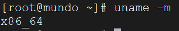
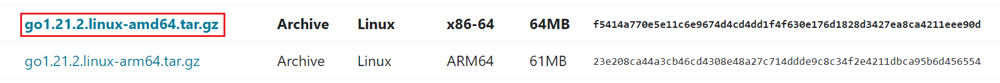
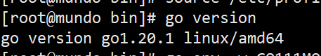

下载之前，我们使用`uname -m`查看一下当前`Linux`系统的架构类型：



在这里，`x86_64`表示`AMD64`架构，`aarch64`表示`ARM64`架构。我们以`AMD64`架构为例，继续执行以下步骤。

在`Linux`专门放置`tar.gz`压缩包的目录中，执行以下命令：

```sh
wget https://dl.google.com/go/go1.21.2.linux-amd64.tar.gz
```

如果这台`Linux`服务器无法连接外部网络，则需要先从`Go`官网下载对应的`tar.gz`安装包，并将其传输到目标安装目录：



下载完成后，将安装包解压到`/usr/local`目录下（官方推荐的位置）：

```shell
tar -C /usr/local -zxvf go1.21.2.linux-amd64.tar.gz
```

解压完成后，需要配置环境变量。将以下设置添加到`/etc/profile`文件的末尾：

```shell
export GOROOT=/usr/local/go
export PATH=$PATH:$GOROOT/bin
export GOBIN=/root/go/bin
```

添加完成后，使用下面命令重新加载配置文件：

```
source /etc/profile
```

安装完成后，使用`go version`命令查看是否安装成功：



同样，我们需要配置`go env`环境变量相关内容：

```shell
go env -w GO111MODULE=on
go env -w GOPROXY=https://goproxy.cn,direct
```

以`Linux`环境为例，彻底删除`Go`环境的步骤如下所示：

1. 删除`GOROOT`目录，在`Linux`和`Mac`环境下通常是`/usr/local/go`。
2. 删除相关环境变量配置。在`Linux`环境下，`GOROOT`和`GOPATH`的相关环境变量配置通常存储在`/etc/profile`文件中。而在`Mac`环境下，这些配置通常位于`~/.bash_profile`、`~/.zshrc`或`~/.bashrc`文件中的其中之一。
3. 删除`GOPATH`目录，在`Linux`环境下通常是`/home/<用户名>/go`（普通用户）或`/root/go`（`root`用户）。
4. 执行命令`where go`检查`Go`的残留文件或旧版本的二进制文件，对其进行删除。
5. 完成上述步骤后，运行`go version`命令以确认`Go`环境是否已成功卸载。

如果只是想升级`Go`版本，例如从`go 1.20`升级到`go 1.21`，无需手动删除旧版本的`Go`环境。只需解压新的`Go`安装包，新版本会自动覆盖旧版本（在`Windows`和`Mac`环境中可能需要手动确认）。升级完成后，使用`go version`检查`Go`版本是否已更换，再使用`go env`查看`GOROOT`、`GOPATH`和`Go Modules`相关的配置信息是否正确即可。

一般来说，只要`Go`语言的安装目录没有变化，安装后无需额外配置或修改。
