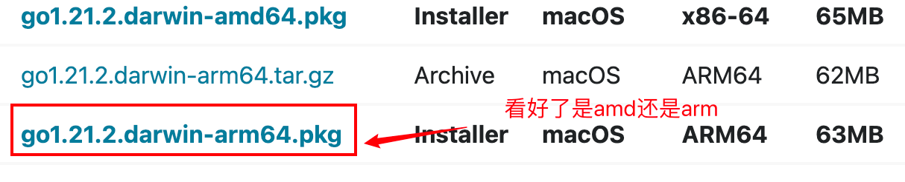
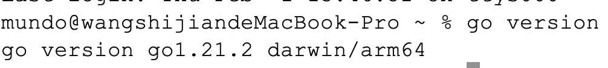

### 1. 官网下载`Go`环境（建议）

首先使用`uname -m`命令查看一下自己` MacBook `的架构：


我的`Mac`架构是`arm64`。在官网找到`arm64`版本，并以`.pkg`结尾的文件，点击下载：



下载完成后，双击运行安装程序，按照提示一路点击“下一步”即可。安装目录（`GOROOT`）建议使用默认值`/usr/local/go`。无需手动将`/usr/local/go/bin`添加到环境变量，系统会自动完成该配置。

`Go`的默认`GOPATH`目录为用户主目录下的`go`文件夹，即`~/go`，在我的`MacBook`中为`/Users/mundo/go`。

安装完成后，使用`go version`命令查看是否安装成功：



若在`zsh`终端中看到`zsh: command not found: go`，说明`GOROOT`的`bin`目录没有被自动添加到环境变量中。我们可以通过编辑`~/.zprofile`或`~/.zshrc`文件，手动添加以下两行命令：

```sh
export GOROOT=/usr/local/go
export PATH=$PATH:$GOROOT/bin
```

如果文件里没有`PATH`，我们在文件开头手动添加下面这一行：

```sh
export PATH=/usr/local/bin:/usr/bin:/bin:/usr/sbin:/sbin
```

安装成功后，还需配置`go env`的一些环境变量（这里修改了`GOPATH`的路径）：

```sh
go env -w GO111MODULE=on
go env -w GOPROXY=https://goproxy.cn,direct
go env -w GOPATH=/Users/mundo/Personal/go
go env -w GOBIN=/Users/mundo/Personal/go/bin
```

> 在公司内部进行项目开发时，可能会涉及访问公司的私有代码库，此时需要将`GOPROXY`修改为公司内部的代理地址。

这里最好也把`GOPATH`的`bin`路径手动放到`~/.zprofile`或`~/.zshrc`文件中：

```sh
export GOPATH=/Users/mundo/Personal/go
export PATH=$PATH:$GOPATH/bin
```

### 2. `Homebrew`下载`Go`环境

我们可以使用`homebrew`完成`go`环境的下载，使用以下命令：

```bash
brew install go@1.21.1
```

出现了这样一个问题：


` brew`对`go`的更新版本太旧，没有`1.21.1`这个版本。我们改用以下命令安装所需版本：

```bash
brew install go@1.20
```

下载完成后，再执行以下命令：

```bash
brew link go@1.20 --force
```

这条命令的作用是将指定版本的`Go`软件包链接到系统中，使其成为系统默认的`Go`版本。

该命令的逆命令如下所示：

```bash
brew unlink go@1.20
```

安装完成后，使用`go version`验证是否安装成功：


同样，我们需要设置`go env`的一些环境变量，命令如下：

```sh
go env -w GO111MODULE=on
go env -w GOPROXY=https://goproxy.cn,direct
go env -w GOPATH=/Users/mundo/Personal/go
go env -w GOBIN=/Users/mundo/Personal/go/bin
```


要使用`brew`卸载`go`环境，可以使用以下命令：

```sh
brew uninstall go
```
