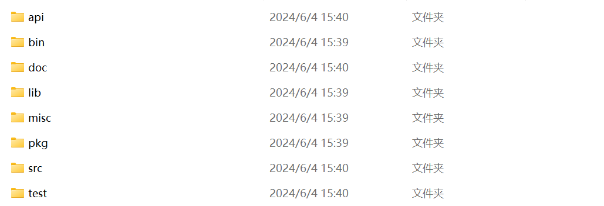
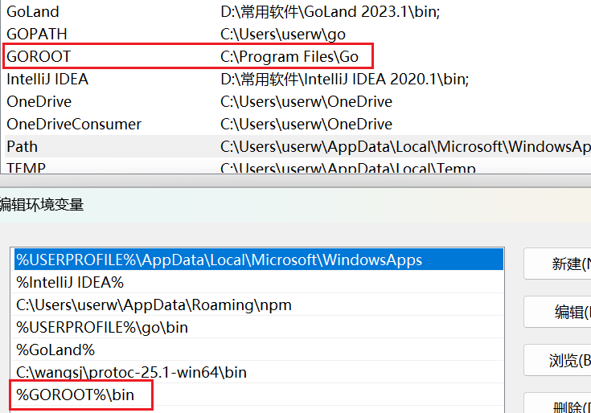
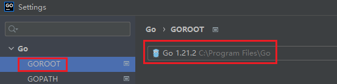

`GOROOT`是`Go`语言的安装目录，用于指定`Go`编译器、标准库、构建工具及其他必要文件的位置。

在`Windows`系统中，`GOROOT`的默认路径为`C:\Program Files\Go`，而在`Linux`和`macOS`系统中，默认路径为`/usr/local/go`。我们一般不会修改`GOROOT`的默认路径。在`GOROOT`目录下，包含多个重要的子目录：

- `bin`目录：包含编译后的可执行文件，这个目录需要被配置到环境变量`PATH`下面：

- `src`目录：存放`Go`语言标准库的源代码，如`fmt`、`http`、`time`等核心库。

- `api`目录：包含用于生成和维护`Go API`文档的工具和配置文件。

在编辑器（如`Goland`）中，可以通过以下步骤查看`GOROOT`的路径信息：

