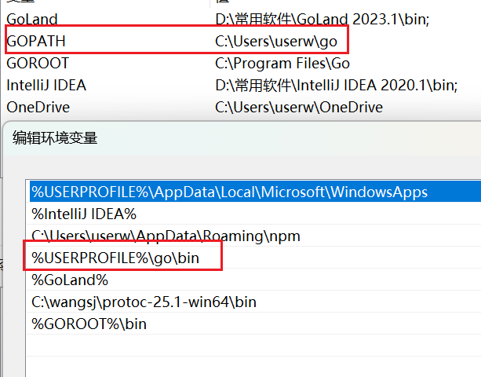
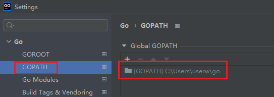
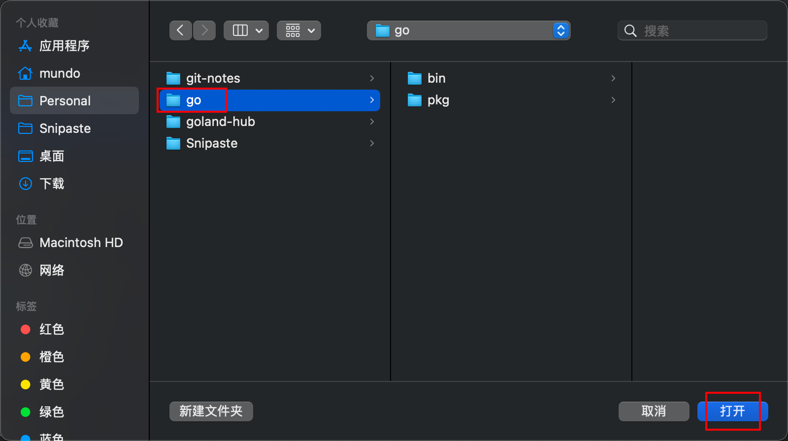
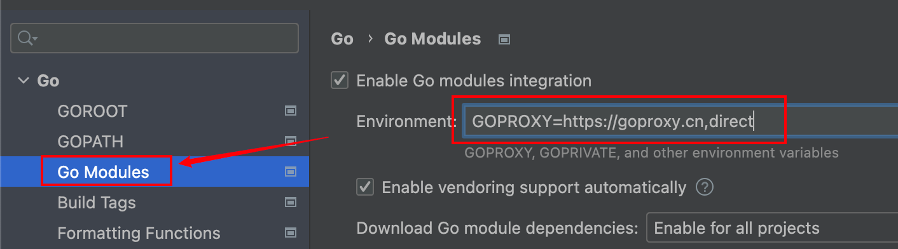

`GOPATH`是一个环境变量，用于指定工作空间的根目录。这个目录包含了`Go`项目的源代码、依赖包和可执行文件。

> **注意：**在`Go 1.11`版本开始使用`GoModules`管理依赖后，`Go`项目的源代码就不必需放在`GOPATH`下面了。

`GOPATH`下面的文件夹：

- `src`：用于存放项目源代码。有了`GoModules`后，这个文件夹不需要了（已废弃）。

- `pkg`：用于存放第三方依赖包。使用`go get`命令下载的第三方库，都保存在`pkg/mod`目录下。

- `bin`：用于存放可执行文件。使用`go install`命令下载的可执行文件，都保存在`bin`目录下。

同样，`GOPATH`的`bin`目录也需要配置到环境变量`Path`里，可以在环境变量列表进行检查：



从`Go 1.11`开始，`GOPATH`会被自动设置默认值，`Go`会根据操作系统设置默认路径：

- 在`Windows`系统中，默认路径是`C:\Users\<用户名>\go`。
- 在`Unix-like`系统（如`Linux`和`Mac`）中，默认路径是`~/go`，即`/Users/<用户名>/go`或`home/<用户名>/go`。
- 在`Unix-like`系统中，如果是`root`用户，则默认路径为`/root/go`。

在编辑器（如`Goland`）中，可以通过以下步骤查看`GOPATH`的路径信息：



如果需要手动设置`GOPATH`，我们点击加号，然后选中对应的`GOPATH`目录，点击打开即可：



同时也可以关注一下`GoModules`选项，看看`Environment`的设置：



我们可以在这里设置其为国内镜像网站：
```sh
GOPROXY=https://goproxy.cn,direct
```

在新建项目时，应该选择`Go`项，而不是`Go(GOPATH)`项：


后者基于传统的`GOPATH`工作区模式，项目必须放在`GOPATH/src`目录下，否则无法正确识别包。
