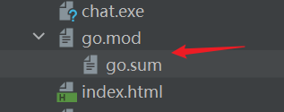
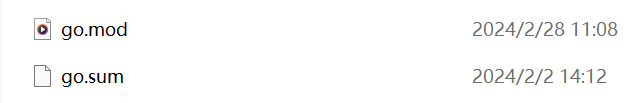
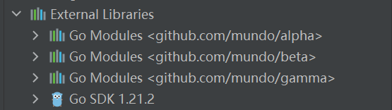
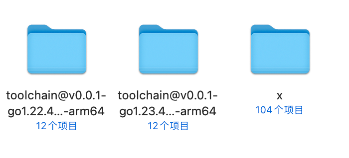
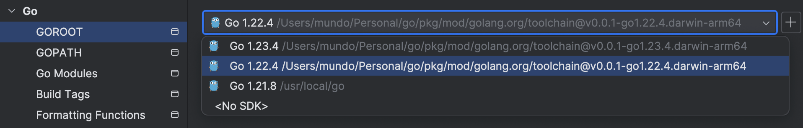

在使用`GoModules`管理项目时，我们会用到两个文件：`go.mod`和`go.sum`。这两个文件在项目目录中的结构通常如下：



在`Goland`中，`go.mod`和`go.sum`文件显示为上下级结构，但实际上在文件夹中，它们是扁平结构的：



### 一、`go.mod`文件详解

`go.mod`文件的内容如下所示（示例）：

```scss
module github.com/mundo-wang/wtool

go 1.21.0

toolchain go1.21.8

require (
	github.com/gin-gonic/gin v1.10.0
	github.com/google/go-querystring v1.1.0
	go.uber.org/zap v1.27.0
)
```

#### 1. `module`关键字

在`Go`中，有三种将指定目录交由`GoModules`管理的方式：

- 使用`Goland`创建项目，`module`的默认值通常会与项目根目录的名称一致，但也可以手动进行修改。
- 执行`go mod init <module-path>`命令，也可将项目目录交由`GoModules`管理，此时`module`的值将被设置为`<module-path>`。

- 在目录下手动创建一个`go.mod`文件，并在其中指定`module`和`go`的值，同样相当于将该目录纳入`GoModules`的管理。

如果你的项目需要托管到远程仓库供其他项目引入，应将`<module-path>`设置为代码托管平台的域名加上项目名。例如，我的`GitHub`用户名为`mundo-wang`，项目名为`wtool`，则`module`的值应设为：

```scss
module github.com/mundo-wang/wtool
```

这样，当项目推送至`GitHub`后，就可通过`https://github.com/mundo-wang/wtool`访问该项目的远程代码仓库，并可以在其他模块中使用`go get`命令引入该模块：

```sh
go get github.com/mundo-wang/wtool
```

例如，`Gin`框架的源码中，`go.mod`文件中`module`的值为`github.com/gin-gonic/gin`，因此可通过`https://github.com/gin-gonic/gin`访问其仓库，或使用以下命令引入`Gin`模块：

```sh
go get github.com/gin-gonic/gin
```

这是`Go`的强制要求。如果`<module-path>`的值与远程仓库地址不一致，执行`go get`时，`Go`会尝试从`<module-path>`指定的路径下载代码，但由于路径不匹配，下载将失败并导致报错。

`GoModules`遵循一套强制性的语义化版本规范：

- 当模块的`Git`版本为`v0`或`v1`时，`<module-path>`就是模块所在的远程仓库地址，例如：`github.com/<user>/<module>`。
- 当模块的`Git`版本为`v2`及以上时，`<module-path>`必须显式包含主版本号，例如：`github.com/<user>/<module>/v2`。

这是因为根据`SemVer`规范，主版本号的变更意味着可能存在破坏性更改。为了让开发者在依赖模块时能明确选择对应的主版本，`Go`通过要求在模块路径中显式指定版本号来避免潜在的不兼容问题。

因此，在使用`go get`命令引入该模块时，也必须带上完整的路径，例如：

```sh
go get github.com/mundo-wang/wtool/v2
```

在`Goland`中，使用`go mod init <module-path>`将目录交给`GoModules`管理后，`External Libraries`下会生成相应的目录，存放的就是项目所依赖的第三方包。如果项目包含多个`GoModules`模块，那么在`External Libraries`中也会有对应数量的目录：



可以使用`go list -m`命令查看指定目录由哪个`GoModules`管理，它会输出该目录对应的`<module-path>`。如果输出为`command-line-arguments`，则表示该目录未被`GoModules`管理。

#### 2. `go`关键字

在`go.mod`文件中，可以使用`go 1.xx.x`或`go 1.xx`两种格式指定`Go`版本。在`Go 1.20`之前，官方推荐使用次要版本号（`go 1.20`），而不是具体的补丁版本号（`go 1.20.8`）。使用`go mod init <module-path>`命令生成`go.mod`文件时，其中的`go`版本通常包含补丁版本号，建议手动去除补丁号，以保持简洁，并符合官方推荐。

`go`关键字在`go.mod`文件中用于指定项目所使用的`Go`版本。这一声明告知编译器和开发者，该模块基于指定版本的`Go`编写。`Go`工具链在执行构建或依赖管理操作时，会依据`go.mod`中的版本号进行相应处理。如果需要更改`Go`版本，只需修改`go.mod`中的版本号，并运行`go mod tidy`整理依赖。

在`Go 1.20`之前，`go.mod`中的`go`关键字仅用于声明建议使用的`Go`版本，而不会强制执行。例如，`go 1.20`表示推荐使用`Go 1.20`及以上版本进行编译，但仍可使用`Go 1.19`甚至`Go 1.15`进行构建。然而，这种向前兼容性并不完全可靠，编译结果无法保证一致。如果代码中使用了高版本`Go`的新特性，在低版本中可能会导致编译失败。

如果使用比`go.mod`声明的版本更高的`Go`版本，在团队协作中也可能遇到兼容性问题。例如，若本地环境使用了`Go 1.21`的特性，而`go.mod`指定的版本为`1.20`，那么团队中仍使用`Go 1.20`的开发者可能会遇到编译错误。此外，如果`go.mod`声明的`Go`版本为`1.20`，但通过`go get`获取的某些依赖项要求`Go 1.21`或更高版本，可能会导致依赖解析失败。

因此，在团队协作时，建议所有开发者统一`Go`版本，以避免兼容性问题。

#### 3. `toolchain`关键字

从`Go 1.21`开始，`go.mod`文件新增了`toolchain`关键字，用于指定模块编译时使用的`Go`工具链版本。

在上面的示例文件中，`go`行声明该模块的最小兼容`Go`版本为`1.21.0`，意味着其他模块依赖该模块时，至少需要`Go 1.21.0`或更高版本。`toolchain`行则指定本地编译时实际使用的工具链版本为`1.21.8`，即在该模块内进行编译或测试时，会采用`Go 1.21.8`的工具链。如果`go.mod`文件中没有`toolchain`行，则默认`toolchain`的`Go`版本与`go`行声明的版本相同。

如果本地`Go`版本低于`toolchain`指定的版本，`Go`会自动下载并使用指定版本的工具链。该工具链以目录形式存放，版本名称格式为`toolchain@v0.0.1-go<VERSION>.<GOOS>-<GOARCH>`，存储在`$GOPATH/pkg/mod/golang.org`路径下，如下所示：



当使用`go get`命令下载的模块所需的最低`Go`版本高于本地已安装的版本时，`Go`会自动下载并使用满足要求的新版本工具链来编译该模块。同时，它会更新`go.mod`文件中的`toolchain`字段，并将新工具链下载并保存到上述路径下。

下载完成后，`Goland`会自动将该工具链设置为项目的`GOROOT`，以确保可以使用正确的`Go`版本进行编译，如下所示：



在`Go 1.21`版本中新增了环境变量`GOTOOLCHAIN`，可以通过`go env GOTOOLCHAIN`查看其值，默认值为`auto`。当`GOTOOLCHAIN=auto`时，`Go`会自动决定使用哪个工具链。当`go.mod`文件中指定的工具链版本低于当前运行的`Go`命令版本时，使用运行的`Go`命令版本；如果`go.mod`文件中指定的版本高于当前运行的`Go`命令版本，则会自动下载并使用指定版本的工具链。

除了`auto`，`GOTOOLCHAIN`还可以设置为`local`，表示始终使用当前运行的`Go`命令自带的工具链，不允许自动下载或切换到其他版本的工具链。如果`go.mod`文件中指定的工具链版本高于当前运行的`Go`命令版本，则会报错。

#### 4. `require`关键字

在`go.mod`文件中，`require`指令用于声明当前`Go`项目所依赖的模块及其具体版本。它确保在构建时下载并使用指定版本的依赖，以保证项目的稳定性和一致性。例如，`require github.com/gin-gonic/gin v1.9.0`表示项目依赖于`gin`框架的`v1.9.0`版本。

在使用`go get`与`go mod tidy`命令时，`Go`都会自动对`require`部分的依赖进行管理。

#### 5. `replace`和`exclude`关键字

在`go.mod`文件中，`replace`（替代模块）和`exclude`（排除模块）是可选的，它们用于更精细地管理依赖版本。`replace`用于替换某个模块的来源或版本，常见于使用本地模块或强制指定特定版本。例如：

```go
replace github.com/gin-gonic/gin v1.9.0 => github.com/gin-gonic/gin v1.8.1
```

这表示在项目中强制使用`Gin`的`v1.8.1`版本，而不是`v1.9.0`。

`exclude`用于排除某个不需要的模块版本，防止其被`Go`解析和使用。例如：

```go
exclude golang.org/x/net v0.10.0
```

这样即使某些依赖间接需要`golang.org/x/net v0.10.0`，`Go`也不会下载该版本，而是选择其他兼容的版本。

### 二、`go.sum`文件详解

`go.sum`的文件内容如下所示（示例）：

```scss
github.com/bytedance/sonic v1.11.6 h1:oUp34TzMlL+OY1OUWxHqsdkgC/Zfc85zGqw9siXjrc0=
github.com/bytedance/sonic v1.11.6/go.mod h1:LysEHSvpvDySVdC2f87zGWf6CIKJcAvqab1ZaiQtds4=
github.com/bytedance/sonic/loader v0.1.1 h1:c+e5Pt1k/cy5wMveRDyk2X4B9hF4g7an8N3zCYjJFNM=
github.com/bytedance/sonic/loader v0.1.1/go.mod h1:ncP89zfokxS5LZrJxl5z0UJcsk4M4yY2JpfqGeCtNLU=
github.com/cloudwego/base64x v0.1.4 h1:jwCgWpFanWmN8xoIUHa2rtzmkd5J2plF/dnLS6Xd/0Y=
github.com/cloudwego/base64x v0.1.4/go.mod h1:0zlkT4Wn5C6NdauXdJRhSKRlJvmclQ1hhJgA0rcu/8w=
github.com/cloudwego/iasm v0.2.0 h1:1KNIy1I1H9hNNFEEH3DVnI4UujN+1zjpuk6gwHLTssg=
github.com/cloudwego/iasm v0.2.0/go.mod h1:8rXZaNYT2n95jn+zTI1sDr+IgcD2GVs0nlbbQPiEFhY=
github.com/davecgh/go-spew v1.1.0/go.mod h1:J7Y8YcW2NihsgmVo/mv3lAwl/skON4iLHjSsI+c5H38=
github.com/davecgh/go-spew v1.1.1 h1:vj9j/u1bqnvCEfJOwUhtlOARqs3+rkHYY13jYWTU97c=
github.com/davecgh/go-spew v1.1.1/go.mod h1:J7Y8YcW2NihsgmVo/mv3lAwl/skON4iLHjSsI+c5H38=
github.com/gabriel-vasile/mimetype v1.4.3 h1:in2uUcidCuFcDKtdcBxlR0rJ1+fsokWf+uqxgUFjbI0=
github.com/gabriel-vasile/mimetype v1.4.3/go.mod h1:d8uq/6HKRL6CGdk+aubisF/M5GcPfT7nKyLpA0lbSSk=
github.com/gin-contrib/sse v0.1.0 h1:Y/yl/+YNO8GZSjAhjMsSuLt29uWRFHdHYUb5lYOV9qE=
github.com/gin-contrib/sse v0.1.0/go.mod h1:RHrZQHXnP2xjPF+u1gW/2HnVO7nvIa9PG3Gm+fLHvGI=
github.com/gin-gonic/gin v1.10.0 h1:nTuyha1TYqgedzytsKYqna+DfLos46nTv2ygFy86HFU=
github.com/gin-gonic/gin v1.10.0/go.mod h1:4PMNQiOhvDRa013RKVbsiNwoyezlm2rm0uX/T7kzp5Y=
github.com/go-playground/assert/v2 v2.2.0 h1:JvknZsQTYeFEAhQwI4qEt9cyV5ONwRHC+lYKSsYSR8s=
github.com/go-playground/assert/v2 v2.2.0/go.mod h1:VDjEfimB/XKnb+ZQfWdccd7VUvScMdVu0Titje2rxJ4=
github.com/go-playground/locales v0.14.1 h1:EWaQ/wswjilfKLTECiXz7Rh+3BjFhfDFKv/oXslEjJA=
```

这个文件记录了项目依赖模块的版本和校验信息，其目的是确保在不同环境下构建项目时使用相同的依赖版本，并提供额外的安全层以防止依赖项被恶意篡改或非法修改。它的格式通常为：`module-path version h1:sum`，即“路径+版本号+校验和”。

`go.sum`文件无需手动修改，`Go`工具链会自动维护和更新它。通常在执行`go get`或`go mod tidy`时，`go.sum`文件会被自动更新。

### 三、注意事项

如果我们不想让某个目录被`GoModules`管理了，只需要删除掉它的`go.mod`与`go.sum`文件即可。

我们在`clone`一个新项目前，最好先确认本地`Go`版本与该项目`go.mod`文件中定义的版本一致。如果项目不涉及协同开发，建议在`clone`后删除项目的`go.mod`和`go.sum`文件，并使用`go mod init <module-path>`重新初始化项目以启用`GoModules`管理，然后运行`go mod tidy`整理依赖，这样做可以避免因`Go`版本不一致而引发的潜在问题。