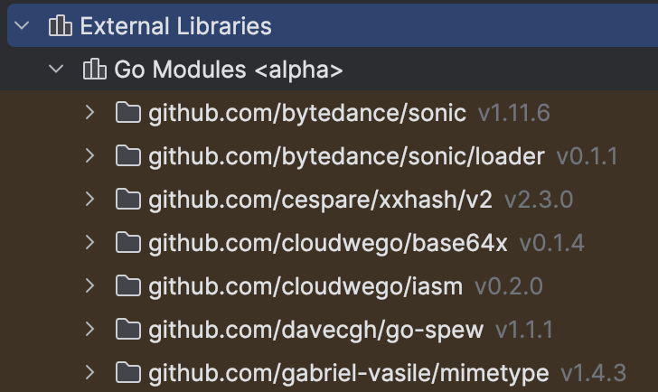

`go get`和`go install`是`GoModules`的两个工具链命令，用于下载第三方库，或者可执行文件。

### 1. `go get`命令

在`GoModules`引入后，`go get`命令一方面用于下载或更新第三方`Go`代码包，并将其存放在`$GOPATH/pkg/mod`目录下；另一方面，它会将这些依赖添加到当前`GoModules`项目的`go.mod`文件中，并在`Goland`中显示为外部依赖库，如下所示：



`go get`命令的下载规则如下：

- 如果`$GOPATH/pkg/mod`目录下不存在所需依赖，`go get`会将该依赖下载至`$GOPATH/pkg/mod`目录下，并导入到项目中。
- 如果该依赖库已存在于`$GOPATH/pkg/mod`目录中，`go get`会直接将本地的库导入到项目中，而不会重新下载。

使用`go get`命令时，`Go`工具会根据其他依赖的版本约束自动解析并选择最合适的版本。通常，`go get`会优先选择符合语义化版本控制（`SemVer`）规则的最新可用版本，同时确保不会破坏现有依赖的兼容性。

`go get`命令的`-u`参数用于将已安装的依赖库更新到最新版本，如下所示：

```
go get -u github.com/mundo-wang/wtool
```

使用`-u`参数后，即使该依赖库已经存在于`$GOPATH/pkg/mod`目录中，`go get`仍会下载该依赖的最新版本，并更新`go.mod`文件中的版本信息，以确保项目使用的是该库的最新版。

> **注意：** 使用`go get -u`命令时需谨慎，`-u`参数不仅会更新指定的依赖库，还会更新该库的直接依赖，即它所依赖的其他库也会被更新到最新版本。因此，在使用该命令时需要避免更新导致的版本冲突，或与本地`Go`环境不兼容问题。

在实际开发中，如果只想更新某个库而不影响其他依赖，可以使用`@latest`语法，如下所示：

```sh
go get github.com/mundo-wang/wtool@latest
```

该命令相比于`go get -u`命令，只会更新指定的库，不会更新该库的直接依赖，这样可以避免由于更新依赖引发的潜在问题。

无论是`go get -u`还是`go get ...@latest`，都会将模块更新至最新的发布版本（即带`Git`标签的`SemVer`版本，如`v1.1.0`、`v1.2.3`等）。此外，我们还可以通过指定特定版本号进行更新，例如：

```sh
go get github.com/mundo-wang/wtool@v1.0.6
```

如果模块没有任何已发布的版本，那么`go get -u`和`go get ...@latest`命令都会更新到该模块`Git`仓库默认分支（通常是`main`或`master`）的最新提交，并使用伪版本（`pseudo-version`）表示，其格式如下：

```sh
vX.Y.Z-yyyymmddhhmmss-<commit-hash>
```

- `X.Y.Z`：如果没有版本标签，是`v0.0.0`，如果有标签，是最近的`SemVer`版本号。
- `yyyymmddhhmmss`：表示该提交的时间戳（`UTC`时间）。
- `<commit-hash>`：`Git`提交的前`12`位`SHA-1`哈希值。

我们可以直接指定分支名称来获取该分支的最新提交，例如拉取`master`分支的最新提交：

```
go get github.com/mundo-wang/wtool@master
```

我们也可以使用具体的`commit-hash`来强制拉取目标提交：

```sh
go get github.com/mundo-wang/wtool@commit-hash
```

### 2. `go install`命令

`go install`用于编译并安装`Go`代码包，并将生成的可执行文件（二进制文件）存储到`$GOPATH/bin`目录下。该命令还可能将一些`Go`依赖包下载到`$GOPATH/pkg/mod`目录。在使用`go install`时，应该在包名后附加`@version`，如果不确定安装的版本，可以使用`@latest`指定最新版本。例如下面命令：

```bash
go install github.com/micro/micro/v2@latest
```

### 3. 联系与区别

二者都用于从远程仓库（如`GitHub`）下载包。`go get`专注于获取和更新包及其依赖，并更新`go.mod`文件。`go install`则专注于编译和安装可执行文件，而不会更新`go.mod`文件。
