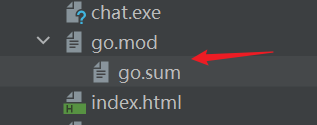
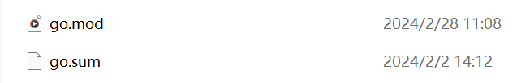

在使用`GoModules`管理项目时，我们会用到两个文件：`go.mod`和`go.sum`。这两个文件在项目目录中的结构通常如下：



在`Goland`中，`go.mod`和`go.sum`文件显示为上下级结构，但实际上在文件夹中，它们是扁平结构的：



### 一、`go.mod`文件详解

`go.mod`文件的内容如下所示（示例）：

```scss
module ginchat

go 1.20

require (
	github.com/aliyun/aliyun-oss-go-sdk v2.2.4+incompatible
	github.com/asaskevich/govalidator v0.0.0-20210307081110-f21760c49a8d
	github.com/gin-gonic/gin v1.7.7
	github.com/go-redis/redis/v8 v8.11.5
	github.com/gorilla/websocket v1.5.0
	github.com/spf13/viper v1.11.0
	github.com/swaggo/files v0.0.0-20210815190702-a29dd2bc99b2
	github.com/swaggo/gin-swagger v1.4.3
	github.com/swaggo/swag v1.8.2
	gopkg.in/fatih/set.v0 v0.2.1
	gorm.io/driver/mysql v1.3.3
	gorm.io/driver/postgres v1.5.4
	gorm.io/gorm v1.25.5
)
```

#### 1. `module`关键字

如果使用`Goland`创建项目，`module`的默认值通常与项目根目录名一致，但可以手动修改。如果使用`go mod init <module-path>`将项目目录交给`GoModules`管理，`module`的值会是`<module-path>`。

通常建议将`<module-path>`的值设置为代码托管平台的域名路径加上项目名，以确保唯一性。例如，若个人域名为`github.com/mundo-wang`，项目名为`wtool`，则`module`的值可以设置为`github.com/mundo-wang/wtool`。

这样，当项目推送到远程仓库（如`GitHub`）时，便可以通过`https://github.com/mundo-wang/wtool`访问该项目。例如`Gin`框架的`go.mod`文件中`module`的值为`github.com/gin-gonic/gin`，即可通过`https://github.com/gin-gonic/gin`访问其代码仓库。

在`Goland`中，使用`go mod init <module-path>`将目录交给`GoModules`管理后，`External Libraries`下会生成相应的目录，存放的就是项目所依赖的第三方包。如果项目包含多个`GoModules`模块，那么在`External Libraries`中也会有对应数量的目录：


可以使用`go list -m`命令查看指定目录由哪个`GoModules`管理，它会输出该目录对应的`<module-path>`。如果输出为`command-line-arguments`，则表示该目录未被`GoModules`管理。

#### 2. `go`关键字

`go 1.20`在`go.mod`文件中指定了项目所使用的`Go`语言版本。这一声明的作用是告知编译器和其他开发者，该模块是使用指定版本的`Go`语言编写的，从而确保编译和构建过程中使用相应的语言特性和语法规则。

如果需要更改`go.mod`文件中指定的`Go`语言版本，只需修改其版本号并保存即可。在进行构建或依赖管理操作时，`Go`工具链会依据`go.mod`文件中的版本进行相应的操作。

#### 3. `require`关键字

`require`代码块列举了项目所依赖的模块以及它们的版本，确保在构建时下载和使用这些版本。

#### 4. 其余内容

除了上面这些，`go.mod`文件还有`replace`（替代模块）、`exclude`（排除模块）等，它们是可选的。

### 二、`go.sum`文件详解

`go.sum`的文件内容如下所示（示例）：

```scss
github.com/BurntSushi/toml v0.3.1/go.mod h1:xHWCNGjB5oqiDr8zfno3MHue2Ht5sIBksp03qcyfWMU=
github.com/BurntSushi/xgb v0.0.0-20160522181843-27f122750802/go.mod h1:IVnqGOEym/WlBOVXweHU+Q+/VP0lqqI8lqeDx9IjBqo=
github.com/KyleBanks/depth v1.2.1 h1:5h8fQADFrWtarTdtDudMmGsC7GPbOAu6RVB3ffsVFHc=
github.com/KyleBanks/depth v1.2.1/go.mod h1:jzSb9d0L43HxTQfT+oSA1EEp2q+ne2uh6XgeJcm8brE=
github.com/PuerkitoBio/purell v1.1.1/go.mod h1:c11w/QuzBsJSee3cPx9rAFu61PvFxuPbtSwDGJws/X0=
github.com/PuerkitoBio/urlesc v0.0.0-20170810143723-de5bf2ad4578/go.mod h1:uGdkoq3SwY9Y+13GIhn11/XLaGBb4BfwItxLd5jeuXE=
github.com/agiledragon/gomonkey/v2 v2.3.1/go.mod h1:ap1AmDzcVOAz1YpeJ3TCzIgstoaWLA6jbbgxfB4w2iY=
github.com/aliyun/aliyun-oss-go-sdk v2.2.4+incompatible h1:cD1bK/FmYTpL+r5i9lQ9EU6ScAjA173EVsii7gAc6SQ=
github.com/aliyun/aliyun-oss-go-sdk v2.2.4+incompatible/go.mod h1:T/Aws4fEfogEE9v+HPhhw+CntffsBHJ8nXQCwKr0/g8=
github.com/asaskevich/govalidator v0.0.0-20210307081110-f21760c49a8d h1:Byv0BzEl3/e6D5CLfI0j/7hiIEtvGVFPCZ7Ei2oq8iQ=
github.com/asaskevich/govalidator v0.0.0-20210307081110-f21760c49a8d/go.mod h1:WaHUgvxTVq04UNunO+XhnAqY/wQc+bxr74GqbsZ/Jqw=
github.com/baiyubin/aliyun-sts-go-sdk v0.0.0-20180326062324-cfa1a18b161f h1:ZNv7On9kyUzm7fvRZumSyy/IUiSC7AzL0I1jKKtwooA=
github.com/baiyubin/aliyun-sts-go-sdk v0.0.0-20180326062324-cfa1a18b161f/go.mod h1:AuiFmCCPBSrqvVMvuqFuk0qogytodnVFVSN5CeJB8Gc=
github.com/census-instrumentation/opencensus-proto v0.2.1/go.mod h1:f6KPmirojxKA12rnyqOA5BBL4O983OfeGPqjHWSTneU=
github.com/cespare/xxhash/v2 v2.1.2 h1:YRXhKfTDauu4ajMg1TPgFO5jnlC2HCbmLXMcTG5cbYE=
github.com/cespare/xxhash/v2 v2.1.2/go.mod h1:VGX0DQ3Q6kWi7AoAeZDth3/j3BFtOZR5XLFGgcrjCOs=
github.com/chzyer/logex v1.1.10/go.mod h1:+Ywpsq7O8HXn0nuIou7OrIPyXbp3wmkHB+jjWRnGsAI=
```

这个文件记录了项目依赖模块的版本和校验信息，其目的是确保在不同环境下构建项目时使用相同的依赖版本，并提供额外的安全层以防止依赖项被恶意篡改或非法修改。它的格式通常为：`module-path version sum`，即“路径+版本号+校验和”。

`go.sum`文件无需手动修改，`Go`工具链会自动维护和更新它。通常在执行`go get`或`go mod tidy`时，`go.sum`文件会被自动更新。

如果我们不想让某个目录被`GoModules`管理了，只需要删除掉它的`go.mod`与`go.sum`文件即可。