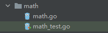
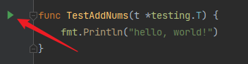
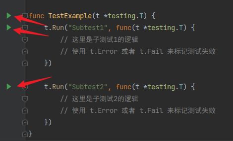

在`Go`语言中，测试函数的编写简洁直观。与`Java`不同，`Go`的测试文件通常与被测试文件位于同一目录，且文件名必须以`_test.go`结尾。这是一个硬性要求，未遵循此命名规则的文件不会被`Go`编译器识别为测试文件，因此测试函数将无法运行。

如果被测试文件名为`math.go`，则对应的测试文件应命名为`math_test.go`。这种命名方式方便开发者快速定位测试文件与其对应的源文件。值得一提的是，在`GoLand`中，测试文件通常以浅绿色背景显示，进一步便于区分：



编写`Go`语言的测试函数时，需要遵循以下规则：

1. 测试函数名必须以`Test`开头，并遵循驼峰命名法，否则`Go`编译器不会识别该函数为测试函数，无法执行。
2. 测试函数有且仅有一个参数，即`t *testing.T`，这是`Go`语言内置的测试参数。
3. 测试函数的命名应与被测试函数的名称保持一致。例如被测试函数名为`AddNums`，则对应的测试函数应命名为`TestAddNums`。
4. 对于测试方法，命名规则类似。如果结构体名为`Users`，且方法名为`Query`，则测试函数应命名为`TestUsers_Query`。

例如下面这个被测试文件：

```go
func AddNums() {

}

type Users struct {

}

func (u *Users) Query() {

}
```

它对应的测试文件代码如下：
```go
import (
	"fmt"
	"testing"
)

func TestAddNums(t *testing.T) {
	
}

func TestUsers_Query(t *testing.T) {

}
```

点击测试函数左侧的绿色小箭头，就可以运行这个测试函数了：



接下来介绍`t *testing.T`对象。`*testing.T`是一个指向测试状态对象的指针，包含测试的状态和功能，可用于报告测试失败、记录日志等操作。以下是几个常用的方法：

#### 1. `Run`方法：

在一个测试函数中，可以使用`Run`方法运行多个子测试以覆盖不同的测试场景。子测试失败时不会影响其他子测试的执行，且每个子测试都会单独报告其结果。它的方法签名如下：

```go
func (t *T) Run(name string, f func(t *T)) bool
```

下面是其使用示例：

```go
import (
    "testing"
)

func TestExample(t *testing.T) {
    t.Run("Subtest1", func(t *testing.T) {
        // 这里是子测试1的逻辑
        // 使用 t.Error 或者 t.Fail 来标记测试失败
    })

    t.Run("Subtest2", func(t *testing.T) {
        // 这里是子测试2的逻辑
        // 使用 t.Error 或者 t.Fail 来标记测试失败
    })
}
```

这里我们看到，每个子测试左侧都有一个绿色小按钮，我们可以单独运行一个子测试，也可以运行整个测试。



#### 2. `Error`和`Errorf`方法

用于报告测试失败。使用示例如下：

```go
t.Error("测试失败")
t.Errorf("测试失败：%s", err)
```

#### 3. `Log`和`Logf`方法

用于记录日志信息。使用示例如下：

```go
t.Log("这是一个日志信息")
t.Logf("这是一个格式化的日志信息：%s", msg)
```

其余的方法，需要使用的时候再进行查阅即可。
