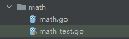
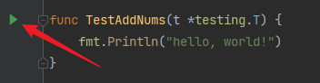
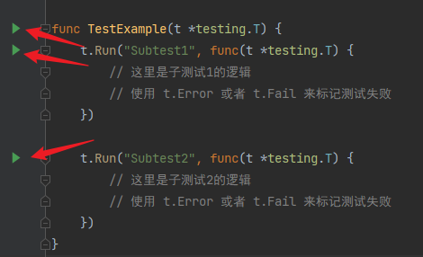

在`Go`语言中，测试函数的编写简洁直观。与`Java`不同，`Go`的测试文件通常与被测试文件位于同一目录，且文件名必须以`_test.go`结尾。这是一项硬性规定，未遵循此命名规则的文件不会被`Go`编译器识别为测试文件，其中的测试函数也无法执行。

若被测试文件名为`math.go`，则对应的测试文件应命名为`math_test.go`。这种命名方式便于开发者快速定位源文件与其测试文件之间的对应关系。值得一提的是，在`GoLand`中，测试文件通常以浅绿色背景显示，进一步方便开发者加以区分：



编写`Go`语言的测试函数时，需要遵循以下规则：

1. 测试函数名必须以`Test`开头，并遵循驼峰命名法，否则`Go`编译器不会将其识别为测试函数，导致无法执行。
2. 测试函数有且仅有一个参数，即`t *testing.T`，这是`Go`语言内置的测试类型参数。
3. 测试函数的命名应与被测试函数保持对应。例如被测试函数名为`AddNums`，则对应的测试函数应命名为`TestAddNums`。
4. 测试方法的命名规则与此类似。若结构体名为`Users`、方法名为`Query`，则对应的测试函数应命名为`TestUsers_Query`。

例如被测试文件的代码如下所示：

```go
func AddNums() {
	// some logic
}

type Users struct {
	// some field
}

func (u *Users) Query() {
	// some logic
}
```

它对应的测试文件代码如下：
```go
import (
	"fmt"
	"testing"
)

func TestAddNums(t *testing.T) {
	// some logic
}

func TestUsers_Query(t *testing.T) {
	// some logic
}
```

点击测试函数左侧的绿色小箭头，就可以对这个测试函数进行单独运行：



接下来介绍`t *testing.T`对象。`*testing.T`是一个指向测试状态的结构体指针，封装了测试过程中所需的状态与功能，可用于报告测试失败、记录日志等操作。以下是该类型的几个常用方法。

#### 1. `Run`方法：

在一个测试函数中，可以使用`Run`方法运行多个子测试以覆盖不同的测试场景。子测试失败时不会影响其他子测试的执行，且每个子测试都会单独报告其结果。它的方法签名如下：

```go
func (t *T) Run(name string, f func(t *T)) bool
```

下面是其使用示例：

```go
import (
    "testing"
)

func TestExample(t *testing.T) {
    t.Run("Subtest1", func(t *testing.T) {
        // 这里是子测试1的逻辑
        // 使用t.Error或者t.Fail来标记测试失败
    })
    t.Run("Subtest2", func(t *testing.T) {
        // 这里是子测试2的逻辑
        // 使用t.Error或者t.Fail来标记测试失败
    })
}
```

这里我们看到，每个子测试左侧都有一个绿色小按钮，我们可以单独运行一个子测试，也可以运行整个测试：



#### 2. `Error`和`Errorf`方法

用于报告测试失败的情况。使用示例如下：

```go
t.Error("测试失败")
t.Errorf("测试失败：%v", err)
```

#### 3. `Fatal`和`Fatalf`方法

用于报告测试失败并立即终止当前测试函数的执行，适用于前置条件不满足、继续执行会导致`panic`或产生无意义结果的场景。

使用示例如下：

```go
t.Fatal("致命错误，终止测试")
t.Fatalf("致命错误：%v", err)
```

#### 4. `Skip`和`Skipf`方法

用于跳过当前测试，测试结果记为`SKIP`而非`FAIL`，常用于某些依赖环境或外部条件不满足时的条件跳过。使用示例如下：

```go
t.Skip("跳过该测试")
t.Skipf("跳过该测试：%s", reason)
```

#### 5. `Log`和`Logf`方法

用于记录执行时的日志信息。使用示例如下：

```go
t.Log("这是一个日志信息")
t.Logf("这是一个格式化的日志信息：%s", msg)
```

其余的方法，需要使用的时候再进行查阅即可。

接下来介绍`go test`命令。`go test`是执行测试的核心命令，上面提到的绿色箭头本质上是`GoLand`对`go test`的图形化封装，点击时底层实际执行的是`go test`加上`-run`参数来定位具体的测试函数，命令如下：

```sh
# 只运行TestAddNums
go test -run TestAddNums .
# 只运行TestExample中名为Subtest1的子测试
go test -run TestExample/Subtest1 .
```

使用`go test .`命令时，`Go`会将当前目录下的被测包与所有`_test.go`文件一起编译，生成一个临时的测试二进制文件，存放于系统临时目录中，生成后会自动运行其中所有符合命名规则的测试函数，执行完毕后默认自动删除。

其中`.`表示当前目录，可替换为其他任意路径。使用`go test ./...`可递归测试当前模块下所有包，此时`Go`会为每个包单独编译并生成一个独立的测试二进制文件，这些二进制文件同样在执行完毕后自动删除。

若需保留编译产物以供调试，可使用`-c`参数，此时不会执行测试，而是将测试二进制文件保存到当前目录：

```sh
# 编译但不执行，将测试二进制保存为「包名.test」
go test -c .

# 通过-o参数自定义输出文件名
go test -c -o math.test .
```

需要注意的是，`-c`参数存在一个限制：它只能作用于单个包，无法与`./...`组合使用。若需保留所有包的测试二进制，只能逐包手动执行，或通过脚本遍历各包分别调用`go test -c`命令。

理解了`go test`的运行机制后，`TestMain`可以看作是对这一机制的扩展，允许你在测试执行前后插入自定义逻辑。当一个测试包中定义了`TestMain`函数时，`go test`会优先执行它，而非直接运行各个测试函数。其函数签名如下：

```go
func TestMain(m *testing.M)
```

`m *testing.M`是测试管理对象，调用`m.Run()`会触发包内所有测试函数的执行，返回值为退出码。必须将该退出码传递给`os.Exit`，否则测试结果将无法正确反映到`CI/CD`流水线或命令行的退出状态中。

使用示例如下所示：

```go
import (
    "fmt"
    "os"
    "testing"
)

func TestMain(m *testing.M) {
    fmt.Println("测试开始前：初始化资源")
    // 在这里进行数据库连接、配置加载等初始化操作
    code := m.Run() // 执行包内所有测试函数
    fmt.Println("测试结束后：清理资源")
    // 在这里进行资源释放、数据清理等操作
    os.Exit(code)
}
```

需要注意，`TestMain`的作用域是整个测试包，而非单个测试文件。一个包内只能定义一个`TestMain`，定义多个会导致编译报错。

