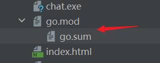

在使用`GoModules`管理项目时，我们会用到两个文件：`go.mod`和`go.sum`。这两个文件在项目目录中的结构通常如下：



在`Goland`中，`go.mod`和`go.sum`文件显示为上下级结构，但实际上在文件夹中，它们是扁平结构的：


### 一、`go.mod`文件详解

`go.mod`文件的内容如下所示（示例）：

```scss
module github.com/mundo-wang/wtool

go 1.21

require (
	github.com/gin-gonic/gin v1.10.0
	github.com/google/go-querystring v1.1.0
	go.uber.org/zap v1.27.0
)
```

#### 1. `module`关键字

如果使用`Goland`创建项目，`module`的默认值通常与项目根目录名一致，但可以手动修改。如果使用`go mod init <module-path>`将项目目录交给`GoModules`管理，`module`的值会是`<module-path>`。

通常建议将`<module-path>`的值设置为代码托管平台的域名路径加上项目名，以确保唯一性。例如，若个人域名为`github.com/mundo-wang`，项目名为`wtool`，则`module`的值可以设置为`github.com/mundo-wang/wtool`。

这样，当项目推送到远程仓库（如`GitHub`）时，便可以通过`https://github.com/mundo-wang/wtool`访问该项目。例如`Gin`框架的`go.mod`文件中`module`的值为`github.com/gin-gonic/gin`，即可通过`https://github.com/gin-gonic/gin`访问其代码仓库。

在`Goland`中，使用`go mod init <module-path>`将目录交给`GoModules`管理后，`External Libraries`下会生成相应的目录，存放的就是项目所依赖的第三方包。如果项目包含多个`GoModules`模块，那么在`External Libraries`中也会有对应数量的目录：


可以使用`go list -m`命令查看指定目录由哪个`GoModules`管理，它会输出该目录对应的`<module-path>`。如果输出为`command-line-arguments`，则表示该目录未被`GoModules`管理。

#### 2. `go`关键字

在`go.mod`文件中，可以写`go 1.21.2`这种格式，也可以写`go 1.21`这种格式，但官方推荐使用次要版本号（`go 1.21`），而不是具体的补丁版本号（`go 1.21.2`）。

`go`关键字在`go.mod`文件中指定了项目所使用的`Go`版本。这一声明用于告知编译器和开发者，该模块基于指定版本的`Go`编写。`Go`工具链在执行构建或依赖管理操作时，会根据`go.mod`中的版本号进行相应处理。如果需要更改`go.mod`中的`Go`版本，只需修改版本号，并使用`go mod tidy`命令重新整理依赖。

这里的`go`版本并不代表强制本地也使用该版本，而是最低兼容版本。`Go`工具链在运行时，会向后兼容旧版本，使用比`go.mod`中指定的版本更高的`Go`（如`Go 1.22`），不会导致`go mod tidy`出错。

但是需要注意一些特殊情况，如果本地使用了`Go 1.21`的新特性，而`go.mod`指定`go 1.20`，那么团队中仍在使用`Go 1.20`的开发者可能会遇到编译错误。此外，如果`go.mod`声明的是`go 1.20`，但某些依赖（例如通过`go get`获取的新包）要求`Go 1.21`或更高版本，可能会导致依赖解析失败。因此，在团队协作时，建议所有开发者统一`Go`版本，以避免兼容性问题。

#### 3. `require`关键字

`require`模块列举了项目所依赖的模块以及它们的版本，确保在构建时下载和使用这些版本。

#### 4. 其余内容

`go.mod`文件还有`replace`（替代模块）、`exclude`（排除模块），以及`toolchain`（工具链），它们是可选的。

### 二、`go.sum`文件详解

`go.sum`的文件内容如下所示（示例）：

```scss
github.com/bytedance/sonic v1.11.6 h1:oUp34TzMlL+OY1OUWxHqsdkgC/Zfc85zGqw9siXjrc0=
github.com/bytedance/sonic v1.11.6/go.mod h1:LysEHSvpvDySVdC2f87zGWf6CIKJcAvqab1ZaiQtds4=
github.com/bytedance/sonic/loader v0.1.1 h1:c+e5Pt1k/cy5wMveRDyk2X4B9hF4g7an8N3zCYjJFNM=
github.com/bytedance/sonic/loader v0.1.1/go.mod h1:ncP89zfokxS5LZrJxl5z0UJcsk4M4yY2JpfqGeCtNLU=
github.com/cloudwego/base64x v0.1.4 h1:jwCgWpFanWmN8xoIUHa2rtzmkd5J2plF/dnLS6Xd/0Y=
github.com/cloudwego/base64x v0.1.4/go.mod h1:0zlkT4Wn5C6NdauXdJRhSKRlJvmclQ1hhJgA0rcu/8w=
github.com/cloudwego/iasm v0.2.0 h1:1KNIy1I1H9hNNFEEH3DVnI4UujN+1zjpuk6gwHLTssg=
github.com/cloudwego/iasm v0.2.0/go.mod h1:8rXZaNYT2n95jn+zTI1sDr+IgcD2GVs0nlbbQPiEFhY=
github.com/davecgh/go-spew v1.1.0/go.mod h1:J7Y8YcW2NihsgmVo/mv3lAwl/skON4iLHjSsI+c5H38=
github.com/davecgh/go-spew v1.1.1 h1:vj9j/u1bqnvCEfJOwUhtlOARqs3+rkHYY13jYWTU97c=
github.com/davecgh/go-spew v1.1.1/go.mod h1:J7Y8YcW2NihsgmVo/mv3lAwl/skON4iLHjSsI+c5H38=
github.com/gabriel-vasile/mimetype v1.4.3 h1:in2uUcidCuFcDKtdcBxlR0rJ1+fsokWf+uqxgUFjbI0=
github.com/gabriel-vasile/mimetype v1.4.3/go.mod h1:d8uq/6HKRL6CGdk+aubisF/M5GcPfT7nKyLpA0lbSSk=
github.com/gin-contrib/sse v0.1.0 h1:Y/yl/+YNO8GZSjAhjMsSuLt29uWRFHdHYUb5lYOV9qE=
github.com/gin-contrib/sse v0.1.0/go.mod h1:RHrZQHXnP2xjPF+u1gW/2HnVO7nvIa9PG3Gm+fLHvGI=
github.com/gin-gonic/gin v1.10.0 h1:nTuyha1TYqgedzytsKYqna+DfLos46nTv2ygFy86HFU=
github.com/gin-gonic/gin v1.10.0/go.mod h1:4PMNQiOhvDRa013RKVbsiNwoyezlm2rm0uX/T7kzp5Y=
github.com/go-playground/assert/v2 v2.2.0 h1:JvknZsQTYeFEAhQwI4qEt9cyV5ONwRHC+lYKSsYSR8s=
github.com/go-playground/assert/v2 v2.2.0/go.mod h1:VDjEfimB/XKnb+ZQfWdccd7VUvScMdVu0Titje2rxJ4=
github.com/go-playground/locales v0.14.1 h1:EWaQ/wswjilfKLTECiXz7Rh+3BjFhfDFKv/oXslEjJA=
```

这个文件记录了项目依赖模块的版本和校验信息，其目的是确保在不同环境下构建项目时使用相同的依赖版本，并提供额外的安全层以防止依赖项被恶意篡改或非法修改。它的格式通常为：`module-path version sum`，即“路径+版本号+校验和”。

`go.sum`文件无需手动修改，`Go`工具链会自动维护和更新它。通常在执行`go get`或`go mod tidy`时，`go.sum`文件会被自动更新。

### 三、注意事项

如果我们不想让某个目录被`GoModules`管理了，只需要删除掉它的`go.mod`与`go.sum`文件即可。

我们在`clone`一个新项目前，最好先确认本地`Go`版本与该项目`go.mod`文件中定义的版本一致。如果项目不涉及协同开发，建议在`clone`后删除项目的`go.mod`和`go.sum`文件，并使用`go mod init`重新初始化项目以启用`GoModules`管理，然后运行`go mod tidy`整理依赖，这样做可以避免因`Go`版本不一致而引发的潜在问题。