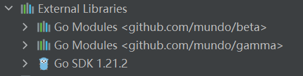
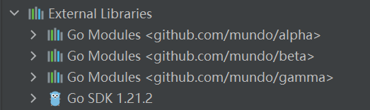

`vendor`模式是`Go 1.5`引入的一种依赖管理方式，尽管已经比较老旧，但与`GoModules`和`GOPATH`模式一样，它的作用都是管理项目所依赖的第三方库或包。其核心思想是将项目依赖的外部包直接存储在项目的特定目录下。

在引入`GoModules`后，启用`vendor`模式的步骤变得非常简单：只需在`GoModules`模块的根目录下运行`go mod vendor`命令，即可将当前模块的所有依赖从`$GOPATH/pkg/mod`目录复制到项目根目录下的`vendor`目录中。

`vendor`模式的优缺点十分明显。优点如下：

1. 可以将私有库（如`GitLab`上的第三方库）直接放入`vendor`目录，确保各环境中的依赖一致性，简化部署和迁移。
2. 依赖库直接包含在项目中，避免了不同环境下依赖库版本不一致的问题，确保项目与依赖库的版本始终保持同步。

缺点如下：

1. 将依赖包复制到项目中会显著增加项目体积，尤其对于大型项目或依赖较多的项目来说可能带来问题。
2. `vendor`目录的依赖包需要手动管理，这会增加维护工作量和复杂度。
3. 在微服务架构中，如果多个模块依赖同一个库，每个模块的`vendor`目录中都会有该库的独立副本，造成资源冗余。

`vendor`目录中包含一个名为`modules.txt`的元数据文件，用于记录项目中使用的模块及其版本信息。通常情况下，当你使用`go mod vendor`命令生成`vendor`目录时，`Go`会自动更新并维护`vendor/modules.txt`文件。该文件详细列出了每个模块的版本信息，以及模块的替换路径（如果存在）。

在`vendor`模式下，使用`go get`引入新的第三方库的过程并不会受到影响。然而，新增库后直接运行`go mod vendor`，只能更新`modules.txt`文件，却不会将新增的库同步到`vendor`目录。因此，通常的流程是在项目可以正常运行的情况下，再执行`go mod vendor`命令完成包的迁移。如果需要添加新的第三方库，建议先删除`vendor`目录，让项目回到`GoModules`的管理模式，新增依赖后，再次运行`go mod vendor`恢复到`vendor`模式。

我们对`alpha`模块执行了`go mod vendor`后，`Goland`中显示的该模块的`GoModules`依赖消失了：

删除`alpha`模块的`vendor`目录后，其在`Goland`中的`GoModules`依赖会恢复显示：

