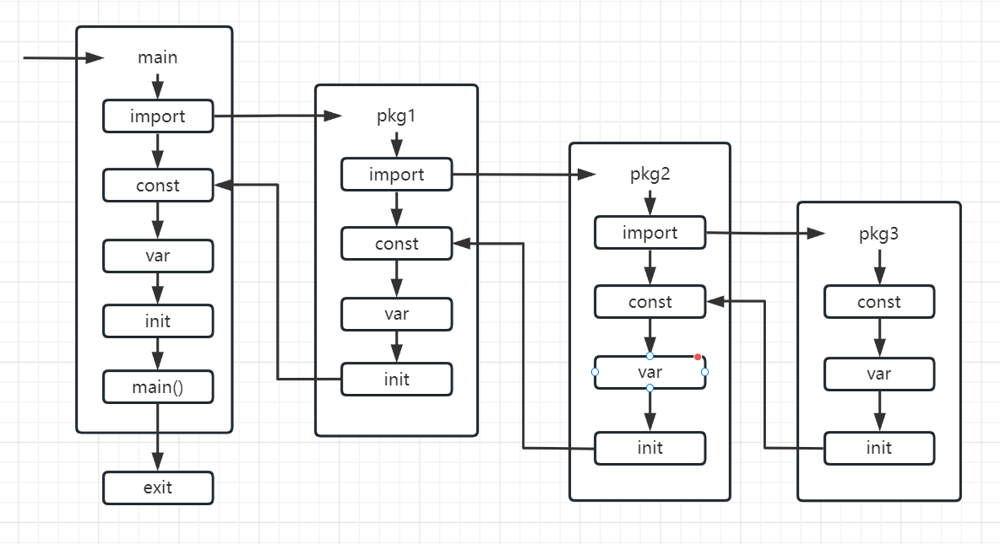

#### 1. 执行时机

- `init()`函数在`main()`函数之前自动执行，无需手动调用与触发。

#### 2. 调用顺序

- 不同包中的`init()`函数执行顺序由包的依赖关系决定，具体流程如下图所示。
- 如果一个包被多个包导入，其`init()`函数只会执行一次。
- 同一文件中的多个`init()`函数会按照代码书写顺序依次执行。
- 同一包内不同文件的`init()`函数的执行顺序不确定，不要依赖同一包内不同文件的`init`函数执行顺序编写代码。

#### 3. 使用时的注意事项

- `init()`函数不能被显式调用，任何尝试对它的调用都会导致编译错误。
- 可以在`init()`函数中启动`Goroutine`，启动的协程不会影响`init()`的初始化顺序。
- 单个文件可以包含多个`init()`函数，合理分组`init()`函数有助于提高代码的可读性。
- 程序设计时不应依赖多个`init()`函数的执行顺序，因为其执行顺序可能是不确定的。

下图展示了常量、变量以及`init()`函数在代码中的初始化顺序与相互关系：

#### 4. `init`函数的缺陷与不足

- `init`函数具有自动调用的特性，其隐式行为在大型项目中可能引发问题，特别是在多个库存在复杂依赖关系时。初始化顺序难以预料，且调试过程往往更加复杂和费时。
- `init`函数无法返回`error`，一旦发生错误，只能通过`panic`或`log.Fatalf`直接终止程序。这种处理方式可能导致程序在运行时崩溃，并增加定位问题的难度。

为了更精确地控制初始化流程，建议采用显式的`InitXXX()`函数，并在`main`函数中主动调用。这种方式不仅能提供清晰的初始化逻辑，还能通过适当的错误处理机制（如返回错误并记录日志）提升系统的健壮性和可维护性。