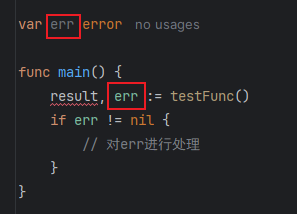

在`Go`语言中，错误`error`也被定义为一种类型，它在`Go`代码里面是一个接口类型：

```go
type error interface {
	Error() string
}
```

常用的创建`error`类型对象的方法有两种，分别使用`Go`内置的`errors`和`fmt`库：

1. `errors.New()`：用于创建一个简单的错误，错误内容仅包含一个字符串消息。
2. `fmt.Errorf()`：用于创建一个带有格式化消息的错误，功能类似于`fmt.Sprintf`，可以在错误消息中嵌入动态变量。

在`Go`语言中，函数或方法通常将`error`类型的值作为最后一个返回值，用于表示执行过程中可能出现的出错情况。调用方通过判断返回的`error`是否为`nil`，来判断操作是否成功。如果返回的`error`不为`nil`，则说明执行过程中发生了错误，常见的处理方式是记录日志并立即`return`，以终止后续逻辑的执行。

一个简单的使用示例如下：

```go
func divide(x, y int) (int, error) {
    if y == 0 {
        return 0, errors.New("division by zero")
    }
    return x / y, nil
}

func main() {
    result, err := divide(10, 0)
    if err != nil {
        log.Printf("Error occurred: %v\n", err) // %v是适用于多种类型数据的默认格式
        return
    }
    fmt.Printf("Result: ", result)
}
```

前文中我们了解到，`error`是一个包含`Error()`方法的接口。这意味着，任何实现了`Error()`方法的结构体类型都可以作为错误类型。通过定义新的类型并实现`Error()`方法，可以创建更具针对性且携带更多信息的自定义错误类型，示例如下：

```go
type MyError struct {
	Code    int
	Msg     string
	Cause   error
	Created time.Time
}

// 建议使用指针接收器
func (e *MyError) Error() string {
	return fmt.Sprintf("Code: %d, Message: %s, Created: %s", e.Code, e.Msg, e.Created.Format("2006-01-02 15:04:05"))
}

func NewMyError(code int, msg string, cause error) error {
	return &MyError{
		Code:    code,
		Msg:     msg,
		Cause:   cause,
		Created: time.Now(),
	}
}

func FindUser(userId int) error {
	if userId != 123 {
		return NewMyError(500, fmt.Sprintf("user with ID %d not found", userId), nil)
	}
	return nil
}

func main() {
	err := FindUser(456)
	fmt.Println(err.Error()) // Code: 500, Message: user with ID 456 not found, Created: 2025-03-27 14:41:02
}
```

标准库`errors`里还有`errors.As`和`errors.Is`这两个函数，它们的函数签名如下：

```go
func As(err error, target interface{}) bool
func Is(err, target error) bool
```

`errors.As`函数用于将`error`接口类型的变量断言为自定义的错误类型，如果断言失败，返回`false`。

我们以上文中的错误类型`MyError`为例，断言代码如下：

```go
func main() {
	err := FindUser(456)
	myErr := &MyError{}
	if !errors.As(err, &myErr) {
		fmt.Println("错误类型断言失败")
	}
	fmt.Println(myErr.Msg) // user with ID 456 not found
}
```

该代码将`error`类型的变量断言为`MyError`类型变量`myErr`，从而可以通过该对象访问具体字段和方法。

> **注意：**`errors.As`函数的第二个参数`target`必须是实现了`error`接口的类型指针或接口，不能为空指针。由于上述代码中使用指针接收器`*MyError`实现了`error`接口，因此在调用`errors.As`时，必须传递`&myErr`作为参数，否则会导致`panic: errors: *target must be interface or implement error`异常。

`errors.Is`函数用于判断错误`err`是否与`target`为同一个错误对象，或者`err`是否是由`target`包装而成。示例代码如下：

```go
var customError = errors.New("自定义错误")

func main() {
	err1 := someFunction1()
	if errors.Is(err1, customError) {
		fmt.Println("someFunction1 遇到了自定义错误") // 会打印
	}
	err2 := someFunction2()
	if errors.Is(err2, customError) {
		fmt.Println("someFunction2 遇到了自定义错误") // 会打印
	}
	err3 := someFunction3()
	if errors.Is(err3, customError) {
		fmt.Println("someFunction3 遇到了自定义错误") // 会打印
	}
}

func someFunction1() error {
	return customError // 返回原始错误
}

func someFunction2() error {
	return fmt.Errorf("发生错误: %w", customError) // 返回用fmt.Errorf包装的错误，%w是用于错误包装的占位符
}

func someFunction3() error {
	return errors.Join(customError, errors.New("其他错误")) // 返回用errors.Join合并的错误
}
```

在一般情况下，我们通常不会对错误进行包装处理，因此更应关注的重点是判断是否为同一个`error`对象。

如果觉得`errors`库功能不够全面，可以使用下面这个第三方库，这是`errors`内置库的增强版：

```sh
go get github.com/pkg/errors
```

这里提供了`errors.Wrap`函数，用于在现有的错误上附加额外的上下文信息，形成一条调用链，相当于对原始错误的包装。

对于`Go`语言中的`:=`用法，当你写`result, err := ...`时，`Go`会尝试进行短变量声明。如果左侧的变量全部已在当前作用域中声明过，会进行赋值操作；如果左侧的变量中至少有一个新变量，会进行重新声明操作，新变量声明，已有变量赋值。

需要注意的是，短变量声明只会关注当前作用域，而不会考虑外层是否已经存在同名变量。例如下面的代码：

```go
func main() {
	var err error
	result, err := testFunc()
	if err != nil {
		// 对err进行处理
	}
}
```

在这段代码中，由于最初定义的变量`err`与`:=`左侧的`err`处于同一作用域内，因此本质上是对已有变量进行赋值。

再看下面这种情况，外层的全局变量`err`和内层局部同名变量`err`不在同一作用域内：

```go
var err error

func main() {
	result, err := testFunc()
	if err != nil {
	    // 对err进行处理
	}
}
```

这种情况实际上相当于`:=`前面的变量`err`是新声明的，并不是对全局变量`err`的重新赋值。我们看下图：



在`Goland`中，全局变量`err`会显示为灰色，表示未被使用，而局部变量`err`显示为绿色，提示我们这是一个新声明的变量，并没有使用外层的同名变量。

在这种情况下，如果想复用全局变量`err`，必须使用普通赋值`=`来代替短变量声明`:=`，代码如下：

```go
var err error

func main() {
	var result int
	result, err = testFunc()
	if err != nil {
	    // 对err进行处理
	}
}
```

