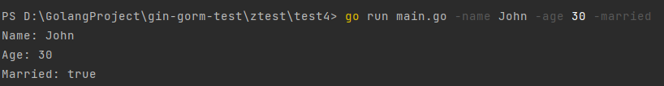
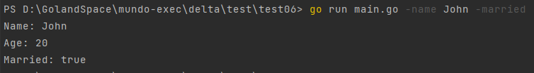
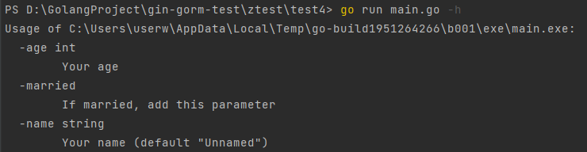

在运行`go build`生成的可执行文件时，可以在后面添加参数，用于配置程序的行为，如下所示：

```bash
go build main.go
./main.exe -name John -age 30 -married
```

或者也可以直接在执行`go run`时在后面添加参数：

```bash
go run main.go -name John -age 30 -married
```

那么我们在程序中如何读取到这些参数呢，就要用到`flag`库了，代码实现如下：

```go
package main

import (
	"flag"
	"fmt"
)

var (
	name    string // 定义命令行参数
	age     int
	married bool
)

func init() {
	flag.StringVar(&name, "name", "Unnamed", "Your name")
	flag.IntVar(&age, "age", 20, "Your age")
	flag.BoolVar(&married, "married", false, "If married, add this parameter")
}

func main() {
	flag.Parse() // 解析命令行参数
	fmt.Printf("Name: %s\nAge: %d\nMarried: %t\n", name, age, married)
}
```

执行这个`main.go`文件时，在后面加上对应的命令行参数，即可看到程序打印的结果：



如果省略某些参数，它会被设置为我们在代码中指定的默认值，例如我们省略`age`参数：

```sh
go run main.go -name John -married
```

打印结果如下所示，`age`参数被设置为默认值`20`：



接下来以`flag.StringVar`函数为例，其函数签名如下所示：

```go
func StringVar(p *string, name string, value string, usage string)
```

该函数的参数的具体含义如下：

- `p`：一个指向目标变量的指针。当命令行中的标志被设置时，该变量将被更新以反映标志的值。
- `name`：命令行标志的名称。通常在命令行中以一个或两个连字符作为前缀出现，例如`-age`或`--age`。需要注意的是，`flag`库不支持简称与全称之间的映射关系，例如不支持将`-n`作为`--name`的简称。
- `value`：变量的默认值。如果命令行中未设置该标志，则变量将采用此默认值。
- `usage`：描述标志用途的字符串。用于生成帮助信息，告诉用户该标志的作用和如何使用它。

参数`usage`可以让我们在执行`go run`时，用`-h`参数获取帮助文档：



`flag.Parse()`是用于解析命令行参数的关键函数。在使用`flag`包定义了命令行标志之后，需要调用`flag.Parse()`来解析实际的命令行参数，以便程序能够正确地获取用户提供的值。

如果不调用`flag.Parse()`，标志变量将保持它们的默认值，而不会被实际的命令行参数所覆盖。

当然，如果不需要使用全局变量来接收命令行参数，还可以通过以下方式接收参数，并将其作为局部变量返回：

```go
func main() {
	flag.Parse() // 解析命令行参数
	name := flag.String("name", "Unnamed", "Your name")
	age := flag.Int("age", 20, "Your age")
	married := flag.Bool("married", false, "If married, add this parameter")
	fmt.Printf("Name: %s\nAge: %d\nMarried: %t\n", *name, *age, *married)
}
```

需要注意，这些函数的返回值都是基础类型的指针，在使用时需要对其进行解引用。