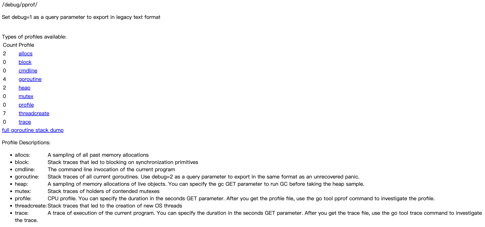
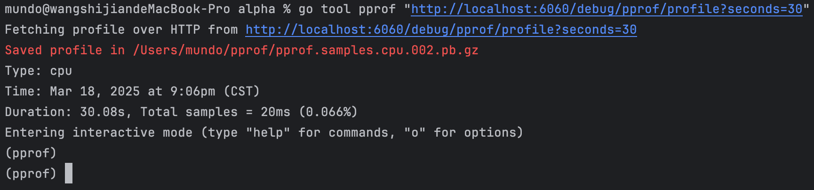
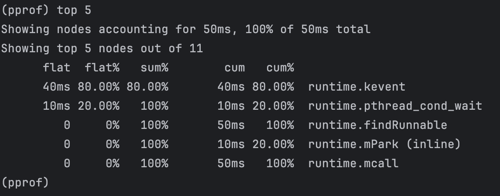

`pprof`（`performance profiler`）是`Go`语言官方提供的性能分析工具，它可以帮助开发者分析和优化程序的性能瓶颈。`pprof`主要用于采集`CPU`使用情况、内存分配、协程调度、阻塞情况等数据，并提供可视化工具，帮助开发者快速找到性能问题。

在`Go`应用中，`pprof`的使用方式主要有两种：

1. `net/http/pprof`：提供`HTTP`接口，可以在运行时远程访问`pprof`数据，适用于线上监测和调试。
2. `runtime/pprof`：允许在代码中手动触发性能数据采集，并存储到本地文件进行分析，适用于离线性能诊断。

无论是调优`CPU`密集型任务、分析内存泄漏，还是排查`goroutine`过多导致的调度问题，`pprof`都是`Go`开发者必不可少的工具。通过合理使用`pprof`，可以提升系统的运行效率，减少资源消耗，从而构建高性能的`Go`应用。

在这里我们只讲解第一种使用方式。只需要在代码中导入`net/http/pprof`，但它不会被显式使用，因此必须使用匿名导入：

```go
package main

import (
	"github.com/gin-gonic/gin"
	"net/http"
	_ "net/http/pprof" // 引入pprof
)
```

我们可以手动把`pprof`相关的接口挂载到`Gin`框架上，如下所示：

```go
func main() {
	r := gin.Default()
	// 手动挂载pprof到Gin
	r.GET("/debug/pprof/*any", gin.WrapH(http.DefaultServeMux))
	r.GET("/hello", func(c *gin.Context) {
		c.String(http.StatusOK, "Hello, World!")
	})
	r.Run(":8080")
}
```

如果想让`pprof`使用独立端口而不是与其他接口共用，可以通过在另一个`goroutine`中启动服务来单独暴露`pprof`端口。这样，`pprof`相关接口将默认在该独立端口上提供服务，如下所示：

```go
func main() {
	r := gin.Default()
	go func() {
		http.ListenAndServe("0.0.0.0:6060", nil) // 默认提供 /debug/pprof 相关接口
	}()
	r.GET("/hello", func(c *gin.Context) {
		c.String(http.StatusOK, "Hello, World!")
	})
	r.Run(":8080")
}
```

运行程序后，访问`http://localhost:6060/debug/pprof/`，可以看到`pprof`的监测页面：



我们也可以在终端使用`go tool pprof`命令进行分析，例如进行`CPU`分析：

```sh
go tool pprof "http://localhost:6060/debug/pprof/profile?seconds=30"
```

这里的`profile?seconds=30`表示采样`30`秒后获取`CPU`性能数据。执行后就是这样的交互式命令行：



可以使用`top 5`命令查看程序中最消耗`CPU`时间的前五个函数：



除了`CPU`分析之外，我们还可以分析`Go`应用的内存分配情况，找出哪些对象占用了大量内存：

```sh
go tool pprof "http://localhost:6060/debug/pprof/heap"
```

还可以查看当前运行的`goroutine`数量，分析是否有`goroutine`泄漏或死锁：

```sh
go tool pprof "http://localhost:6060/debug/pprof/goroutine"
```

分析线程创建情况，查看是否有不必要的线程占用资源：

```sh
go tool pprof "http://localhost:6060/debug/pprof/threadcreate"
```

分析`Go`应用的阻塞情况，例如`channel`、`mutex`等，帮助优化锁的使用：

```sh
go tool pprof "http://localhost:6060/debug/pprof/block"
```

上述命令执行后，进入交互式命令行界面，可以通过`top`命令查看内存、`goroutine`、线程创建和阻塞等方面的热点，从而帮助我们快速定位性能瓶颈。此外，可以使用`help`命令查看所有可用命令，或者通过`help <command>`来查看某个特定命令的详细使用方法。