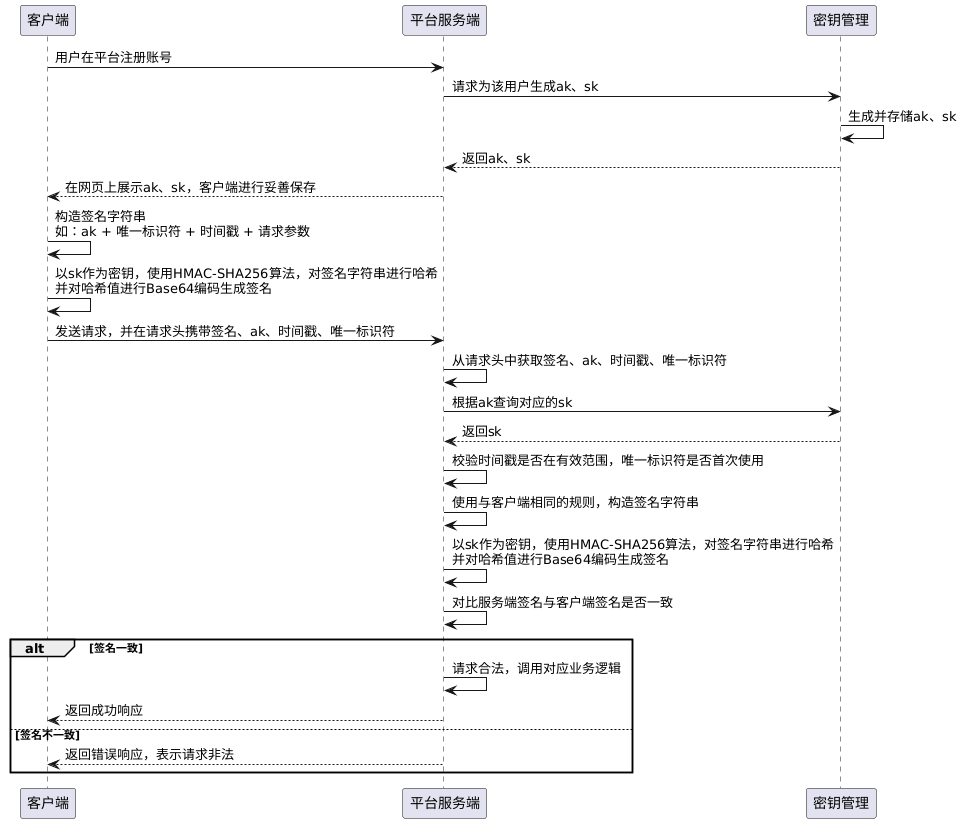

在使用`Go`语言进行对外`API`开发时，设计一个可靠的签名验证机制是确保`API`安全性的重要措施。签名验证的作用主要包括：

1. 防止伪造请求：可以确认请求的来源是合法的。只有持有正确密钥的发送方才能生成有效的签名，从而防止伪造请求。
2. 数据完整性：可以确保数据在传输过程中没有被篡改。接收方通过验证签名，可以确认数据是否在传输过程中被修改。
3. 防止重放攻击：结合时间戳和唯一标识符（例如随机生成的`UUID`），并配合签名验证机制，可以有效防止重放攻击（即相同请求被恶意重复提交）。时间戳限制请求在短时间窗口内的有效性，唯一标识符确保每个请求在服务器上都是首次处理。

客户端在调用`API`之前，签名的过程通常包括以下几个步骤：

1. 生成签名密钥：一般包括`ak`与`sk`。其中`ak`类似于用户`ID`，是公开的标识符，`sk`类似于用户的密码，用于生成认证签名，证明请求的真实性。`ak`和`sk`通常由服务端提供，可以在网页的账户页面进行获取，获取后需要将其妥善保管。
2. 准备数据：准备好`API`请求所需的所有必要数据，例如请求路径、请求参数等，另外还包括当前的时间戳以及唯一标识符。
3. 构造签名字符串：将待签名的数据按照服务端提供的规则，拼接成签名字符串（例如：`ak` + 唯一标识符 + 当前时间戳 + 请求参数）。对于请求参数，如果在`URL`中，需先按字典序排序，并以`param1=value1&param2=value2`的格式进行拼接；如果请求参数以`JSON`格式放置在请求体中，则将其字节切片通过编码算法（如`Base64`）转换为字符串后再进行拼接。
4. 生成签名：使用`HMAC-SHA256`算法，`sk`作为`HMAC`的密钥，对签名字符串进行哈希处理。然后，将生成的哈希值通过`Base64`进行编码，并将其作为签名附加到请求中（通常放置在请求头，也可以放在请求参数或请求体中）。
5. 发送请求：除了将签名包含在请求头中，还需将`ak`、当前时间戳和唯一标识符一并附加，以便服务器能够验证签名的有效性。做完这些工作后，调用`HTTP`请求，把请求数据发送到服务端。

服务器收到请求后，按照以下步骤对签名进行验证：

1. 从请求头中获取到出`ak`、当前时间戳、唯一标识符，并使用`ak`在服务端的密钥管理系统中查询到对应的`sk`。
2. 对时间戳和唯一标识符做验证，确保请求在有效时间范围内且具有唯一性，从而保证请求的有效性并有效防止重放攻击。
3. 根据相同的签名算法规则，构造签名字符串，重新生成签名，并与从请求头中获取的客户端提供的签名进行对比。
4. 如果服务器生成的签名和客户端提供的签名一致，那么这个请求就被认为是合法的，否则拒绝请求。

客户端签名，服务端验签的时序图如下所示：



签名流程要求客户端每次调用第三方接口时，都必须执行一次签名算法，在实际项目中，通常会在上述签名方式的基础上引入更复杂的安全机制，以增强签名的安全性。尽管具体措施可能有所不同，但这类签名机制的整体流程大体一致。

除此之外，还有两种安全性不及签名算法、但调用更为简便的鉴权方式。

`AccessToken`机制是先用`ak`+`sk`在平台换取一个短期有效的凭证，后续请求只携带该凭证即可，签名逻辑从请求参数中完全解耦。平台侧负责生成、存储`Token`并维护其有效期与状态。由于凭证不绑定请求参数，请求被截获后攻击者可任意篡改请求内容并重新发送，且不具备防重放能力，安全性略低于签名算法，但调用更轻量，接入也更简单。

`API Key`是最简单的方式，本质上是平台将用户名和密码合并为一个静态字符串，用户从平台获取后，在调用接口时，将其放在请求头（如`X-API-Key`）或请求参数中，服务端维护`API Key`与用户的映射关系，查库比对即完成身份验证。无签名绑定，部分平台支持设置过期时间，但一旦泄露在过期前便可被任意使用，安全性最低，适合内网服务或对安全要求不高的场景。

客户端签名，服务端验签的时序图，其`PlantUML`代码如下所示：

```scss
@startuml
participant 客户端 as Client
participant 平台服务端 as Server
participant 密钥管理 as KMS

Client -> Server: 用户在平台注册账号
Server -> KMS: 请求为该用户生成ak、sk
KMS -> KMS : 生成并存储ak、sk
KMS --> Server: 返回ak、sk
Server --> Client: 在网页上展示ak、sk，客户端进行妥善保存

Client -> Client: 构造签名字符串\n如：ak + 唯一标识符 + 时间戳 + 请求参数
Client -> Client: 以sk作为密钥，使用HMAC-SHA256算法，对签名字符串进行哈希\n并对哈希值进行Base64编码生成签名
Client -> Server: 发送请求，并在请求头携带签名、ak、时间戳、唯一标识符

Server -> Server: 从请求头中获取签名、ak、时间戳、唯一标识符
Server -> KMS: 根据ak查询对应的sk
KMS --> Server: 返回sk
Server -> Server: 校验时间戳是否在有效范围，唯一标识符是否首次使用
Server -> Server: 使用与客户端相同的规则，构造签名字符串
Server -> Server: 以sk作为密钥，使用HMAC-SHA256算法，对签名字符串进行哈希\n并对哈希值进行Base64编码生成签名
Server -> Server: 对比服务端签名与客户端签名是否一致

alt 签名一致
    Server -> Server: 请求合法，调用对应业务逻辑
    Server --> Client: 返回成功响应
else 签名不一致
    Server --> Client: 返回错误响应，表示请求非法
end
@enduml
```

