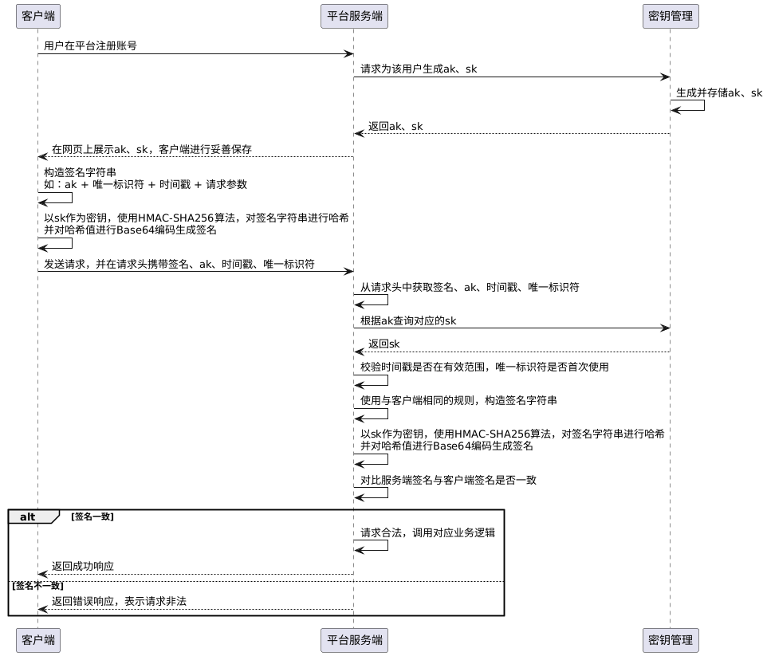

在使用`Go`语言进行对外`API`开发时，设计一个可靠的签名验证机制是确保`API`安全性的重要措施。签名验证的作用主要包括：

1. 防止伪造请求：可以确认请求的来源是合法的。只有持有正确密钥的发送方才能生成有效的签名，从而防止伪造请求。
2. 数据完整性：可以确保数据在传输过程中没有被篡改。接收方通过验证签名，可以确认数据是否在传输过程中被修改。
3. 防止重放攻击：结合时间戳和唯一标识符（例如随机生成的`UUID`），并配合签名验证机制，可以有效防止重放攻击（即相同请求被恶意重复提交）。时间戳限制请求在短时间窗口内的有效性，唯一标识符确保每个请求在服务器上都是首次处理。

客户端在调用`API`之前，签名的过程通常包括以下几个步骤：

1. 生成签名密钥：一般包括`ak`与`sk`。其中`ak`类似于用户`ID`，是公开的标识符，`sk`类似于用户的密码，用于生成认证签名，证明请求的真实性。`ak`和`sk`通常由服务端提供，可以在网页的账户页面进行获取，获取后需要将其妥善保管。
2. 准备数据：准备好`API`请求所需的所有必要数据，例如请求路径、请求参数等，另外还包括当前的时间戳以及唯一标识符。
3. 构造签名字符串：将待签名的数据按照服务端提供的规则，拼接成签名字符串（例如：`ak` + 唯一标识符 + 当前时间戳 + 请求参数）。对于请求参数，如果在`URL`中，需先按字典序排序，并以`param1=value1&param2=value2`的格式进行拼接；如果请求参数以`JSON`格式放置在请求体中，则将其字节切片通过编码算法（如`Base64`）转换为字符串后再进行拼接。
4. 生成签名：使用`HMAC-SHA256`算法，`sk`作为`HMAC`的密钥，对签名字符串进行哈希处理。然后，将生成的哈希值通过`Base64`进行编码，并将其作为签名附加到请求中（通常放置在请求头，也可以放在请求参数或请求体中）。
5. 发送请求：除了将签名包含在请求头中，还需将`ak`、当前时间戳和唯一标识符一并附加，以便服务器能够验证签名的有效性。做完这些工作后，调用`HTTP`请求，把请求数据发送到服务端。

服务器收到请求后，按照以下步骤对签名进行验证：

1. 从请求头中获取到出`ak`、当前时间戳、唯一标识符，并使用`ak`在服务端的密钥管理系统中查询到对应的`sk`。
2. 对时间戳和唯一标识符做验证，确保请求在有效时间范围内且具有唯一性，从而保证请求的有效性并有效防止重放攻击。
3. 根据相同的签名算法规则，构造签名字符串，重新生成签名，并与从请求头中获取的客户端提供的签名进行对比。
4. 如果服务器生成的签名和客户端提供的签名一致，那么这个请求就被认为是合法的，否则拒绝请求。

客户端签名，服务端验签的时序图如下所示：



签名流程要求客户端每次调用第三方接口时，都必须执行一次签名算法，在实际项目中，通常会在上述签名方式的基础上引入更复杂的安全机制，以增强签名的安全性。尽管具体措施可能有所不同，但这类签名机制的整体流程大体一致。

除此之外，还有两种安全性不及签名算法、但调用更为简便的鉴权方式。

`API Key`是最简单的身份认证方式，本质上是平台为用户或应用生成的一段唯一静态凭证。其格式通常由平台自行设计，常见形式是以`sk-`作为前缀，后续跟随一段高随机性的字符串。具体长度没有统一标准，由平台根据安全性和业务需求决定。平台通常使用密码学安全的随机数生成器生成具有足够熵的随机数据，以降低凭证被猜测或碰撞的风险。

生成完成后，服务端通常不会直接保存完整的`API Key`，而是先对其进行哈希处理，仅保存哈希值以及对应的用户、应用或租户信息。与此同时，平台一般只会在`API Key`创建成功后向用户完整展示一次原始凭证，后续在控制台中仅展示部分字符用于识别，从而避免完整凭证长期暴露。如果用户忘记`API Key`，通常需要重新生成新的凭证，并作废之前的`API Key`。

用户从平台获取`API Key`后，在调用接口时通常将其放在请求头中，例如`X-API-Key`，也可以按照平台约定放置在其他位置。当客户端携带`API Key`发起请求时，服务端首先从请求中提取凭证，然后使用与创建时相同的哈希算法计算其哈希值，并根据该哈希值查询对应的凭证记录。如果记录不存在，或者`API Key`已被禁用、撤销或超过有效期，则认证失败；如果凭证有效，服务端即可根据其关联的用户、应用或租户信息确认调用方身份，并继续执行后续的权限校验。

由于`API Key`本身是一段静态凭证，既没有请求签名机制，也不与具体请求内容绑定，因此服务端无法通过`API Key`验证请求内容是否遭到篡改。一旦`API Key`泄露，攻击者通常可以在凭证失效或被撤销之前直接使用该凭证调用接口。即使部分平台支持设置过期时间，也只能缩短凭证泄露后的有效窗口，并不能从根本上解决静态凭证泄露带来的风险。因此，`API Key`的安全性相对较低，更适用于内网服务、低风险接口或安全要求不高的场景。

`AccessToken`机制是使用平台提供的`ak`+`sk`调用接口，换取一个短期有效的凭证，后续请求只携带该凭证即可，签名逻辑从请求参数中完全解耦。平台侧负责生成、存储`Token`并维护其有效期与状态。由于凭证不绑定请求参数，请求被截获后攻击者可任意篡改请求内容并重新发送，且不具备防重放能力，安全性略低于签名算法，但调用更轻量，接入也更简单。

实际上，`AccessToken`的生成、存储和验证机制与`API Key`整体上较为类似。平台完成`ak`+`sk`认证后，会生成一段具有足够随机性的`Token`，服务端通常不会直接保存完整的`Token`，而是以哈希值或其他安全形式进行存储，并关联对应的用户、应用或租户信息。客户端后续携带`Token`发起请求时，服务端提取凭证并进行校验，根据凭证记录确认调用方身份，同时检查其有效期、撤销状态等。

两者的主要区别在于，`API Key`通常作为长期有效的静态凭证直接使用，而`AccessToken`通常具有较短的有效期，需要通过`ak`+`sk`重新获取，从而缩短凭证泄露后的有效时间窗口。但从凭证本身的认证机制来看，二者本质上都是由服务端根据凭证值识别调用方身份，均不参与具体请求内容的签名，因此无法验证请求参数是否被篡改，也通常不具备防重放能力。

客户端签名，服务端验签的时序图，其`PlantUML`代码如下所示：

```scss
@startuml
participant 客户端 as Client
participant 平台服务端 as Server
participant 密钥管理 as KMS

Client -> Server: 用户在平台注册账号
Server -> KMS: 请求为该用户生成ak、sk
KMS -> KMS : 生成并存储ak、sk
KMS --> Server: 返回ak、sk
Server --> Client: 在网页上展示ak、sk，客户端进行妥善保存

Client -> Client: 构造签名字符串\n如：ak + 唯一标识符 + 时间戳 + 请求参数
Client -> Client: 以sk作为密钥，使用HMAC-SHA256算法，对签名字符串进行哈希\n并对哈希值进行Base64编码生成签名
Client -> Server: 发送请求，并在请求头携带签名、ak、时间戳、唯一标识符

Server -> Server: 从请求头中获取签名、ak、时间戳、唯一标识符
Server -> KMS: 根据ak查询对应的sk
KMS --> Server: 返回sk
Server -> Server: 校验时间戳是否在有效范围，唯一标识符是否首次使用
Server -> Server: 使用与客户端相同的规则，构造签名字符串
Server -> Server: 以sk作为密钥，使用HMAC-SHA256算法，对签名字符串进行哈希\n并对哈希值进行Base64编码生成签名
Server -> Server: 对比服务端签名与客户端签名是否一致

alt 签名一致
    Server -> Server: 请求合法，调用对应业务逻辑
    Server --> Client: 返回成功响应
else 签名不一致
    Server --> Client: 返回错误响应，表示请求非法
end
@enduml
```

