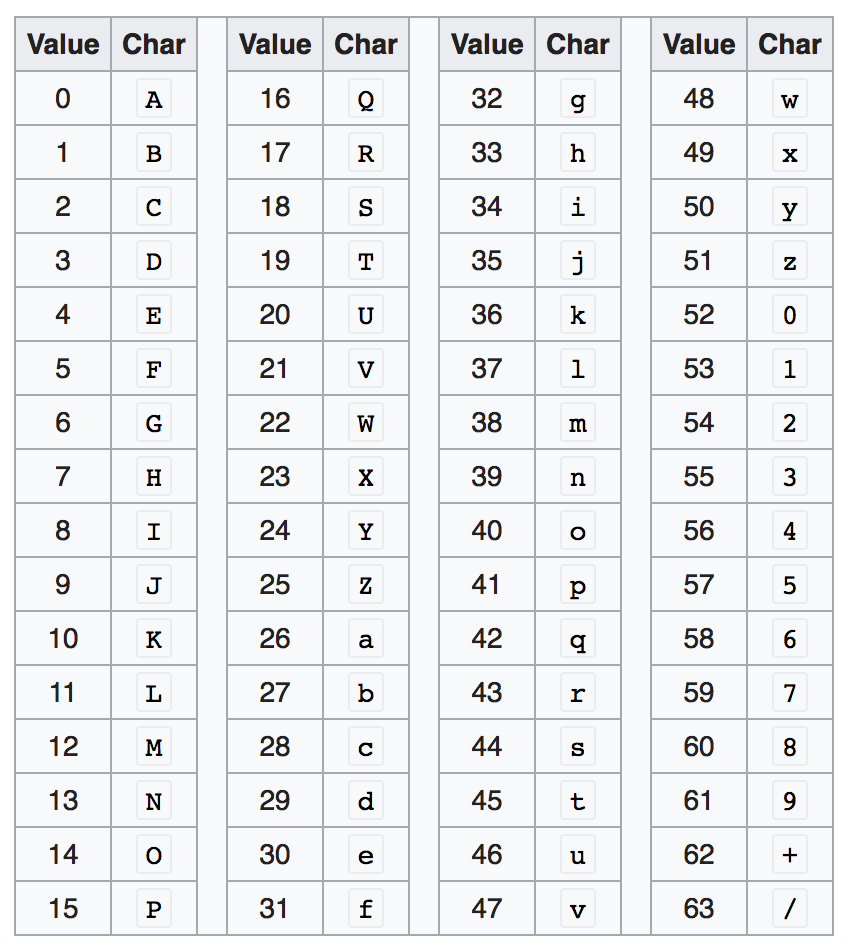

在前两篇文章中，我们已经探讨了在开发对外`API`时的签名流程及其实现方式，涉及了多种签名算法，包括编码算法和哈希算法。本节将进一步深入解析这两种算法的原理及其实际应用。

### 1. 编码算法`Base64`

编码算法的主要目的是将信息从一种形式转换为另一种形式，以便于数据的存储、传输和提高兼容性。编码不仅使数据适合特定的传输介质，还确保其在不同系统和平台间的一致性和可读性。

常见的编码算法之一是`Base64`，它将二进制数据转换为`Base64`字符集。某些文本协议（如`HTTP`）在处理二进制数据时可能存在兼容性问题，`Base64`编码能够将二进制数据转为可安全传输的字符格式，从而避免这些问题。

> `Base64`在线编码/解码网站：https://base64.us/

`Base64`编码的原理是将每`3`个字节（`24`位）的一组二进制数据转换为`4`个`Base64`字符。每个字符由`6`位二进制数映射生成，因此可表示`64`种不同的字符（即`2^6 = 64`），这也是`Base64`名称的由来。

`Base64`的字符集中包含`64`个字符，包括：`A-Z`、`a-z`、`0-9`、`+`、`/`，字符集顺序如下：



`Base64`编码的工作原理与步骤如下：

1. 将输入的二进制数据按每`3`个字节（`24`位）为一组处理，若最后一组不足`24`位，则在末尾补`0`凑齐`24`位。
2. 将每组`24`位分成`4`个`6`位的块，每个`6`位块对应`Base64`字符集中的索引值。将二进制数据转换为十进制后，依据`Base64`字符集转换为相应的字符。例如：`17`对应`R`，`60`对应`8`。
3. 如果原始数据长度不是`3`的倍数，编码后的字符串会用一个或两个`=`进行填充，以确保`Base64`字符串长度为`4`的倍数。`=`仅作为填充标记，不代表实际数据。

我们以字符串`"hello"`为例，演示其经过`Base64`编码后的过程。首先，将字符串`"hello"`的每个字符转换为`ASCII`码值，`hello`的`ASCII`码表示为：`104 101 108 108 111`。转换为二进制数据如下：

```sh
01101000 01100101 01101100 01101100 01101111
```

接着，我们按照每`3`个字节（`24`位）进行分组，这里可以分为两个组：

- 第一组：`01101000 01100101 01101100`

- 第二组：`01101100 01101111`（不足`24`位，需补零）

我们给第二组补`0`后，这段二进制数据就是：

```sh
01101000 01100101 01101100 01101100 01101111 00000000
```

接着我们给每组`24`位数据分割成`4`个`6`位的块：

```sh
011010 000110 010101 101100  # 第一组
011011 000110 111100 000000  # 第二组（加上补0）
```

给每个`6`位的块先转换成十进制，再对照字符集，转换成`Base64`字符：

- 第一组`Base64`编码：`aGVs`
- 第二组`Base64`编码：`bG8=`（有一个`=`填充，因为原始数据长度不足`3`的倍数）

结合起来后，我们得到字符串`hello`的`Base64`编码为`aGVsbG8=`。

上述内容中，我们将英文字符串根据`ASCII`码表转换为二进制数据，并进一步转换为`Base64`格式。对于汉字或其他文字，因`ASCII`码表没有对应的映射关系，需要使用`UTF-8`编码。在`UTF-8`编码中，一个汉字通常占用三个字节。

`Base64`编码不仅限于字符串格式。实际上，任何可以转换为二进制的数据（图像、文档等）都可以使用`Base64`进行编码。

`Base64`是一种可逆的编码算法。它将二进制数据转换为文本字符串，并且可以通过相应的解码步骤将其恢复到原始的二进制格式。由于`Base64`的编码过程和解码过程是对称的，我们可以根据编码的步骤逆向操作来进行解码。具体的解码步骤在这里不再详细展示。

### 2. 哈希算法`SHA-256`

哈希算法通过对任意长度的数据生成固定长度的字符串（通常以十六进制表示），这个字符串可以被视为数据的“摘要”或“指纹”。哈希算法的主要功能是提取出数据的关键特征，使得即使输入有微小差异，生成的哈希值也会显著不同。

哈希算法的一个核心特点是不可逆，即无法通过哈希值还原原始数据。因此，它在数据完整性验证、加密、数字签名等安全性应用中非常重要，能够有效验证数据在传输或存储过程中是否被篡改。

常见的哈希算法包括`MD5`、`SHA-1`、`SHA-256`等，这里我们对`SHA-256`算法做出详细讲解。`SHA-256`（`Secure Hash Algorithm 256-bit`），能够将任意长度的输入映射为固定长度的`256`位（`32`字节，`64`字符）的哈希值。

`SHA-256`的主要特性如下：

- 固定长度输出：无论输入的长度是多少，`SHA-256`总会输出`256`位（`64`个字符）的哈希值。
- 确定性：相同的输入数据经过`SHA-256`算法处理后，总会产生相同的哈希值。
- 抗碰撞性：找到两个不同的输入，使得它们产生相同的哈希值是极其困难的，这保证了哈希值的唯一性。
- 雪崩效应：输入的微小变化会导致输出的哈希值产生巨大的变化，哪怕只改变一个比特位，结果也会完全不同。
- 不可逆性：`SHA-256`是单向函数，从哈希值无法推导出原始输入，确保了数据的隐私性和安全性。

`SHA-256`的工作过程包括以下几个主要步骤：

1. 消息填充：将输入数据填充为`512`位的整数倍。具体方法是在消息末尾添加一个`1`，然后添加足够的`0`，直到消息长度达到`448`位（即距离下一个`512`位的整数倍差`64`位）。最后，用`64`位来表示原始消息的长度。
2. 消息分组：将填充后的消息分成多个`512`位的块，每个块被称为一个消息块。

3. 初始化哈希值：设定`8`个初始的`32`位哈希值，这些值是从前`8`个质数的平方根的小数部分中提取的常数，作为哈希的初始状态。

4. 消息压缩：对每个`512`位的消息块，`SHA-256`会执行`64`轮迭代计算。在每一轮中，消息块的各部分通过移位、异或、与等复杂位运算，与当前的哈希值相互作用，不断更新哈希值。这些迭代操作确保每个消息块的内容充分影响最终的哈希输出。

5. 结果拼接：当所有消息块处理完毕后，将更新后的`8`个`32`位哈希值依次连接，形成最终的`256`位哈希值。

消息压缩的过程中，每个消息块都要与所有的哈希值进行复杂的数学运算。对于运算过程，我这里不做展示。

在签名相关流程和代码实现中，我们介绍了如何结合使用`HMAC`和`SHA-256`。这种结合不仅能够确保数据的完整性，还能验证数据是否来自授权的发送方。`HMAC`（`Hash-based Message Authentication Code`）是一种基于密钥（一般为用户的`sk`）和哈希函数生成消息认证码的技术，其工作原理如下：

1. 密钥准备：`HMAC`需要一个密钥（`key`）。如果密钥长度超过了哈希函数的块大小（`block size`），则对密钥进行哈希化，得到一个新的密钥，该密钥长度等于哈希函数的输出长度。若密钥长度小于块大小，则用零填充密钥直到其达到块大小。
2. 创建内部和外部填充：内部填充（`ipad`）和外部填充（`opad`）是两种特殊的填充值，通常用`0x36`和`0x5c`来填充。这些填充值用于在哈希过程中对密钥进行变换。
3. 生成哈希码：先将密钥与内部填充（`ipad`）进行异或操作，得到`key_ipad`，将`key_ipad`与数据（消息）拼接，使用`SHA-256`对拼接结果进行哈希计算，得到中间哈希值（`inner_hash`）。然后将密钥与外部填充（`opad`）进行异或操作，得到`key_opad`。最后将`key_opad`与中间哈希值拼接，再使用`SHA-256`拼接结果进行哈希计算，得到最终的`HMAC`值。

哈希算法的实际应用场景如下：

- 数据完整性验证：通过生成数据的哈希值，可以验证数据在传输或存储过程中是否保持了完整性，确保数据未被篡改。
- 密码存储：用户密码通常会经过哈希处理后再存入数据库。这种方式即使数据库泄露，也难以恢复原始密码，从而增强了安全性。
- 数字签名：哈希算法用于生成数字签名，可以验证数据的来源，确认数据确实来自于声明的发送者，而未被伪造或篡改。

在存储、传输或处理敏感数据时，应先对数据进行加盐处理，再进行哈希运算。这样可以防止相同的数据生成相同的哈希值，从而有效防御彩虹表攻击。以用户密码为例，即使多个用户使用相同的密码，由于每个用户的盐值都是随机生成的，最终生成的哈希值会完全不同。这种方式显著增强了数据安全性，并大幅降低了密码被破解的风险。
