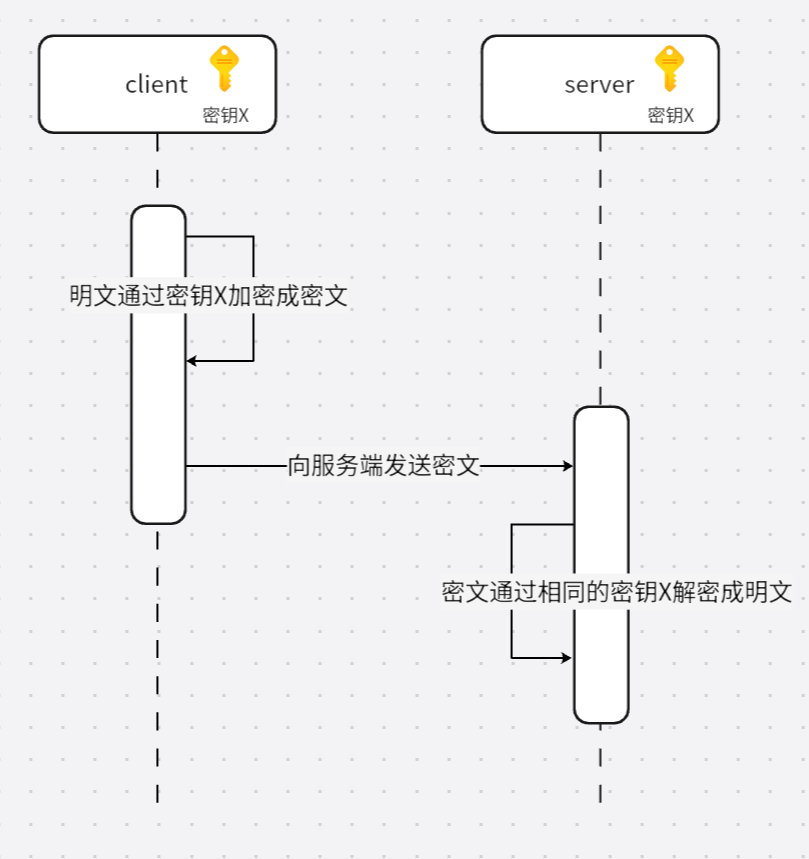
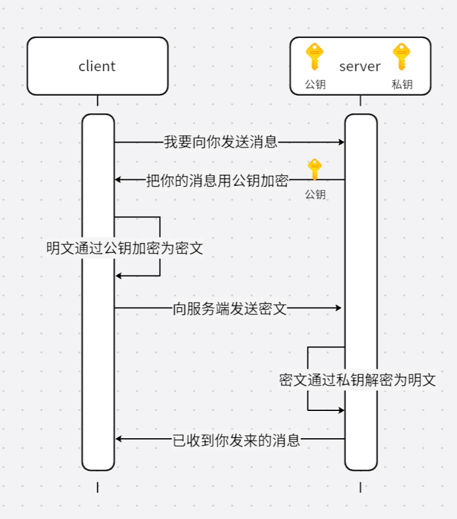

在前面的章节中，我们详细讲解了编码算法和哈希算法，并深入探讨了在`Go`语言中如何使用这些算法。除了这两种算法外，还有一种同样重要的算法——加密算法，也需要我们进行关注和理解。

加密算法用于将信息从可读的形式转换为不可读的形式，以保护数据的隐私和安全。加密算法通过一个密钥将明文数据转换为密文数据，从而防止未经授权的访问或窥探。只有持有正确密钥的人才能解密数据，恢复其原始的明文内容。

加密算法主要分为两大类：对称加密和非对称加密。

> **注意：**下面的概念中，使用到的专业术语是**密钥**而不是~~秘钥~~。

### 1. 对称加密

对称加密的加密和解密过程使用相同的密钥。加密时，明文数据通过密钥转换为密文，而解密时则使用相同的密钥将密文恢复为明文。这种方法的主要优点是计算速度快、效率高。然而，密钥必须在发送方和接收方之间安全地共享，密钥管理成为一个关键挑战。

对称加密的时序图如下所示：

常用的对称加密算法有`AES`、`DES`、`Blowfish`、`RC4`和`ChaCha20`，其中`AES`和`ChaCha20`由于安全性和性能表现更优，在现代加密应用中最为常见。下面详细讲一下`AES`（`Advanced Encryption Standard`，高级加密标准）的代码使用。

### 2. 非对称加密

非对称加密使用一对密钥：公钥和私钥。公钥用于加密数据，私钥用于解密数据。公钥可以公开，任何人都可以用它加密数据，但只有拥有相应私钥的接收者才能解密数据。此方法的优点在于密钥管理更加灵活，特别适用于需要安全数据传输和数字签名的场景。非对称加密的主要缺点是相较于对称加密，其计算过程更为复杂，性能较低。

非对称加密的时序图如下所示：

常用的非对称加密算法包括`RSA`、`ECC`、`DSA`、`ElGamal`和`Diffie-Hellman`，其中`RSA`和`ECC`主要用于加密和签名，`DSA`专注于数字签名，而`Diffie-Hellman`用于安全密钥交换。下面详细讲一下`RSA`加密算法的代码使用。
