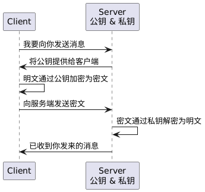

在前面的章节中，我们详细讲解了编码算法和哈希算法，并深入探讨了在`Go`语言中如何使用这些算法。除了这两种算法外，还有一种同样重要的算法——加密算法，也需要我们进行关注和理解。

加密算法用于将信息从可读的形式转换为不可读的形式，以保护数据的隐私和安全。加密算法通过密钥将明文数据转换为密文数据，从而防止未经授权的访问或窥探。只有持有正确密钥的人才能解密数据，恢复其原始的明文内容。

加密算法主要分为两大类：对称加密和非对称加密。

> **注意：**下面的概念中，使用到的专业术语是**密钥**而不是~~秘钥~~。

### 1. 对称加密

对称加密在加密和解密过程中使用相同的密钥。加密时，明文通过密钥转换为密文；解密时，再使用相同的密钥将密文还原为明文。

对称加密的时序图如下所示：


常用的对称加密算法有`AES`、`DES`、`Blowfish`、`RC4`和`ChaCha20`，其中`AES`和`ChaCha20`由于安全性和性能表现更优，在现代加密应用中最为常见。下面详细讲一下`AES`（`Advanced Encryption Standard`，高级加密标准）的代码使用。

`AES`是一种分组加密算法，它会将明文划分为多个`128`位（即`16`字节）大小的分组，并对每个分组分别进行加密。`AES`支持`128`、`192`和`256`位的密钥长度，分别对应`16`、`24`和`32`字节。具体的工作原理，这里不做详细讲解。

在`Go`语言中，可以通过标准库中的`crypto/aes`和`crypto/cipher`包实现`AES-CBC`的加解密操作。整体流程如下：

```scss
// 加密流程
原始明文 → PKCS7填充明文 → 生成随机IV → 使用密钥构造AES加密器 → 创建CBC加密器 → 执行块加密 → 拼接IV+密文 → Base64编码

// 解密流程
Base64解码 → 拆分出IV和密文 → 使用相同密钥构造AES解密器 → 创建CBC解密器 → 执行块解密 → 去除PKCS7填充 → 获取原始明文
```

加密流程中，对原始明文数据进行`PKCS7`填充，函数如下所示：

```go
func pkcs7Padding(data []byte, blockSize int) []byte {
	padding := blockSize - len(data)%blockSize
	padtext := bytes.Repeat([]byte{byte(padding)}, padding)
	return append(data, padtext...)
}
```

`AES-CBC`模式要求明文长度必须是`16`字节（块大小）的整数倍。如果不是，则需要进行填充操作。`PKCS7`填充方式的规则是：添加`N`个字节，每个字节的值均为`N`本身。例如，当明文长度为`14`字节时，需要填充`2`个字节，填充内容为两个值为`0x02`的字节。需要注意的是，即使明文长度刚好是`16`的倍数，也会再填充一整块`0x10`以示区分。

加密流程的代码如下所示：

```go
func encryptAesCbc(plainText, key []byte) (string, error) {
	// 构造AES加密器，参数key即为密钥，长度可为16、24或32字节
	block, err := aes.NewCipher(key)
	if err != nil {
		return "", err
	}
	// 使用PKCS7填充明文长度为16的倍数，这里block.BlockSize()返回值为16
	plainText = pkcs7Padding(plainText, block.BlockSize())
	// 生成随机IV，其中aes.BlockSize为16。IV是CBC模式中必须的，用于防止相同明文产生相同密文
	cipherText := make([]byte, aes.BlockSize+len(plainText))
	iv := cipherText[:aes.BlockSize]
	if _, err = io.ReadFull(rand.Reader, iv); err != nil {
		return "", err
	}
	// 使用IV和AES加密器，创建一个CBC加密器
	mode := cipher.NewCBCEncrypter(block, iv)
	// 对明文进行逐块加密，并使用IV拼接密文，这样解密时就可从前16字节中恢复出原始IV
	mode.CryptBlocks(cipherText[aes.BlockSize:], plainText)
	// 返回Base64编码的密文结果
	return base64.StdEncoding.EncodeToString(cipherText), nil
}
```

解密流程中，去除明文的`PKCS7`填充，恢复原始明文，函数如下所示：

```go
func pkcs7Unpadding(data []byte) []byte {
	length := len(data)
	unpadding := int(data[length-1])
	return data[:(length - unpadding)]
}
```

该函数首先获取输入数据的总长度，然后读取最后一个字节的数值，该数值表示填充的字节数。最后，通过截取前`length - unpadding`个字节，从而移除填充，还原出原始明文。

解密流程的代码如下所示：

```go
func decryptAesCbc(cipherTextBase64 string, key []byte) (string, error) {
	// 使用Base64对输入的拼接密文进行解码
	cipherText, err := base64.StdEncoding.DecodeString(cipherTextBase64)
	if err != nil {
		return "", err
	}
	// 根据拼接密文，提取IV和具体密文内容
	iv := cipherText[:aes.BlockSize]
	cipherText = cipherText[aes.BlockSize:]
	// 使用相同的密钥，构建AES解密器（block对象不区分加密解密）
	block, err := aes.NewCipher(key)
	if err != nil {
		return "", err
	}
	// 使用AES解密器，和解析出的IV，创建CBC解密器
	mode := cipher.NewCBCDecrypter(block, iv)
	// 对密文进行就地解密，dst和src使用同一个切片，解密结果（明文）会覆盖原密文
	mode.CryptBlocks(cipherText, cipherText)
	// 去除对原始明文的填充，恢复原始明文内容
	plainText := pkcs7Unpadding(cipherText)
	return string(plainText), nil
}
```

接下来是使用该`AES-CBC`加解密函数的示例：

```go
func main() {
	// AES的key必须是固定长度（16/24/32），可以使用SHA256等方式生成定长密钥
	key := []byte("1234567890abcdef")
	plainText := "Hello AES in Go"
	encrypted, err := encryptAesCbc([]byte(plainText), key)
	if err != nil {
		log.Fatal(err)
	}
	fmt.Println("加密结果：", encrypted) // 示例：+51zM7yhcENb37TfjLue2h3z9Qmfmtr0p2KMapO294A=
	decrypted, err := decryptAesCbc(encrypted, key)
	if err != nil {
		log.Fatal(err)
	}
	fmt.Println("解密结果：", decrypted) // Hello AES in Go
}
```

对称加密的优势在于计算速度快、执行效率高，适合用于加密大体积数据。但密钥的管理、分发以及安全共享问题需要开发者妥善应对。此外，在客户端与服务端首次通信等开放式场景中，对称加密难以满足需求。

### 2. 非对称加密

非对称加密采用一对密钥：公钥和私钥。其中，公钥用于加密数据，可以对外公开，任何人都可以使用它对数据进行加密；而私钥用于解密数据，由接收方私密保管，只有持有对应私钥的一方才能成功解密。

非对称加密的时序图如下所示：



常用的非对称加密算法包括`RSA`、`ECC`、`DSA`、`ElGamal`和`Diffie-Hellman`，其中`RSA`和`ECC`主要用于加密和签名，`DSA`专注于数字签名，而`Diffie-Hellman`用于安全密钥交换。下面详细讲一下`RSA`（`Rivest–Shamir–Adleman`）加密算法的代码使用。

`RSA`算法的安全性基于大整数因式分解的难题。它使用一对密钥：公钥用于加密，私钥用于解密，或反过来用于数字签名和验签。常见的`RSA`密钥长度有`1024`、`2048`和`4096`位，密钥长度越大，安全性越强，但性能会有所下降。

与`AES`等分组加密算法不同，`RSA`不对明文进行分组，而是直接加密有限长度的数据，其加密长度受密钥长度限制。具体而言，最大加密数据长度为`key_length - padding_overhead`字节，其中`padding_overhead`为填充开销，这里为`11`。由于`RSA`加密效率较低，它常与对称加密结合使用，如用`RSA`加密对称密钥，再用`AES`加密数据。

在`Go`语言中，可以通过标准库中的`crypto/rsa`、`crypto/x509`和`encoding/pem`等包实现`RSA`的加密与解密。整体流程如下：

```scss
// 生成密钥流程
使用RSA生成密钥对 -> 使用x509对私钥和公钥进行编码 -> 使用PEM对私钥和公钥进行二次编码
// 加密流程
解析PEM格式公钥 -> 使用x509对公钥进行解码 -> 使用PKCS1v15填充明文数据 -> 使用公钥进行加密 -> 使用Base64编码密文
// 解密流程
使用Base64解码密文 -> 解析PEM格式私钥 -> 使用x509对私钥进行解码 -> 使用私钥进行解密 -> 移除PKCS1v15填充数据
```

生成`RSA`密钥对的代码如下所示：

```go
func generateRsaKeyPair(bits int) ([]byte, []byte, error) {
	// 生成私钥对象
	privateKey, err := rsa.GenerateKey(rand.Reader, bits)
	if err != nil {
		return nil, nil, err
	}
	// 使用x509编码私钥，将密钥结构序列化为符合PKCS#1标准格式的二进制数据
	privateDer := x509.MarshalPKCS1PrivateKey(privateKey)
	// 使用PEM编码私钥，通过Base64编码将二进制数据转换为文本格式，便于人类阅读、存储和跨平台传输
	privateBlock := pem.Block{
		Type:  "RSA PRIVATE KEY", // 自定义，决定了PEM格式编码后的文本开头和结尾标识
		Bytes: privateDer,
	}
	privatePem := pem.EncodeToMemory(&privateBlock)
	// 获取公钥并进行x509编码
	publicDer := x509.MarshalPKCS1PublicKey(&privateKey.PublicKey)
	// 使用PEM编码公钥
	publicBlock := pem.Block{
		Type:  "RSA PUBLIC KEY",
		Bytes: publicDer,
	}
	publicPem := pem.EncodeToMemory(&publicBlock)
	return privatePem, publicPem, nil
}
```

该函数生成指定长度（如`2048`位）的`RSA`密钥对，并返回`PEM`格式的私钥和公钥字节切片。需要注意的是，`RSA`密钥对的生成过程计算量较大，建议只生成一次，并将公钥与私钥信息分开保存到`.pem`文件中，后续通过加载文件内容使用。

使用公钥加密明文数据，代码如下所示：

```go
func rsaEncrypt(plainText string, publicKeyPem []byte) (string, error) {
	// 解析PEM格式的公钥，忽略的返回值为类型为[]byte的rest
	// 作用：返回输入数据中除已解析出的首个PEM块外的剩余字节内容
	block, _ := pem.Decode(publicKeyPem)
	if block == nil {
		return "", fmt.Errorf("PEM解析公钥失败")
	}
	// 获取到原始的*rsa.PublicKey公钥对象
	pubKey, err := x509.ParsePKCS1PublicKey(block.Bytes)
	if err != nil {
		return "", err
	}
	// 使用PKCS1v15填充明文，并使用公钥加密明文
	cipherText, err := rsa.EncryptPKCS1v15(rand.Reader, pubKey, []byte(plainText))
	if err != nil {
		return "", err
	}
	// 将密文使用Base64编码并返回
	return base64.StdEncoding.EncodeToString(cipherText), nil
}
```

注意：加密数据长度不能超过`key_length - 11`字节，否则会返回`error`。

解密流程中，使用私钥还原出原始明文，代码如下所示：

```go
func rsaDecrypt(cipherTextBase64 string, privateKeyPem []byte) (string, error) {
	// 使用Base64解码密文
	cipherText, err := base64.StdEncoding.DecodeString(cipherTextBase64)
	if err != nil {
		return "", err
	}
	// 解析PEM格式的私钥
	block, _ := pem.Decode(privateKeyPem)
	if block == nil {
		return "", fmt.Errorf("PEM解析私钥失败")
	}
	privKey, err := x509.ParsePKCS1PrivateKey(block.Bytes)
	if err != nil {
		return "", err
	}
	// 使用私钥解密密文，并移除填充数据，获得明文
	plainTextBytes, err := rsa.DecryptPKCS1v15(rand.Reader, privKey, cipherText)
	if err != nil {
		return "", err
	}
	return string(plainTextBytes), nil
}
```

接下来是使用该`RSA`加解密函数的示例：

```go
func main() {
	// 生成RSA密钥对
	privateKey, publicKey, err := generateRsaKeyPair(2048)
	if err != nil {
		log.Fatal(err)
	}
	// 原始明文
	plainText := "Hello RSA in Go"
	// 使用公钥对明文加密，获取密文
	encrypted, err := rsaEncrypt(plainText, publicKey)
	if err != nil {
		log.Fatal(err)
	}
	// 使用私钥对密文解密，获取原始明文
	decrypted, err := rsaDecrypt(encrypted, privateKey)
	if err != nil {
		log.Fatal(err)
	}
	fmt.Println("解密结果：", decrypted) // Hello RSA in Go
}
```

非对称加密的优势在于无需提前共享密钥，使通信过程更加灵活，并具备较高的安全性。然而，其计算过程相对复杂，性能显著低于对称加密；同时，加密数据的长度存在一定限制，且生成的密文通常较长。因此，非对称加密更适用于加密小体积敏感信息。
