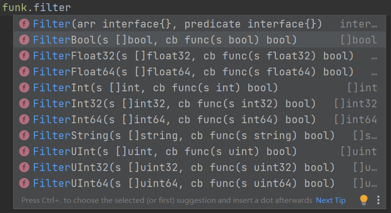

`Go`语言的官方库有一些缺陷，比如我想判断一个元素是否在切片中是否存在，常规方法只能遍历这个切片，挨个对比，才能得出结果，非常麻烦。或者也可以写下面这样一个工具函数：

```go
func Contains[T interface{}](s []T, e T) bool {
	for _, a := range s {
		if reflect.DeepEqual(a, e) {
			return true
		}
	}
	return false
}
```

但这个函数用到了泛型和反射的概念，比较复杂，而且在所有项目模块都要引入这个函数，不方便。

那有没有快捷的`API`完成这个操作呢？当然有！就是我要介绍的`go-funk`包。首先我们下载这个包：

```bash
go get github.com/thoas/go-funk
```

然后用这个包的`funk.Contains`函数完成判断即可，例如：

```go
stringSlice := []string{"apple", "banana", "orange"}
contains := funk.Contains(stringSlice, "grape") // false
```

除了`funk.Contains`，`funk`包还有很多好用的工具函数，下面讲解几个常用的函数。

`funk.Keys`和`funk.Values`用来处理`map`类型的`key`和`value`为切片类型，使用方法如下：

```go
numbers := map[string]int{"a": 1, "b": 2, "c": 3, "d": 4}
keys := funk.Keys(numbers).([]string)  // [a b c d]
values := funk.Values(numbers).([]int) // [1 2 3 4]
```

这两个函数可以搭配`funk.Contains`使用，用来判断一个`map`的`key`或者`value`是否包含指定值：

```go
numbers := map[string]int{"a": 1, "b": 2, "c": 3, "d": 4}
result1 := funk.Contains(funk.Keys(numbers), "e") // false
result2 := funk.Contains(funk.Values(numbers), 3) // true
```

`funk.Filter`有些类似于`Java`的`stream`流，可以根据指定的条件，对切片做过滤，并返回过滤后的切片：

```go
numbers := []int{1, 2, 3, 4, 5, 6, 7, 8, 9, 10}
// 筛选出大于 5 的元素
result := funk.Filter(numbers, func(x int) bool {
	return x > 5
}).([]int)
fmt.Println(result) // [6 7 8 9 10]
```

这里最后是对`[]int`类型进行了类型断言，并省略`ok`参数，这和忽略`ok`参数（`result, _ := xxx.(xx)`）这种写法不同之处在于，前者如果类型不匹配，会报`panic`；后者如果类型不匹配，`result`会被赋值为断言类型的零值。

除了`funk.Filter`，还有以下这些指定了切片参数类型的函数：



同样对应的还有函数`funk.Map`，它可以操作切片或`map`，对每个元素执行指定的操作：

```go
numbers := []int{1, 2, 3, 4, 5}
// 给集合每个元素乘以二
result := funk.Map(numbers, func(x int) int {
	return x * 2
}).([]int)
fmt.Println(result) // [2 4 6 8 10]
```

```go
numbers := map[string]int{"a": 1, "b": 2, "c": 3, "d": 4}
double := func(k string, v int) (string, int) {
	return k, v * 2
}
doubledNumbers := funk.Map(numbers, double).(map[string]int)
fmt.Println(doubledNumbers) // map[a:2 b:4 c:6 d:8]
```

然后就是对两个集合的交集、并集、差集等操作：

```go
set1 := []int{1, 2, 3, 4, 5}
set2 := []int{3, 4, 5, 6, 7}

intersection := funk.Intersect(set1, set2).([]int)
fmt.Println("交集:", intersection) // 交集: [3 4 5]

union := funk.Union(set1, set2).([]int)
union = funk.UniqInt(union) // 去重处理
fmt.Println("并集:", union) // 并集: [1 2 3 4 5 6 7]

diff1, diff2 := funk.DifferenceInt(set1, set2)
fmt.Printf("差集1: %v 差集2: %v", diff1, diff2) // 差集1: [1 2] 差集2: [6 7]
```

我原本打算介绍一个`Join`操作，但由于它需要直接处理反射类型，显得过于复杂，因此我不建议使用它。
