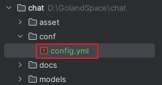
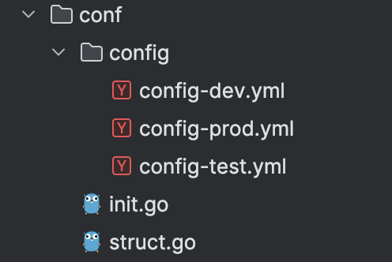

`viper`库是一个读取配置文件的库，它可以处理`json`、`yaml`、`properties`等配置文件，读取这些配置文件配置的信息。下面是`viper`库的具体使用方式，首先安装`viper`库：

```bash
go get github.com/spf13/viper
```

在初始化`viper`时，我们需要指定要读取的配置文件，并将其解析到`viper`的实例中，以便后续使用。例如，我们希望读取`conf`目录下的`config.yml`配置文件，其目录结构如下：



这个配置文件的内容是这样：

```yaml
database:
  host: localhost
  port: 3306
  username: root
  password: password123
  dbname: mundo

features:
  enabled:
    - authentication
    - logging
    - caching

configurations:
  settings:
    api_key: my_api_key
    max_connections: 1000
    log_level: debug
```

我们使用`viper`库读取这个配置文件，有以下两种常见方式：

1. 直接指定配置文件的相对路径。这里的“相对路径”不是相对这行代码所在文件的路径，而是相对于距离该文件最近的`GoModules`管理的目录的相对路径。也就是说，`Go`编译器会从最近的包含`go.mod`文件的目录开始解析这个路径。

```go
viper.SetConfigFile("conf/config.yml")
```

2. 首先指定配置文件的目录路径，为相对于项目根目录的路径。接着指定配置文件名，注意文件名后不需要加`.yml`后缀。

```go
viper.AddConfigPath("conf")
viper.SetConfigName("config")
```

如果在这个路径下有多个以`config`命名的文件，例如`config.json`、`config.properties`，它会按在这个目录下检索顺序来查找，由于首字母顺序把`config.json`排在最前面，所以它会获取`config.json`文件。

这里建议使用第一种方式去指定配置文件。接下来我们使用`ReadInConfig()`函数将配置文件内容解析到`viper`实例中：

```go
err := viper.ReadInConfig()
```

如果指定的配置文件不存在，该函数将返回一个`error`。

上述代码可以封装在`InitConfig`函数内，放置在`utils`目录下的`config.go`文件中，并在主函数中显式调用它：

```go
func InitConfig() error {
	viper.SetConfigFile("conf/config.yml")
	err := viper.ReadInConfig()
	if err != nil {
		wlog.Error("call viper.ReadInConfig failed").Err(err).Log()
		return err
	}
	wlog.Info("InitConfig complete!").Log()
	return nil
}
```

准备工作做好后，就可以用`viper`内部的实例来获取配置信息了。例如我们获取`database`的`host`和`port`属性：

```go
host := viper.GetString("database.host")
port := viper.GetInt("database.port")
```

如果使用错误的类型获取方法获取了类型，例如使用`viper.GetInt`获取`host`，它不会报错，而是获取到对应类型的零值。

对于`yaml`文件中的数组格式和`map`格式的数据，我们同样也可以通过`viper`的类型获取方法获取它：

```go
enabledSlice := viper.GetStringSlice("features.enabled")           // []string 类型
settingsStringMap := viper.GetStringMap("configurations.settings") // map[string]interface{} 类型
```

也可以使用更通用的`viper.Get()`获取一个`interface{}`类型，然后自己进行类型断言。还有更多的`api`，自己参考使用即可。

`viper`支持观察配置文件的变化，并在配置文件发生更改时触发回调函数：

```go
viper.WatchConfig()
viper.OnConfigChange(func(e fsnotify.Event) {
    fmt.Println("Config file changed:", e.Name)
})
```

这里的`viper.WatchConfig()`并不会使程序阻塞，而是启动一个`goroutine`来异步监听，所以需要保证主函数不被关闭。

上文中，我们直接使用包名`viper`调用函数，其内部使用了`viper`包提供的全局变量来操作配置文件。其源码如下：

```go
var v *Viper

func init() {
	v = New()
}
```

如果程序需要加载多个配置文件，可以手动调用`viper.New()`函数来创建一个新的`viper`实例：

```go
v := viper.New()
v.SetConfigFile("conf/config.yml")
err := v.ReadInConfig()
```

这样就可以通过`Viper`的实例`v`，代替`viper`进行配置文件属性的获取了。

`viper`也支持读取远程的配置文件（如`Nacos`配置），这部分内容在`Nacos`的部分有详细讲解。

上面使用`viper.GetString`等方法逐个获取配置项并不够方便。`viper`包提供了一个方法，可以将配置文件的内容反序列化到指定的结构体对象中，之后通过访问对象的属性即可获取配置内容。该方法的签名如下：

```go
func Unmarshal(rawVal interface{}, opts ...DecoderConfigOption) error
func (v *Viper) Unmarshal(rawVal interface{}, opts ...DecoderConfigOption) error
```

把上面配置文件的结构写成`Go`结构体，代码如下所示：

```go
type Config struct {
	Database       Database       `mapstructure:"database"`
	Features       Features       `mapstructure:"features"`
	Configurations Configurations `mapstructure:"configurations"`
}

type Database struct {
	Host     string `mapstructure:"host"`
	Port     int    `mapstructure:"port"`
	Username string `mapstructure:"username"`
	Password string `mapstructure:"password"`
	DBName   string `mapstructure:"dbname"`
}

type Features struct {
	Enabled []string `mapstructure:"enabled"`
}

type Configurations struct {
	Settings Settings `mapstructure:"settings"`
}

type Settings struct {
	ApiKey         string `mapstructure:"api_key"`
	MaxConnections int    `mapstructure:"max_connections"`
	LogLevel       string `mapstructure:"log_level"`
}
```

`viper`默认使用`mapstructure`标签将配置文件的字段映射到结构体字段。这是因为配置文件会先被转换为`map[string]interface{}`格式，然后再将该`map`映射为结构体对象。

将上述代码放入`conf`目录的`config.go`文件，在`utils`目录的`config.go`文件中，创建以下结构体对象：

```go
var (
	Config conf.Config
)
```

在`InitConfig`函数的`viper.ReadInConfig()`后，使用下面这个函数，把配置文件的内容反序列化到结构体对象中：

```go
err := viper.Unmarshal(&Config)  // 必须使用对象的引用
```

这样就可以使用这个结构体对象的属性了，例如这样：

```go
fmt.Println(utils.Config.Database.Host)                  // localhost
fmt.Println(utils.Config.Database.Port)                  // 3306
fmt.Println(utils.Config.Features.Enabled[0])            // authentication
fmt.Println(utils.Config.Configurations.Settings.ApiKey) // my_api_key
```

> **注意：**在使用该结构体对象的字段时，不要将其直接赋值给全局变量。由于全局变量会优先于`viper`执行，这会导致在配置文件尚未反序列化到结构体字段之前，全局变量被赋予字段的零值，从而引发数据不一致的问题。

在实际项目开发中，通常会涉及开发、测试、生产三个环境，这意味着需要维护三套配置文件，假设我们将其命名为`config-dev.yml`、`config-test.yml`、`config-prod.yml`，这三个配置文件都在`conf`目录下。

那么，如何通过`viper`库实现编译或运行时的多配置文件切换呢？以下是三种常见的实现方式：

1. 通过环境变量切换配置文件

我们可以使用环境变量指定当前使用的环境，例如`export env=prod`（`Shell`会话使用）或者`-e env=prod`（`Docker`使用），然后在代码中动态获取环境变量，再拼接到配置文件路径中：

```go
env := os.Getenv("env")
if env == "" {
	env = "dev"
}
viper.SetConfigFile(fmt.Sprintf("conf/config-%s.yml", env))
// 以下部分同上文
```

可通过指定环境变量，在不同环境中运行程序，命令如下：

```sh
env=prod go run main.go
```

如果运行的是已编译的二进制可执行文件，也可以采用相同方式指定环境变量：

```sh
env=prod ./imchat
```

2. 在编译阶段设置环境变量，固定某一环境

修改代码，使用`buildEnv`替代环境变量：

```go
var buildEnv string

func main() {
	if buildEnv == "" {
		buildEnv = "dev"
	}
	viper.SetConfigFile(fmt.Sprintf("conf/config-%s.yaml", buildEnv))
	// 以下部分同上文
}
```

在编译时设置`ldflags`，使用以下命令编译程序：

```sh
go build -ldflags "-X main.buildEnv=prod" -o imchat.exe main.go
```

这样，就可以直接运行已编译的二进制文件：

```sh
.\imchat.exe
```

该方法适用于在编译阶段固定运行环境，特别适合于`CI/CD`流程中，通过在不同阶段（如测试、部署）明确绑定特定环境，从而降低配置错误的风险，确保部署过程的稳定性和一致性。

3. 通过命令行参数切换配置文件

可以使用`flag`这个标准库来动态获取命令行参数：

```go
env := flag.String("env", "dev", "Specify the environment (dev, test, prod)")
flag.Parse()
viper.SetConfigFile(fmt.Sprintf("conf/config-%s.yaml", *env))
// 以下部分同上文
```

运行程序时，可以通过命令行传递环境参数，示例如下：

```sh
go run main.go --env=prod
```

如果运行的是已编译的二进制可执行文件，也可以采用相同方式指定环境变量：

```sh
./imchat --env=prod
```

默认情况下，`Go`语言不会自动将配置文件打包进编译后的二进制文件中。也就是说，如果在本地编译生成了`Linux`环境的二进制文件，部署到`Linux`服务器时，还需要手动同步配置文件到服务器上。否则，程序在运行时将无法找到配置文件，从而导致报错。这种手动同步方式不仅繁琐，还容易因为忘记同步配置文件而导致意外错误。

我们对配置文件相关结构进行了调整：

1. 将`conf`目录下的`config.go`文件重命名为`struct.go`，并将原有的`Config`结构体更名为`YamlConfig`。
2. 将原本位于`utils`目录的`config.go`文件移动至`conf`目录并重命名为`init.go`。
3. 将原本存放在`conf`目录下的所有`.yml`配置文件统一迁移至`conf/config`目录。

调整后的目录结构如下所示：



我们可以使用`embed`包将配置文件打包进二进制文件里。编辑`init.go`，定义一个全局变量，并通过`go:embed`注释，将`config`包中的所有配置文件嵌入到二进制文件：

```go
//go:embed config/*.yml
var configsFS embed.FS // 把所有配置文件打包进embed.FS对象
```

> 使用`go:embed`时，匹配路径是相对于当前`Go`源文件所在目录计算的，而不是相对于项目根目录。此外，`go:embed`不允许路径中包含`..`来访问上级目录，路径必须指向当前源文件所在目录或其子目录中的文件。

接下来，我们修改`InitConfig`函数，通过命令行参数的方式，动态指定需要读取的配置文件名称：

```go
env := flag.String("env", "dev", "Specify the environment (dev, test, prod)")
flag.Parse()
configFile := fmt.Sprintf("config/config-%s.yml", *env)
```

这里的`configFile`所使用的相对路径，也并非从项目根目录计算，而是与`go:embed`中指定的路径保持一致。

然后用`configsFS`对象读取指定的嵌入配置文件：

```go
data, err := configsFS.ReadFile(configFile) // 如果找不到指定名称配置文件，会返回error
```

`ReadFile`方法返回的是一个`[]byte`对象，我们初始化`viper`对象，并从字节流中读取配置：

```go
v := viper.New()
v.SetConfigType("yml") // 指定配置文件类型这一步不可缺少
err = v.ReadConfig(bytes.NewReader(data))
```

之后，就可以通过`Viper`的实例`v`读取配置文件，可以直接读取配置项或将其反序列化为指定的结构体对象：

```go
err = v.Unmarshal(&Config)
```

通过这种方式，我们可以正常打包用于`Linux`环境的二进制文件，而无需手动同步`yml`配置文件。只需在`./`执行程序时通过命令行参数传入环境标识，例如`--env=prod`，即可实现多环境配置文件的自动切换。
