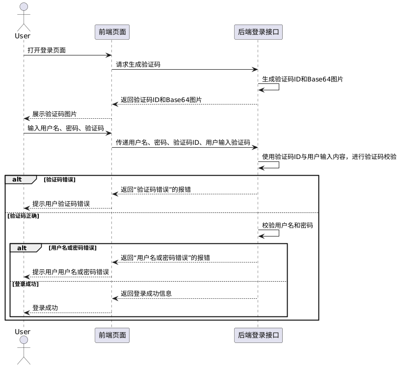

为了抵御自动化攻击并保障系统安全，平台的登录接口应启用图形验证码。登录通常要求输入用户名和密码，若不加任何限制，攻击者可以使用脚本进行大量尝试（例如遍历常用密码或进行字典攻击），即所谓的“暴力破解”。图形验证码引入人工识别步骤，使自动化程序难以通过，从而显著降低暴力破解的成功概率。

除了登录接口外，凡是需要区分真人用户与自动化脚本、以防止接口被滥用的场景，都应启用图形验证码。

我们引入下方这个图形验证码生成库：

```sh
go get github.com/mojocn/base64Captcha
```

该库可生成多种验证码类型，例如数字、字符、算术和音频验证码。

生成数字验证码的驱动的代码如下所示：

```go
// 创建数字验证码驱动：高度80，宽度240，字符个数6，最大扭曲0.7，噪点80
driver := base64Captcha.NewDriverDigit(80, 240, 6, 0.7, 80)
```

后续生成的图片如下所示：


生成字符验证码的驱动的代码如下所示：

```go
// 创建字符验证码驱动：高度80，宽度240，噪点80，不加干扰线，字符个数6
driver := base64Captcha.NewDriverString(
    80, 240, 80, 0, 6, "abcdefghijklmnopqrstuvwxyz0123456789", nil, nil, nil,
)
```

创建字符验证码驱动，支持自定义字符集。后面的三个入参设置为`nil`，分别表示使用默认背景色、默认字体存储器和字体文件列表，我们也可以根据具体业务要求进行更详细的配置。后续生成的图片如下所示：


生成算术验证码的驱动的代码如下所示：

```go
// 创建算术验证码驱动：高度80，宽度240，噪点80，不加干扰线
driver := base64Captcha.NewDriverMath(80, 240, 80, 0, nil, nil, nil)
```

`NewDriverMath`函数的后三个入参和`NewDriverString`函数含义相同。后续生成的图片如下所示：


我们需要在代码中定义一个存储器，用来保存验证码答案，这里使用`base64Captcha`默认的内存存储器`DefaultMemStore`：

```go
store := base64Captcha.DefaultMemStore
```

这是一个全局单例的内存存储器，内部使用`map[string]string`结构，键为验证码的`id`，值为验证码的答案。程序重启或退出后，其中的数据将会丢失。换言之，它的生命周期与程序运行周期一致。

接下来我们使用`driver`和`store`创建验证码生成对象：

```go
captcha := base64Captcha.NewCaptcha(driver, store)
```

生成验证码的方法如下所示：

```go
id, b64s, answer, err := captcha.Generate()
```

其中返回值`id`表示验证码的唯一标识，用于后续校验时从`store`中查找对应记录；`b64s`为验证码图片的`base64`字符串，通常带有前缀`data:image/png;base64,`，用于返回给前端展示；`answer`为验证码的答案，例如数字验证码对应的具体数字或算术题的计算结果，可用于测试或调试，但在生产环境中应忽略该值，避免暴露给客户端。

后续对验证码进行校验的代码如下所示：

```go
userInput := "123456"
if store.Verify(id, userInput, true) { // 第三个参数true表示验证通过后清除答案
	fmt.Println("验证成功")
} else {
	fmt.Println("验证失败")
}
```

以平台登录为例，验证码的作用时序图如下：



验证码的作用时序图，其`PlantUML`代码如下所示：

```scss
@startuml
actor User
participant "前端页面" as Frontend
participant "后端登录接口" as Backend

User -> Frontend : 打开登录页面
Frontend -> Backend : 请求生成验证码
Backend -> Backend : 生成验证码ID和Base64图片
Backend --> Frontend : 返回验证码ID和Base64图片
Frontend --> User : 展示验证码图片

User -> Frontend : 输入用户名、密码、验证码
Frontend -> Backend : 传递用户名、密码、验证码ID、用户输入验证码

Backend -> Backend : 使用验证码ID与用户输入内容，进行验证码校验
alt 验证码错误
    Backend --> Frontend : 返回“验证码错误”的报错
    Frontend --> User : 提示用户验证码错误
else 验证码正确
    Backend -> Backend : 校验用户名和密码
    alt 用户名或密码错误
        Backend --> Frontend : 返回“用户名或密码错误”的报错
        Frontend --> User : 提示用户用户名或密码错误
    else 登录成功
        Backend --> Frontend : 返回登录成功信息
        Frontend --> User : 登录成功
    end
end
@enduml
```

