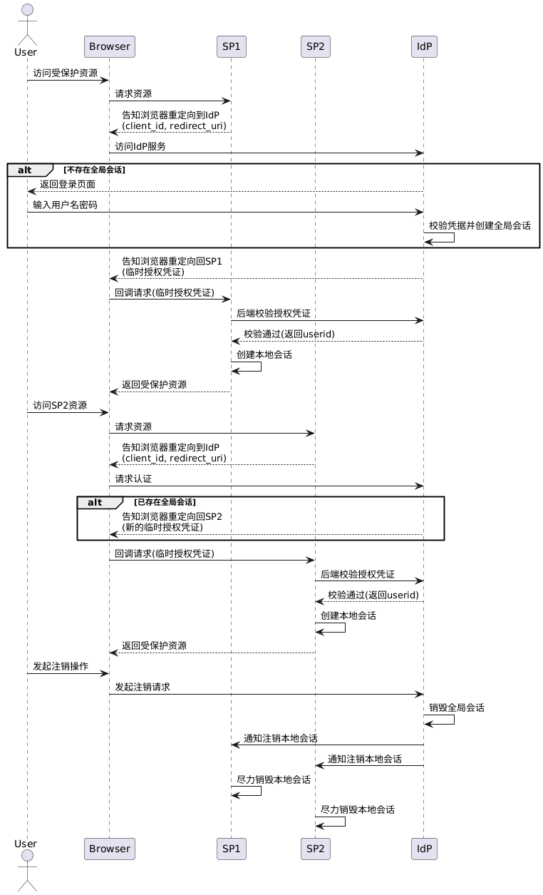

### 一、单机登录

在开发过程中，单点登录常与单机登录混淆。单机登录指同一账号在同一时间只能在有限数量的客户端保持登录状态。例如，有些系统仅允许单个`PC`端以及单个`APP`端登录，也有一些系统会限制最多同时登录`5`个客户端。

在单机登录场景中，通常需要使用有状态的`Token`进行认证。每次用户登录成功后，服务器都会为其生成新的`Token`，并将该`Token`与账号、设备类型、登录时间等信息统一存入`Redis`。可采用以下存储方式：

- 以`login:{user_id}`为`Key`，使用`ZSet`记录该用户当前所有有效`Token`与最近上线时间的时间戳。
- 以`token:{token}`为`Key`，使用`JSON`字符串保存该客户端的设备信息、登录时间，以及用户信息等数据。

在最多同时登录`5`个客户端的场景下，客户端完成登录后会生成对应的`Token`，设置`score`为当前时间戳并写入`ZSet`。后续请求在携带该`Token`时，后端会在确认其仍存在于`ZSet`的前提下同步更新对应的`score`值，否则重新登录。

当新的客户端登录成功后，会将新的`Token`写入`Redis`的`ZSet`，并检查该`ZSet`的元素数量是否已超出限制。如果超出，则根据`score`移除最近上线时间最早的`Token`，同时删除该`Token`在`Redis`中对应的`Key`保存的数据。

若需要在不同终端上分别限制登录数量，例如`PC`端与`APP`端各允许一个客户端登录，可以通过为不同终端使用独立的`Key`进行分桶处理，如`login:pc:{user_id}`与`login:app:{user_id}`。后端识别登录来源的终端类型后，会选择对应的`Key`进行操作。

在这种情况下，如果要控制客户端的登录态过期时间，需要为每个`token:{token}`设置`TTL`，例如`30`天，这样一旦`Token`超过有效期，对应的`Key`会自动过期并被`Redis`删除。

由于`ZSet`本身没有针对内部元素的`TTL`，无法自动清理过期元素，因此在新用户登录时，在判断`ZSet`元素是否超限之前，应先检查`ZSet`中的每个`Token`对应的`Key`是否存在于`Redis`，若不存在，则将该`Token`从`ZSet`中移除。同时，当客户端使用`Token`访问接口时，如果该`Token`仍在`ZSet`中，但对应的`Key`已经不存在，也应将其从`ZSet`中移除。

### 二、单点登录（`SSO`）

单点登录（`SSO`，`Single Sign-On`）本质上是一套跨系统的统一认证机制，由集中化的身份认证与分布式的登录态传递协同构成。其中涉及两个核心角色：`IdP`（`Identity Provider`）与`SP`（`Service Provider`）。`IdP`承担统一的身份认证职责，负责凭证签发与会话管理，所有用户身份数据均集中存储于此；`SP`则专注于自身的业务逻辑，不参与登录认证流程，仅依赖`IdP`完成用户身份的校验。用户只需在`IdP`侧完成一次认证，即可无缝访问所有与该`IdP`建立信任关系的`SP`，无需在各系统间重复登录。

在`SSO`模型中，用户与`IdP`之间建立的是全局会话，与各`SP`之间则分别建立独立的局部会话。局部会话的创建以全局会话的存在为前提，但其生命周期通常由各`SP`自行管理。全局会话存在期间，用户并不一定在所有`SP`中都持有局部会话。当全局会话终止时，系统可借助`SLO`（`Single Logout`）机制联动注销各`SP`的局部会话，但在实际工程落地中，该过程往往只能做到尽力而为，在语义层面保证最终一致性，难以实现严格意义上的强一致注销。

`SSO`的具体落地依赖标准化协议，常见的有以下三种：

1. `SAML 2.0`，基于`XML`断言传递认证信息，协议本身较为厚重，主要面向企业级集成场景；
2. `CAS`，流程相对轻量，票据机制简洁直观，在高校系统与早期互联网应用中较为普遍；
3. `OIDC`，构建于`OAuth 2.0`授权框架之上，通过引入身份层实现标准化的用户认证，是目前互联网场景下的主流选择。

在包含`IdP`与多个`SP`（如`SP1`、`SP2`、`SP3`）的系统中，用户单点登录的整体流程如下：

1. 用户在客户端访问`SP1`受保护资源时，`SP1`检测到本地会话缺失，将用户重定向至`IdP`，重定向请求中携带自身标识`client_id`及回调地址`redirect_uri`，供`IdP`校验`SP1`合法性并在认证成功后将用户导回。
2. 若`IdP`当前不存在全局会话，则向用户展示登录页面，要求输入用户名与密码完成身份认证。凭据校验通过后，`IdP`创建并维护全局会话，通常以全局`Token`的形式存在，同时为目标`SP`签发一枚临时授权凭证，用于后续身份校验。
3. `IdP`通过浏览器重定向将用户导回`SP1`，并在回调中携带上述临时授权凭证。`SP1`收到凭证后，经由后端`API`向`IdP`完成有效性校验，随后为用户建立本地会话，用户即可访问`SP1`的受保护资源。
4. 用户随后访问`SP2`时，`SP2`同样检测到本地会话缺失，将用户重定向至`IdP`。此时`IdP`侧已存在全局会话，无需再次要求登录，直接为`SP2`签发新的临时授权凭证并返回。`SP2`经后端`API`完成校验并建立本地会话后，用户得以无感知地访问`SP2`资源。
5. 用户发起注销时，`IdP`可触发`SLO`（`Single Logout`）机制，尝试通知所有已参与的`SP`销毁对应的本地会话。受限于网络状况与各`SP`实现差异，跨`SP`的联动注销通常只能保证最终一致性，部分`SP`的会话失效可能存在延迟甚至失败的情况。

用户单点登录的时序图如下所示：



用户单点登录的时序图，其`PlantUML`代码如下所示：

```scss
@startuml
actor User
participant Browser
participant SP1
participant SP2
participant IdP

User -> Browser: 访问受保护资源
Browser -> SP1: 请求资源
SP1 --> Browser: 告知浏览器重定向到IdP\n(client_id, redirect_uri)
Browser -> IdP: 访问IdP服务

alt 不存在全局会话
    IdP --> User: 返回登录页面
    User -> IdP: 输入用户名密码
    IdP -> IdP: 校验凭据并创建全局会话
end

IdP --> Browser: 告知浏览器重定向回SP1\n(临时授权凭证)
Browser -> SP1: 回调请求(临时授权凭证)
SP1 -> IdP: 后端校验授权凭证
IdP --> SP1: 校验通过(返回userid)
SP1 -> SP1: 创建本地会话
SP1 --> Browser: 返回受保护资源

User -> Browser: 访问SP2资源
Browser -> SP2: 请求资源
SP2 --> Browser: 告知浏览器重定向到IdP\n(client_id, redirect_uri)
Browser -> IdP: 请求认证

alt 已存在全局会话
    IdP --> Browser: 告知浏览器重定向回SP2\n(新的临时授权凭证)
end

Browser -> SP2: 回调请求(临时授权凭证)
SP2 -> IdP: 后端校验授权凭证
IdP --> SP2: 校验通过(返回userid)
SP2 -> SP2: 创建本地会话
SP2 --> Browser: 返回受保护资源

User -> Browser: 发起注销操作
Browser -> IdP: 发起注销请求
IdP -> IdP: 销毁全局会话
IdP -> SP1: 通知注销本地会话
IdP -> SP2: 通知注销本地会话
SP1 -> SP1: 尽力销毁本地会话
SP2 -> SP2: 尽力销毁本地会话
@enduml
```

