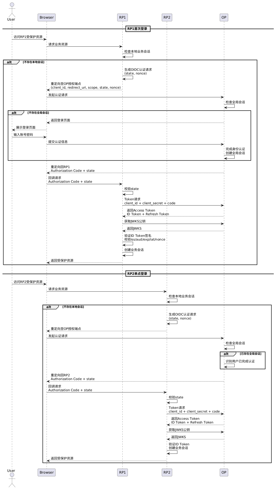

`OIDC`（`OpenID Connect`）是构建于`OAuth 2.0`授权框架之上的身份认证协议。在保留`OAuth 2.0`授权能力的基础上，`OIDC`进一步引入统一的身份层，为客户端提供标准化的身份认证结果。在关于`OAuth 2.0`的笔记中已经介绍过，`OAuth 2.0`解决的是授权问题，即用户授权第三方应用代表自己访问资源服务器上的受保护资源。

但`OAuth 2.0`规范本身并没有定义如何表达「用户已经完成身份认证」，也没有规定客户端应如何验证此次登录对应的用户身份。它关注的是客户端是否获得了合法的资源访问权限，而不是客户端是否能够标准化地确认当前登录用户的真实身份。

以「用户通过微信登录小红书」为例，在仅使用`OAuth 2.0`授权码模式的情况下，授权流程完成后，小红书服务端会获得一枚访问令牌，随后可以携带该令牌调用微信资源服务器提供的用户信息接口，获取头像、昵称等资料。

对于小红书而言，虽然能够确认当前`AccessToken`具备访问用户资料接口的权限，但仅依靠`OAuth 2.0`协议本身，仍无法确认当前用户是否刚刚完成了一次身份认证，而不仅仅是持有一枚未过期的`AccessToken`；也无法判断这次认证结果是否专门签发给当前客户端，是否对应用户本次主动发起的登录请求，以及不同身份提供方之间是否具有统一的用户身份标识和声明规范。

造成这一问题的根本原因在于，`OAuth 2.0`定义的是授权框架，而不是身份认证协议。

`OAuth 2.0`规范并未要求`AccessToken`必须包含身份认证相关信息，也没有规定统一的令牌格式。不同身份提供方可以采用不同实现方式，例如使用随机字符串作为不透明令牌，或使用`JWT`作为令牌格式。即使某些`JWT`格式的`AccessToken`中包含`iss`、`aud`、`sub`、`exp`等声明，这些字段也属于具体实现中的扩展内容，并非`OAuth 2.0`协议定义的标准身份声明。

因此，客户端不能依赖`AccessToken`完成用户身份认证。换句话说，在`OAuth 2.0`中，客户端能够证明的是「我被授权访问资源」，但无法标准化地证明「用户已经完成身份认证，并且当前用户就是某个确定的身份」。

这正是`OIDC`诞生的原因。`OIDC`在`OAuth 2.0`授权框架基础上引入了一套标准化的身份认证机制，当用户完成身份认证并成功授权后，`OIDC`授权服务器除了返回用于访问资源的`AccessToken`之外，还会额外签发一枚`ID Token`。

`ID Token`采用`JWT`格式，由身份提供方进行数字签名，其中包含用户身份信息以及本次认证相关的标准化声明。例如，`iss`表示身份提供方，`sub`表示用户唯一标识，`aud`表示本次认证面向的客户端，`exp`表示过期时间，`iat`表示签发时间，`auth_time`表示用户完成身份认证的时间，`nonce`用于关联本次认证请求并防止认证结果被重放。

将`JWT`的`Payload`部分解码后的示例结果如下所示：

```json
{
  "iss": "https://idp.example.com",
  "sub": "user-123456789",
  "aud": "client-app-id",
  "exp": 1722489600,
  "iat": 1722486000,
  "auth_time": 1722485900,
  "nonce": "n-0S6_WzA2Mj",
  "name": "张三",
  "email": "zhangsan@example.com",
  "email_verified": true,
  "acr": "urn:mace:incommon:iap:silver",
  "amr": ["pwd", "mfa"],
  "azp": "client-app-id",
  "sid": "session-abcdef123456"
}
```

客户端收到`ID Token`后，需利用身份提供方公开的公钥验证其数字签名是否合法，并按照`OIDC`规范进一步校验`iss`、`aud`、`exp`、`iat`、`nonce`等声明，从而确认令牌的真实性、有效性以及对应的用户身份。

因此，两者的职责可以明确区分如下：

- `OAuth 2.0`负责回答「客户端是否被授权访问资源」。

- `OIDC`负责回答「当前登录的用户是谁」，并向客户端提供可验证的身份认证结果。

实际项目中的第三方登录通常会同时使用二者，由`OAuth 2.0`负责授权，由`OIDC`负责标准化身份认证。

微信登录目前采用的是基于`OAuth 2.0`的登录方案，并未对外提供符合`OIDC`标准的`ID Token`及相关身份认证接口，因此开发者通常仍需要依赖`openid`、用户信息接口等平台特有机制完成身份确认。

而对于支持`OIDC`的平台，例如`Google`、`Microsoft Entra ID`、`Auth0`、`Keycloak`等，则可以按照统一的`OIDC`规范完成身份认证流程。客户端无需针对不同身份提供方设计独立的身份校验逻辑，只需要按照`OIDC`标准验证`ID Token`即可完成用户身份确认。

回归单点登录，在现代互联网和企业内部系统中，`OIDC`通常作为实现`SSO`的一种标准协议。

例如，一个企业可能存在多个业务系统，如办公系统、客户管理系统、财务系统等。如果每个系统都独立维护用户账号和密码，用户需要在不同系统之间重复登录，同时企业也需要维护多套用户体系。此时，可以引入统一身份中心`OP`（`OpenID Provider`），并将各业务系统接入其中，作为`RP`（`Relying Party`）角色。`OP`负责完成用户身份认证并签发`ID Token`，`RP`负责验证`ID Token`的有效性，并基于认证结果建立自身业务会话。通过多个`RP`共享同一个`OP`，用户即可实现一次认证、多系统访问的单点登录体验。

假设企业内部存在办公系统、客户管理系统、财务系统三个业务系统，分别作为`RP1`、`RP2`、`RP3`接入统一身份中心`OP`。在接入前，各业务系统需要先在`OP`完成客户端注册，注册成功后由`OP`为其分配唯一的`client_id`以及用于后端身份校验的`client_secret`，同时配置允许的`redirect_uri`等信息。后续单点登录的流程如下：

1. 用户访问`RP1`受保护资源时，`RP1`检查本地业务会话是否存在。若不存在，则生成`OIDC`认证请求，并将用户重定向至`OP`授权端点。请求通常携带`client_id`、`redirect_uri`、`response_type`、`scope`、`state`和`nonce`等参数。其中，`scope`通常包含`openid`表示启用`OIDC`身份认证流程，`state`用于防止跨站请求伪造，`nonce`用于防止认证结果被重放。
2. 用户被重定向至`OP`后，`OP`检查是否存在全局会话。若用户未登录，则要求完成身份认证，成功后创建全局会话。随后，`OP`通过浏览器重定向回`RP1`的`redirect_uri`，并返回一次性授权码`Authorization Code`以及原始`state`参数。
3. `RP1`收到授权码和`state`后，首先校验`state`是否与本地保存的值一致，以确认该认证响应来自当前发起的登录流程。校验通过后，`RP1`通过后端服务向`OP`令牌端点发起请求，使用`client_id`、`client_secret`和授权码交换令牌。`OP`校验授权码有效性后，返回`Access Token`、`ID Token`以及可选的`Refresh Token`。
4. `RP1`收到`ID Token`后，首先使用`OP`公开的`JWKS`公钥集合验证`JWT`签名，然后校验`iss`、`aud`、`exp`、`iat`、`nonce`等关键声明。验证通过后，`RP1`即可确认用户身份，并根据`sub`作为用户唯一标识创建自身业务会话。
5. 当用户随后访问`RP2`时，`RP2`发现自身不存在本地会话，因此生成新的`OIDC`认证请求并重定向至`OP`。由于浏览器已保存`OP`侧全局会话信息，`OP`能够识别用户已完成认证，无需再次输入账号密码，直接返回`Authorization Code`以及原始`state`参数。
6. `RP2`收到授权码和`state`后，先校验`state`合法性，确认响应对应当前发起的认证请求。验证通过后，通过后端服务向`OP`交换令牌，使用`client_id`、`client_secret`和授权码获取`Access Token`、`ID Token`以及可选的`Refresh Token`。随后验证`ID Token`有效性，确认用户身份并创建业务会话。用户无需再次登录，即可访问多个接入同一`OP`的业务系统。

基于`OIDC`的单点登录核心时序流程如下图所示：



基于`OIDC`的单点登录核心时序流程，其`PlantUML`代码如下所示：

```scss
@startuml
actor User
participant Browser
participant RP1
participant RP2
participant OP

== RP1首次登录 ==

User -> Browser: 访问RP1受保护资源
Browser -> RP1: 请求业务资源

RP1 -> RP1: 检查本地业务会话

alt 不存在本地会话
    RP1 -> RP1: 生成OIDC认证请求\n(state, nonce)
    RP1 --> Browser: 重定向至OP授权端点\n(client_id, redirect_uri, scope, state, nonce)
    Browser -> OP: 发起认证请求

    OP -> OP: 检查全局会话

    alt 不存在全局会话
        OP --> Browser: 返回登录页面
        Browser --> User: 展示登录页面
        User -> Browser: 输入账号密码
        Browser -> OP: 提交认证信息
        OP -> OP: 完成身份认证\n创建全局会话
    end

    OP --> Browser: 重定向回RP1\nAuthorization Code + state
    Browser -> RP1: 回调请求\nAuthorization Code + state

    RP1 -> RP1: 校验state

    RP1 -> OP: Token请求\nclient_id + client_secret + code
    OP --> RP1: 返回Access Token\nID Token + Refresh Token

    RP1 -> OP: 获取JWKS公钥
    OP --> RP1: 返回JWKS

    RP1 -> RP1: 验证ID Token签名\n校验iss/aud/exp/iat/nonce
    RP1 -> RP1: 创建业务会话

    RP1 --> Browser: 返回受保护资源
end


== RP2单点登录 ==

User -> Browser: 访问RP2受保护资源
Browser -> RP2: 请求业务资源

RP2 -> RP2: 检查本地业务会话

alt 不存在本地会话
    RP2 -> RP2: 生成OIDC认证请求\n(state, nonce)
    RP2 --> Browser: 重定向至OP授权端点
    Browser -> OP: 发起认证请求

    OP -> OP: 检查全局会话

    alt 已存在全局会话
        OP -> OP: 识别用户已完成认证
    end

    OP --> Browser: 重定向回RP2\nAuthorization Code + state
    Browser -> RP2: 回调请求\nAuthorization Code + state

    RP2 -> RP2: 校验state

    RP2 -> OP: Token请求\nclient_id + client_secret + code
    OP --> RP2: 返回Access Token\nID Token + Refresh Token

    RP2 -> OP: 获取JWKS公钥
    OP --> RP2: 返回JWKS

    RP2 -> RP2: 验证ID Token\n创建业务会话

    RP2 --> Browser: 返回受保护资源
end
@enduml
```

