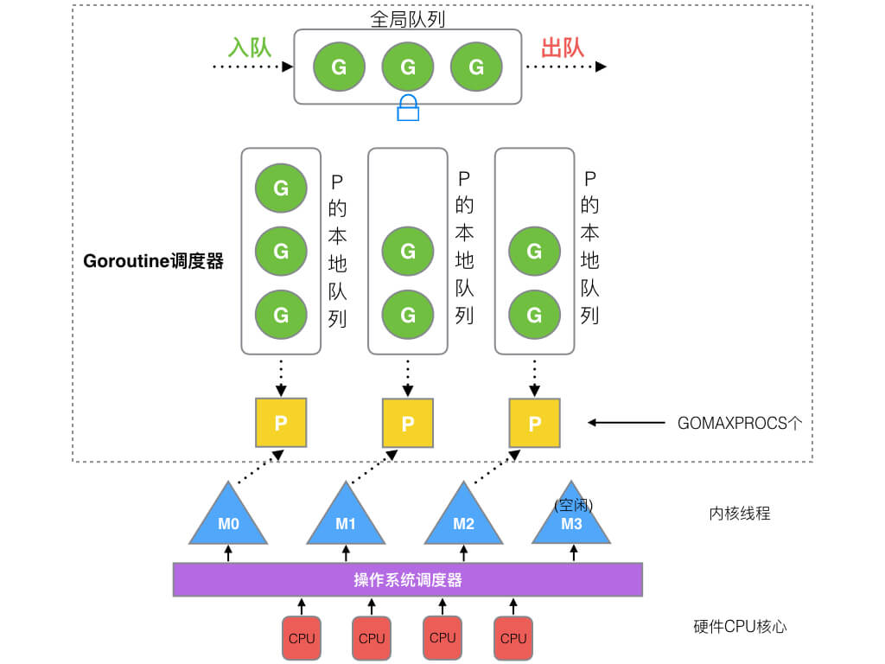

`Go`语言的`GMP`模型是并发编程的核心，负责调度和执行`Goroutine`。该模型由三个关键组成部分构成：`G`（协程）、`M`（机器线程）和`P`（处理器），它们通过协同工作实现高效的并发执行。具体说明如下：

- `G`（`Goroutine`，协程）：`G`是`Go`语言中的并发执行单元，类似于轻量级线程。与传统线程相比，`G`的创建和销毁开销极小，这使得程序可以轻松创建和管理成千上万个并发任务，从而提高并发性能和系统吞吐量。
- `M`（`Machine`，机器线程）：`M`是操作系统线程的抽象。每个`M`都与一个操作系统级线程关联，负责在操作系统层面执行`G`。`Go`运行时调度器根据系统负载动态管理`M`的数量，确保在不同的负载情况下系统的并发性能达到最优。
- `P`（`Processor`， 处理器）：`P`代表调度器的上下文，负责管理`G`的队列和调度状态。通过`GOMAXPROCS`配置，可以限制并行执行的`G`数量。每个`P`持有自己的本地队列，用于分配和调度`G`在`M`上执行。本地队列已满时，部分`G`会被转移到全局队列。相反，当本地队列为空时，它会使用`Work Stealing`策略从全局队列或其他`P`的队列中窃取任务，提高资源利用率并减少空闲等待。

> `P`与`M`之间的关系是动态的，`Go`运行时根据负载情况灵活调整二者的映射关系，并不是固定的一对一。

通过`GMP`模型，`Go`语言实现了轻量化、高效的并发处理，开发者可以轻松编写并发安全的代码，同时最大化利用多核处理器的性能。这种设计使得`Goroutine`在高并发场景下执行效率极高，并显著提升系统资源的利用率。

`GMP`模型执行流程图如下：

在`GMP`模型中，`P`在调度过程中发挥了关键作用，主要通过本地队列和全局队列来管理可并行执行的`Goroutine`数量。那么，为什么不将这个功能直接集成到`M`中呢？通常情况下，`M`的数量要远大于`P`。在`Go`运行时，`M`的默认最大数量为`10000`，而`P`的数量通常与`CPU`核心数相等（由`GOMAXPROCS`控制）。这样的设计使得系统能够灵活适应负载并充分利用多核处理器的优势。

如果将`P`的功能直接集成到`M`中，那么每个`M`都将拥有一个独立的本地队列。这种设计会带来以下几个问题：

1. 管理复杂度增加：调度器需要管理更多的本地队列，增加了调度的复杂性，并且可能导致任务调度的不均衡。例如，一些队列可能会积压大量任务，而其他队列则可能空闲，从而影响系统的整体性能。
2. 降低`Work Stealing`效率：过多的本地队列可能会降低`Work Stealing`算法的效率。因为`M`的数量较多，某些`M`可能会变得过载，而其他`M`则处于空闲状态。这样一来，`Work Stealing`的机制就难以有效地平衡负载，导致一些`M`无用功或资源浪费。
3. 阻塞处理复杂化：当一个`M`因系统调用或`I/O`操作而被阻塞时，调度器需要将未执行的`Goroutine`重新分配。如果每个`M`都持有独立的本地队列，任务重新调度将变得更加复杂。相反，通过将队列的管理集中在`P`中，调度器可以更方便地将一个未阻塞的`M`与`P`绑定，从而继续执行队列中的任务，避免任务调度的复杂性。

说到这里，我们再详细讲一下进程、线程、协程的区别与关联：

- 进程是程序在操作系统中独立运行的实例，是资源分配的基本单位。每个进程拥有独立的内存空间，包括代码段、数据段、堆和栈。由于进程间的数据隔离性，它们不能直接共享内存，必须通过进程间通信（`Inter-Process Communication`，`IPC`）机制（如管道、信号、共享内存、消息队列等）进行数据交换。进程的创建和销毁开销较大，因为涉及资源分配和回收。

- 线程是进程内的独立执行流，是`CPU`调度的基本单位。一个进程可以包含多个线程，所有线程共享进程的内存空间和其他资源（如文件描述符），这使得线程间的数据交换更加高效。与进程相比，线程的创建和销毁开销较小，线程间的并发执行有助于提升程序性能。然而，线程共享资源也引入了并发控制问题，例如死锁和竞态条件。

- 协程是一种更加轻量级的并发执行单元，由用户态代码进行调度，不依赖操作系统内核。协程可以在执行过程中主动挂起和恢复，避免了系统调用和内核态的上下文切换，因此切换开销非常小，特别适合用于`I/O`密集型任务和异步编程。与线程相比，协程在高并发场景下能够提供更高的执行效率。同样地，使用协程时仍然需要注意并发控制问题。
