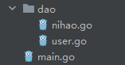
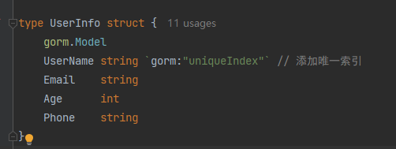
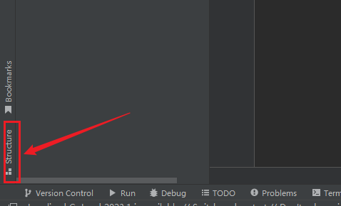
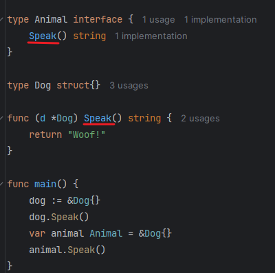
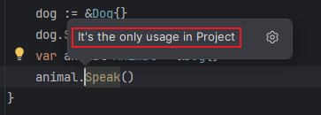
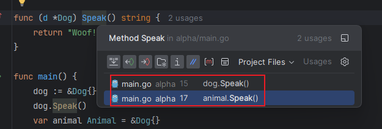

`Go`语言具备面向对象的特性，但与`Java`等传统面向对象语言有所不同。`Go`的类（结构体）并不在内部定义方法，接口的实现也采用隐式机制，而非显式声明。此外，`Go`的方法可以分散定义在同一包中的不同文件里。例如，文件结构如下：

我们在`user.go`里定义了结构体`UserInfo`：

它有一个方法，定义在和`user.go`同目录下的文件`nihao.go`里，名字叫`getUserInfo`：

我们定义了一个接口`GetInfo`，该接口仅包含一个方法`getUserInfo`。由于结构体`UserInfo`已经实现了这个方法，因此可以认为结构体`UserInfo`已经实现了接口`GetInfo`。

那么如何查看结构体`UserInfo`实现了哪些接口呢？可以点击结构体左侧的绿色箭头：

如果结构体仅实现一个接口，点击绿色箭头会直接跳转；若实现多个接口，则会弹出接口的列表，可选择任意一个进行跳转。

要查看结构体的所有方法，可以进入结构体所在的文件，点击下方的`Structure`按钮：

点击后，可以看到该结构体包含的所有字段和方法，并且可以查看每个方法所在的文件位置：

对于以下代码，结构体`Dog`实现了接口`Animal`。我们分别创建了`Dog`和`Animal`类型的实例，并调用了`Speak`方法。通过按住`Ctrl`（或`Command`）并点击接口定义中的`Speak`方法与结构体实现的`Speak`方法，会得到不同的结果：

点击接口定义的`Speak`方法时，它只会跳转到接口类型对象`animal`调用的`Speak`方法：

点击结构体实现的`Speak`方法时，它会显示出结构体类型对象和接口类型对象调用`Speak`方法的选项，供我们选择：

