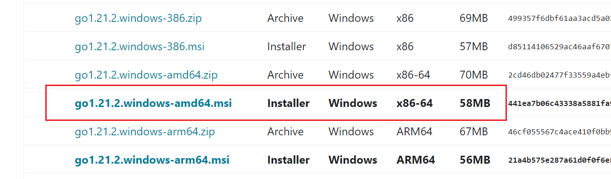
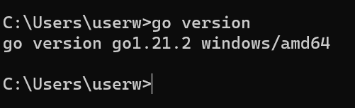
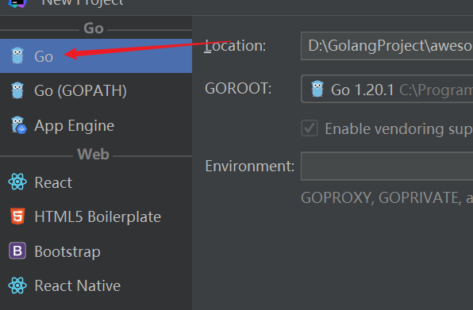
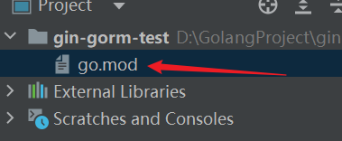
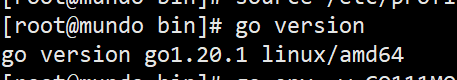
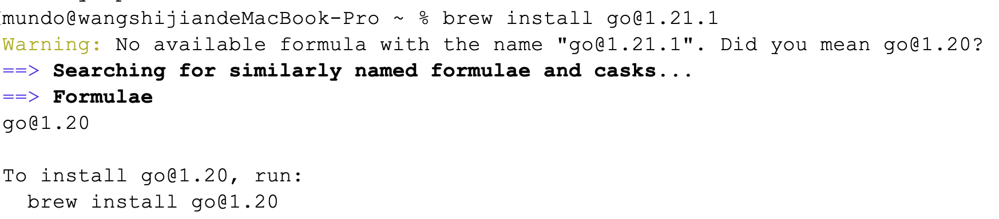
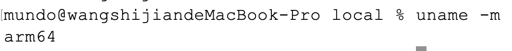
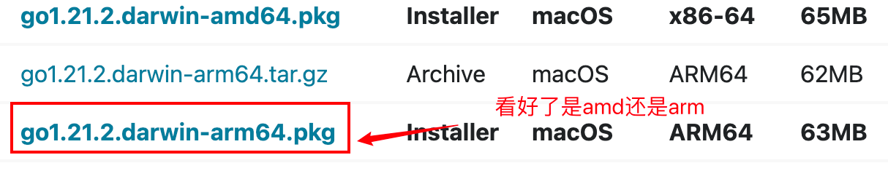
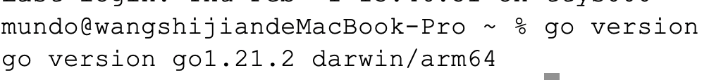

### Windows11

go语言各版本下载网站：https://go.dev/dl/

对于windows来说，可以看看自己电脑是什么版本，例如我的就是x86-64版本，选择x86-64版本的Go下载。



这里我选择的是1.21.2版本。

下载完毕后，安装，直接一路下一步，安装完成。



安装完成后，不需要我们手动配置`C:\Program Files\Go\bin`到环境变量，系统已经自动配置好了。

这里我们也可以查看一下环境变量信息，或者在控制台输入`go env`，查看环境，主要查看的是GOROOT信息。

由于我们需要用到GoModules来管理项目，所以有两个环境变量是需要我们关注的：

```bash
set GO111MODULE=on
set GOPROXY=https://goproxy.cn,direct
```

设置第一个参数为on，第二个参数，这个cn是设置的是国外的，我们要给它改成国内镜像。

```bash
go env -w GO111MODULE=on
go env -w GOPROXY=https://goproxy.io,direct
```

我们这里再配置一个GOBIN参数（GOPATH下面的bin目录）：

```bash
go env -w GOBIN=C:\Users\userw\go\bin
```

这样就ok了，至于GOPATH，我们可以不用改它的目录位置，它有一个默认的安装位置。

GOPATH用来存储我们使用`go get`或者`go install`下载的内容。

然后我们在使用Goland新建项目时，注意不要新建依赖GOPATH的项目即可，新建完成后，看看有没有go.mod文件，如果有，说明是使用go Modules管理的。





然后我们就可以使用go mod命令对项目模块进行管理了。

### Linux（Centos）

首先准备一个压缩包的安装目录，随便指定一个就可以。

在这个安装目录下面，执行以下命令：

```shell
wget https://dl.google.com/go/go1.20.1.linux-amd64.tar.gz
```

这里我下载的是1.20.1版本，和Windows11上的对应。

下载完后，给其解压到 /usr/local 目录下（官方推荐）

```shell
tar -C /usr/local -zxvf go1.20.1.linux-amd64.tar.gz
```

解压完后，配置环境变量，一般配置到 /etc/profile 文件里，在这个文件最后两行添加：

```shell
export GOROOT=/usr/local/go
export PATH=$PATH:$GOROOT/bin
```

添加后保存退出，然后 source 一下，重新加载配置文件。

验证是否安装成功：



然后配置GoModules相关内容：

```shell
go env -w GO111MODULE=on
go env -w GOPROXY=https://goproxy.io,direct
```

### Mac

使用Macbook，我们可以使用homebrew完成go环境的下载。

我们首先使用以下命令：

```bash
brew install go@1.21.1
```

出现了这样一个问题：



可能是brew对go的更新版本太旧，没有1.21.1这个版本。

于是我们使用下面命令：

```bash
brew install go@1.20
```

这样就可以下载了，下载后再执行一下下面这条命令：

```bash
brew link go@1.20 --force
```

这条命令是将指定版本的Go软件包链接到系统中，使其成为系统默认的Go版本。

这条命令的逆命令是：

```bash
brew unlink go@1.20
```

操作完这个，查看下go的版本，看看是否安装成功：


同样要设置`go env`的一些属性：

```sh
go env -w GO111MODULE=on
go env -w GOPROXY=https://goproxy.io,direct
go env -w GOPATH=/Users/mundo/Personal/go
go env -w GOBIN=/Users/mundo/Personal/go/bin
```


想使用brew卸载go，使用以下命令：

```
brew uninstall go
```

然后我们看看如何在官网下载go的，首先查看一下自己Mac的架构：

```sh
uname -m
```



然后去官网查询对应版本，下载，需要下载pkg结尾的文件。



下载完点击开，一路下一步就可以。

环境变量系统自己就配好了，我们使用下面命令查看go版本



安装成功，然后还是设置go env的一些属性：

```sh
go env -w GO111MODULE=on
go env -w GOPROXY=https://goproxy.io,direct
go env -w GOPATH=/Users/mundo/Personal/go
go env -w GOBIN=/Users/mundo/Personal/go/bin
```

如果之前安装过go，这些配置会保留下来，就不用重新配置了。

这种情况安装的GOROOT是：`GOROOT='/usr/local/go'`