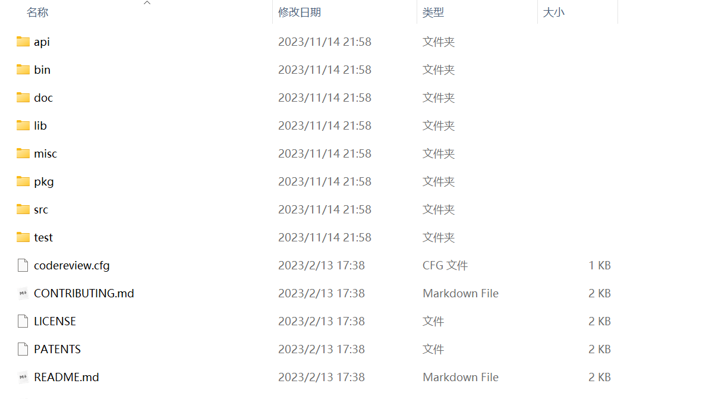
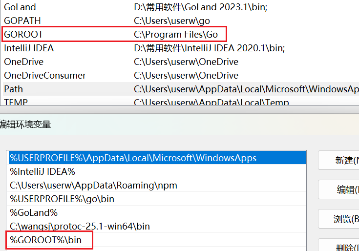

GOROOT是Go语言的安装目录，指定了Go编译器和标准库的位置。

GOROOT包含了Go语言的标准库、编译器、工具和其他必要的文件和目录。

也就是说，我们的GOROOT格式大概是：C:\Program Files\Go

当我们安装Go语言时，就需要指定这个安装路径GOROOT，在这个路径下，会有一些重要的子目录：

bin目录：包含编译后的可执行文件，这个目录要被配置到环境变量PATH下面。

src目录：包含Go语言标准库的源代码，例如fmt、http等等。

api目录：这里存储了一些用于生成和维护 Go API 文档的工具和配置。