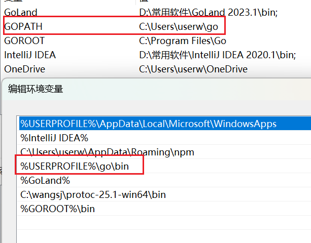

GOPATH是一个环境变量，用于指定工作空间的根目录，包含了Go项目的源代码文件、包对象文件以及可执行文件。在Go Modules管理依赖后，Go项目的源代码就不用放在GOPATH下面了。

GOPATH下面的文件夹：

src：用于存放项目源代码。有了Go Modules后，这个文件夹不需要了。

pkg：用于存放编译后的包对象文件。项目中引用其他包时，会编译它们，保存在mod目录下。

bin：存放可执行文件。使用 go install 命令安装Go程序时，在这个目录下生成可执行文件。

同样，GOPATH的bin也需要配置到环境变量Path里

从Go 1.11后，都会设置默认的GOPATH，如果你自己没有设置GOPATH，Go会设置默认值：

在Windows系统下是：`C:\Users\你的用户名\go`

在Unix-like（如Linux、Mac）下是：`~/go`，也就是`/Users/你的用户名/go`