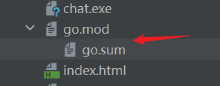

我们在使用GoModules管理项目时，会依赖两个文件，go.mod和 go.sum。

这两个文件在目录中的结构是这样的。



### go.mod

go.mod文件的内容是如下的（部分）

```go
module ginchat

go 1.20

require (
	github.com/aliyun/aliyun-oss-go-sdk v2.2.4+incompatible
	github.com/asaskevich/govalidator v0.0.0-20210307081110-f21760c49a8d
	github.com/gin-gonic/gin v1.7.7
	github.com/go-redis/redis/v8 v8.11.5
	github.com/gorilla/websocket v1.5.0
	github.com/spf13/viper v1.11.0
	github.com/swaggo/files v0.0.0-20210815190702-a29dd2bc99b2
	github.com/swaggo/gin-swagger v1.4.3
	github.com/swaggo/swag v1.8.2
	gopkg.in/fatih/set.v0 v0.2.1
	gorm.io/driver/mysql v1.3.3
	gorm.io/driver/postgres v1.5.4
	gorm.io/gorm v1.25.5
)
```

`module` 声明模块路径，这个是我们使用`go mod init <module-path>`的这个`<module-path>`的值，一般`<module-path>`的值设置为`Git`的域名路径+项目名，以确保唯一性，例如项目域名是`github.com/mundo`，项目名是`wchat`，`module`的值可以设置为`github.com/mundo/wchat`。

也就是保证，之后推到Git远程仓库（如Github）后，可以通过这个路径访问到。

这样设置的好处是方便之后给外部模块或者其他项目去使用。具体使用方式可以参考下面这个：

[Go1.18 新特性：多 Module 工作区模式 - 掘金 (juejin.cn)](https://juejin.cn/post/7056623982358822919)

可以使用下面命令查看指定目录被哪个`GoModules`所管理，他会输出`<module-path>`的内容：

```bash
go list -m
```

如果输出：command-line-arguments，表示这个目录没有被`GoModules`所管理.

`go 1.20` 指定我们项目使用的Go语言的版本。

`require`代码块，列举了项目所依赖的其他模块以及它们的版本。

除了上面这些，`go.mod` 文件还有 `replace`（替代模块）、`exclude`（排除模块），它们是可选的。

`require` 列举的项目依赖，都会被下载并保存在 `$GOPATH/pkg/mod`下面

例如在我的本机，就保存在了：`C:\Users\userw\go\pkg\mod`

### go.sum

go.sum的文件内容都是这样的

```go
github.com/BurntSushi/toml v0.3.1/go.mod h1:xHWCNGjB5oqiDr8zfno3MHue2Ht5sIBksp03qcyfWMU=
github.com/BurntSushi/xgb v0.0.0-20160522181843-27f122750802/go.mod h1:IVnqGOEym/WlBOVXweHU+Q+/VP0lqqI8lqeDx9IjBqo=
github.com/KyleBanks/depth v1.2.1 h1:5h8fQADFrWtarTdtDudMmGsC7GPbOAu6RVB3ffsVFHc=
github.com/KyleBanks/depth v1.2.1/go.mod h1:jzSb9d0L43HxTQfT+oSA1EEp2q+ne2uh6XgeJcm8brE=
github.com/PuerkitoBio/purell v1.1.1/go.mod h1:c11w/QuzBsJSee3cPx9rAFu61PvFxuPbtSwDGJws/X0=
github.com/PuerkitoBio/urlesc v0.0.0-20170810143723-de5bf2ad4578/go.mod h1:uGdkoq3SwY9Y+13GIhn11/XLaGBb4BfwItxLd5jeuXE=
github.com/agiledragon/gomonkey/v2 v2.3.1/go.mod h1:ap1AmDzcVOAz1YpeJ3TCzIgstoaWLA6jbbgxfB4w2iY=
github.com/aliyun/aliyun-oss-go-sdk v2.2.4+incompatible h1:cD1bK/FmYTpL+r5i9lQ9EU6ScAjA173EVsii7gAc6SQ=
github.com/aliyun/aliyun-oss-go-sdk v2.2.4+incompatible/go.mod h1:T/Aws4fEfogEE9v+HPhhw+CntffsBHJ8nXQCwKr0/g8=
github.com/asaskevich/govalidator v0.0.0-20210307081110-f21760c49a8d h1:Byv0BzEl3/e6D5CLfI0j/7hiIEtvGVFPCZ7Ei2oq8iQ=
github.com/asaskevich/govalidator v0.0.0-20210307081110-f21760c49a8d/go.mod h1:WaHUgvxTVq04UNunO+XhnAqY/wQc+bxr74GqbsZ/Jqw=
github.com/baiyubin/aliyun-sts-go-sdk v0.0.0-20180326062324-cfa1a18b161f h1:ZNv7On9kyUzm7fvRZumSyy/IUiSC7AzL0I1jKKtwooA=
github.com/baiyubin/aliyun-sts-go-sdk v0.0.0-20180326062324-cfa1a18b161f/go.mod h1:AuiFmCCPBSrqvVMvuqFuk0qogytodnVFVSN5CeJB8Gc=
github.com/census-instrumentation/opencensus-proto v0.2.1/go.mod h1:f6KPmirojxKA12rnyqOA5BBL4O983OfeGPqjHWSTneU=
github.com/cespare/xxhash/v2 v2.1.2 h1:YRXhKfTDauu4ajMg1TPgFO5jnlC2HCbmLXMcTG5cbYE=
github.com/cespare/xxhash/v2 v2.1.2/go.mod h1:VGX0DQ3Q6kWi7AoAeZDth3/j3BFtOZR5XLFGgcrjCOs=
github.com/chzyer/logex v1.1.10/go.mod h1:+Ywpsq7O8HXn0nuIou7OrIPyXbp3wmkHB+jjWRnGsAI=
```

它用于记录项目依赖的模块的版本以及校验和信息，该文件的目的是确保在不同环境中构建项目时使用相同的依赖版本，以及提供一层额外的安全性，防止恶意篡改或非法修改依赖项。

它的格式一般为：module-path version sum，也就是 路径 + v + h1

go.sum模块不需要我们手动修改操作，Go工具链会负责维护和更新它。