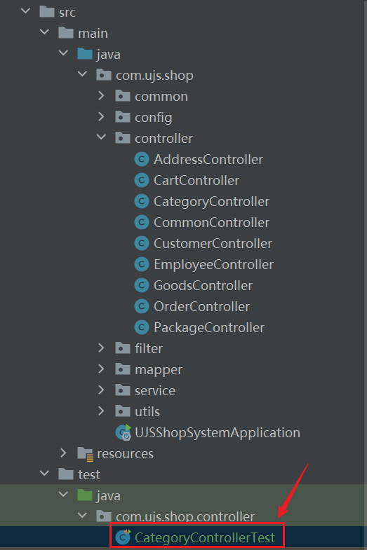
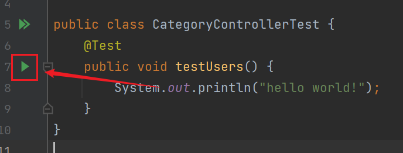
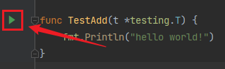

你还记得Java的单元测试怎么写吗？

在SpringBoot框架中，单元测试都是写在`src/test/java`目录下的。在这个目录中，通常会按照与`src/main/java`相似的包结构来组织测试代码。

这里的测试类不是随便写的，应该符合这种规范：对于每个需要进行单元测试的类，都可以在对应的测试包中创建一个相应的测试类，命名约定通常是在被测试的类名后加上`Test`或者`IT`（Integration Test）等后缀。

例如，如果有一个名为`CategoryController`的类，在`src/main/java/com/ujs/shop/controller`目录下，那么相应的单元测试类可以放在`src/test/java/com/ujs/shop/controller`目录下，命名为`CategoryControllerTest`。

具体结构是这样的：



测试方法编写，举个最简单的例子就是下面这种：

```java
package com.ujs.shop.controller;

import org.junit.jupiter.api.Test;

public class CategoryControllerTest {
    @Test
    public void testUsers() {
        System.out.println("hello world!");
    }
}
```

这样，点击下面这个绿色小箭头，就可以运行这个测试方法了。



那么，Go语言的测试方法是怎么写的呢？

不同于Java中，测试文件和被测试文件间隔十万八千里，Go语言的测试代码通常写在与被测试代码相同的包中，它的命名要求必须是以`_test`做结尾（与Java不同，这一点是**硬性要求**，如果不这么做，Go编译器不会把这个文件当做测试文件）。如果被测试文件命名为`math.go`，那么测试文件可以命名为`math_test.go`，这样命名可以让开发者一眼就可看出是对哪个文件进行的测试。


测试文件的背景颜色是浅绿色。

然后就是测试函数的编写，必须遵守以下约定：

1. 测试函数的函数名必须以`Test`开头，驼峰，不然Go编译器不认为它是测试函数。
2. 测试函数必须有且只能有一个参数，为`t *testing.T`，这是Go的内置参数。
3. 测试函数应满足约定，例如要测试的函数名字为`Add`，那么测试函数应命名为`TestAdd`。

例如下面的代码：

```go
import (
	"fmt"
	"testing"
)

func TestAdd(t *testing.T) {
	fmt.Println("hello world!")
}
```

同样地，点击下面这个绿色小箭头，就可以运行这个测试函数了。



我接下来讲一下这个`t *testing.T`对象，`*testing.T`是一个测试状态对象的指针，它包含了测试的状态和功能，可以用于报告测试失败、记录日志等操作。下面讲两个主要的方法。

Error和Errorf方法： 用于报告测试失败：

```go
t.Error("测试失败")
t.Errorf("测试失败：%s", err)
```

Log和Logf方法： 用于记录日志信息，不会导致测试失败。

```go
t.Log("这是一个日志信息")
t.Logf("这是一个格式化的日志信息：%s", msg)
```

其余的方法，需要使用的时候再进行查阅即可。

这里我记一个知识点，在Go语言中，每个文件夹下的所有文件都应该有一样的package值（第一行代码），这个值默认是和所在文件夹的名字一样的，但也可以改成不一样！