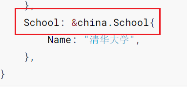

Go语言没有类的概念，自然也就没有继承这个概念。Go语言有结构体的概念，但不可以简单地把结构体类比于其他面向对象语言的类。

因为在其他面向对象语言（例如Java）中，只有类才能有方法，而Go语言不只是 struct 可以有方法，任何类型都可以有，甚至是基本类型（如int64）

下面就是一个自定义基本类型并给该类型添加方法的示例

```go
type MyInt int64

func (mi MyInt) Add(other MyInt) MyInt {
	return mi + other
}

func (mi MyInt) Print() {
	fmt.Printf("result = %d", mi)
}

func main() {
	num1 := MyInt(5)
	num2 := MyInt(10)
	result := num1.Add(num2)
	result.Print()
}
```

对于基本数据类型作为接收器，我们推荐使用值接收器的方式，因为我们不需要修改接收器的状态。

说回Go结构体嵌套，首先是最基础的嵌套方式，例如：

```go
type Address struct {
	City string
}

func (add *Address) Do() {
	fmt.Println("do something...")
}

type User struct {
	Name    string
	Address *Address
}

func main() {
	user := &User{
		Name:   "mundo",
		Address: &Address{
			City:     "杭州市",
		},
	}
	fmt.Printf("user1=%#v\n", user)
}
```

这其实只是一个结构体包含了以另一个结构体为数据类型的字段，在这种情况下，结构体`User`的对象，不可以使用结构体`Address`的`Do()`方法。

这种情况下，要想访问 user 对象中的 City 字段，只能使用全路径访问

```go
fmt.Println(user.Address.City)
fmt.Println(user.City)  // 访问不到
```

还有一种结构体嵌套方式，叫做嵌套匿名结构体

```go
type Address struct {
	City string
}

type School struct {
	Name string
}

func (add *Address) Do() {
	fmt.Println("Address do something...")
}

func (sch *School) Do() {
	fmt.Println("School do something...")
}

type User struct {
	Name string
	*Address
	*School
}

func main() {
	user := &User{
		Name: "mundo",
		Address: &Address{
			City: "杭州市",
		},
		School: &School{
			Name: "清华大学",
		},
	}
	fmt.Printf("user1=%#v\n", user)
}
```

这种方式，相当于User结构体继承了Address和School结构体的所有方法，但我们使用

```go
user.Do()
```

发现报错了，因为结构体 User 嵌套了 Address 和 School 两个结构体，而这两个结构体都定义了方法 Do()，导致 user 对象不知道自己要使用哪个结构体定义的方法。

这里两种方法，一是 User 结构体重写这个Do()方法，二是两个 Do() 方法改一个名字。建议使用第一种，不破坏原本两个结构体的定义。

使用匿名结构体嵌套，我们可以直接访问嵌套结构体中的字段，例如

```
fmt.Println(user.City)
```

我们发现，结构体User和结构体School有一个同名字段Name，所以我们应该这样访问这两个Name：

```go
fmt.Println(user.Name)  // User结构体的Name
fmt.Println(user.School.Name)  // School结构体的Name
```

上面还需要注意一点，我们创建user对象时，对于嵌套结构体的字段，不能直接给字段赋值，需要给外层的嵌套结构体初始化，再给里面字段赋值。如果这个嵌套结构体是其他包的，例如：

```go
type User struct {
	Name string
	*Address
	*china.School
}
```

我们在给这个user对象赋值时，是这么做的：

```go
user := &User{
	Name: "mundo",
	Address: &Address{
		City: "杭州市",
	},
	School: &china.School{
		Name: "清华大学",
	},
}
```

注意到这个地方：



第一个School为结构体名，后面赋值的时候才使用到了包名。

结构体不但可以嵌套结构体，同样也可以嵌套接口，但是这种嵌套方式并没有什么卵用，不建议使用。

接口也可以嵌套接口，这种写法是比较常用的，用于简便地创建一些复杂的接口，方便管理：

```go
type Writer interface {
	Write(data string)
}

type Closer interface {
	Writer
	Close()
}

type MyCloser struct{}

func (m MyCloser) Write(data string) {
	fmt.Println("Writing:", data)
}

func (m MyCloser) Close() {
	fmt.Println("Closing...")
}

func main() {
	var closer Closer = MyCloser{}
	closer.Write("Hello, Go!")
	closer.Close()
}
```

在这个例子中，`Closer` 接口嵌套了 `Writer` 接口，继承了`Writer`接口的所有方法。

这里需要注意的是，结构体`MyCloser`必须对接口`Closer`和接口`Writer`的所有方法进行实现，否则不认为它实现了`Closer`接口。