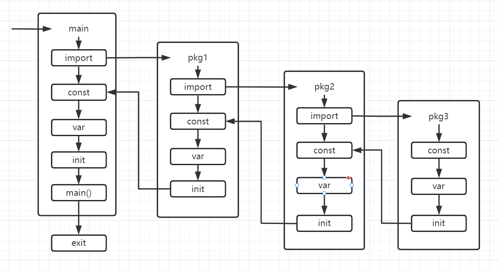

**1. 执行时机：**

   - init() 函数会在 main() 函数之前自动执行。
   - 每个包中的 init() 函数无需手动调用，它们自动执行。

**2. 调用顺序：**

   - 不同包中的 init() 函数的执行顺序是由包的依赖关系决定的，如下图顺序。
   - 如果在同一个文件内有多个 init() 函数，它们会按照出现在文件中的顺序依次执行。
   - 如果在同一个包的不同文件中分别有 init() 函数，它们会按照文件名的排序顺序执行。
   - 如果一个包被多个包导入，它的 init() 函数只会执行一次。

**3. 限制和注意事项：**

   - init() 函数不能被显式调用，它只能依赖包级别的变量。
   - 可以在 init() 函数中启动goroutines，不会影响初始化顺序。
   - 在一个源文件中可以包含多个 init() 函数，分组可以提高可读性。
   - 编写程序时不应该依赖 init() 函数的执行顺序。

下面这张图讲了常量、变量、init函数在代码中的调用顺序与关系：

 