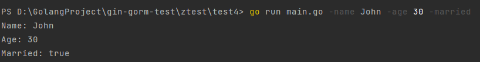
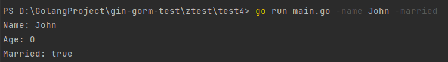
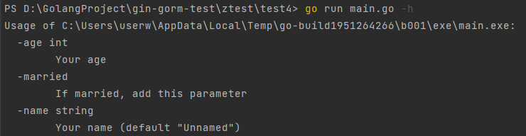

最近我接手了公司的一个Go的项目，开始熟悉代码，看到代码中大量用到了一个Go语言的标准库flag。

这里我简单讲一下这个标准库的使用。

`flag`是 Go 语言标准库中用于处理命令行参数的包。它提供了一种简单的方法来定义和解析命令行参数，以及将这些参数与变量关联起来。这个命令行参数指的是我们在执行`go build`生成的可执行文件后面跟着的参数，用来配置程序的行为，例如下面执行`main.exe`的过程：

```bash
go build main.go
./main.exe -name John -age 30 -married
```

或者也可以直接使用`go run`实现：

```bash
go run main.go -name John -age 30 -married
```

将名字设置为 "John"，年龄设置为 30，且标记为已婚。

那么我们在程序中如何读取到这些参数呢，就要用到flag包了，代码如下：

```go
package main

import (
	"flag"
	"fmt"
)

// 定义命令行参数
var (
	name string
	age int
	married bool
)

func init() {
	flag.StringVar(&name, "name", "Unnamed", "Your name")
	flag.IntVar(&age, "age", 0, "Your age")
	flag.BoolVar(&married, "married", false, "If married, add this parameter")
}

func main() {
	// 解析命令行参数
	flag.Parse()

	fmt.Printf("Name: %s\nAge: %d\nMarried: %t\n", name, age, married)
}
```

执行这个`main.go`文件时，带上对应的命令行参数



结果就被打印出来了。

如果我们有些参数不加，它就会设置为我们在代码中指定的默认值



接下来以`flag.StringVar`为例，讲一下它的几个参数：

```go
// StringVar defines a string flag with specified name, default value, and usage string.
// The argument p points to a string variable in which to store the value of the flag.
func StringVar(p *string, name string, value string, usage string)
```

- `p` 是指向目标字符串变量的指针。
- `name` 是命令行标志的名称。
- `value` 是字符串变量的默认值。
- `usage` 是描述标志用途的字符串。

最后这个usage有什么用呢？可以让我们在执行`go run`时，用`-h`参数获取帮助文档：



设置`int`类型默认值为`0`、`string`类型默认值为`""`，`bool`类型默认值为`false`，都相当于没有默认值。

`flag.Parse()` 是用于解析命令行参数的关键函数。在使用 `flag` 包定义了命令行标志之后，你需要调用 `flag.Parse()` 来解析实际的命令行参数，以便你的程序能够正确地获取用户提供的值。

如果不调用 `flag.Parse()`，标志变量将保持它们的默认值，而不会被实际的命令行参数所覆盖。