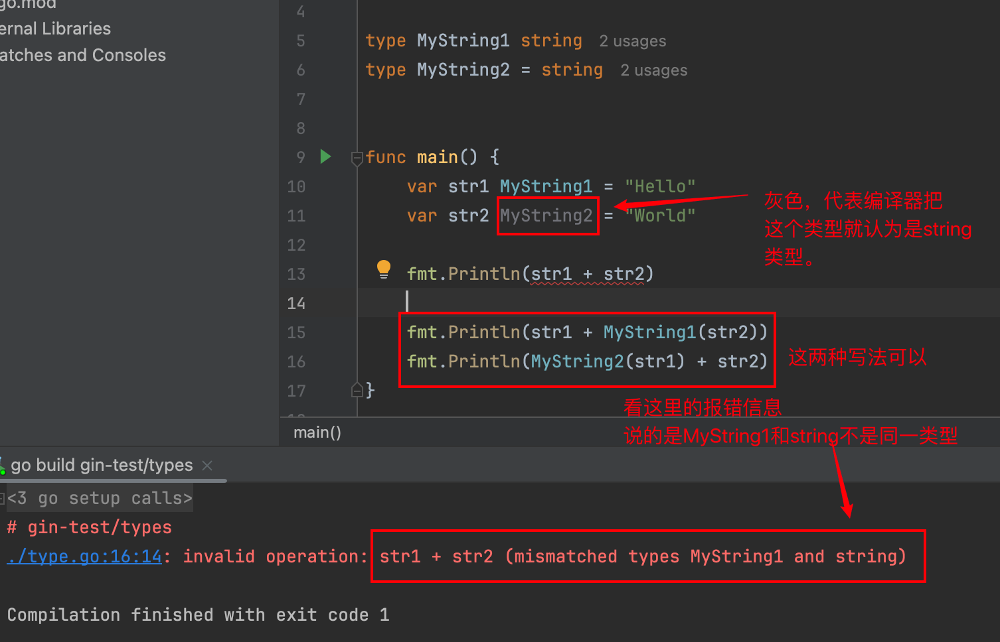

我们在阅读代码时，总会看到有这么两种写法：

```go
type MyString1 string
type MyString2 = string
```

这让我有些摸不到头脑，用等号连接和不用等号连接，区别在哪呢？各自的适用场景又是什么呢？

这两种类型当然不是一回事，让我分开来讲一下：

`type MyString1 string`是定义了一个新的类型`MyString1`，它的底层是`string`，这种方式创建了一个新类型，`MyString1`和`string`在类型系统上是不同的，尽管它们底层表示相同。

`type MyString2 = string`则创建了一个类型别名，`MyString2`和`string`在类型系统完全相同，是同一个类型的不同名称。这意味着你可以将`MyString2`当作`string`来使用，它们之间可以互相赋值，相互兼容。

简而言之，就是`MyString1`是一个和`string`等价的新类型，而`MyString2`就是`string`类型。



我们再看类型的方法：

```go
// MyString1是一个新类型，可以定义独有的方法
func (s *MyString1) Print() {
	fmt.Println("hello world!")
}

// 会发生编译错误：Invalid receiver type '*string' ('string' is a non-local type)
func (s *MyString2) Print() {
	fmt.Println("hello world!")
}
```

也就是说定义新类型，就可以定义这个类型的方法；而创建的类型别名不可以。