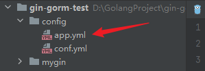

viper库是一个读取配置文件的库，它可以处理`json、yaml、properties`等配置文件，读取这些配置文件配置的信息。下面是viper库的具体使用方式。

安装viper库：

```bash
go get -u github.com/spf13/viper
```

首先我们先要对viper进行初始化，指定它需要读取的文件，读取后解析到viper实例中，方便后续使用。

例如我们想读取`config`目录下的配置文件`app.yml`，目录结构如下图：



这个配置文件的内容是这样：

```yaml
database:
  host: localhost
  port: 3306
  username: root
  password: password123
  dbname: mundo

features:
  enabled:
    - basketball
    - football

configurations:
  settings:
    key1: value1
    key2: value2
    key3: value3
```

首先我们读取这个配置文件，有以下这些方式。

直接指定配置文件的路径和名称，这里的路径是相对项目根目录的路径，开头没有斜杠

```go
viper.SetConfigFile("config/app.yml")
```

先指定配置文件的目录路径，也是相对项目根目录的路径，再指定配置文件名，这里需要注意，没有`.yml`后缀

```go
viper.AddConfigPath("config")
viper.SetConfigName("app")
```

如果在这个路径下有多个以`app`命名的文件，例如`app.json`、`app.properties`，它会按在这个目录下检索顺序来查找，由于首字母顺序把`app.json`排在最前面，所以它会获取`app.json`文件。

我尝试使用`viper.SetConfigType("yml")`指定它读取`app.yml`文件，但是并没有效果。

所以这里我们要求使用第一种方式去指定配置文件。

拿到配置文件后，我们使用下面的方式读取配置信息，并解析到viper实例中，后续就可以获取配置信息了。

```go
err := viper.ReadInConfig()
```

如果上面读取的配置文件不存在，这个方法会返回一个error。

上面的操作，可以放到一个初始化文件里，通过init函数去完成它。

准备工作做好后，就可以用viper对象来获取配置信息了，例如我们获取database的host和port：

```go
host := viper.GetString("database.host")
port := viper.GetInt("database.port")
```

如果使用错误的类型获取方法获取了类型，例如使用`viper.GetInt`获取host，它不会报错，而是获取到零值。

上面还有一个数组格式和map格式的数据，我们同样也可以通过viper获取它：

```go
slice := viper.GetStringSlice("features.enabled")
stringMap := viper.GetStringMap("configurations.settings")
```

也可以使用更通用的`viper.Get()`获取一个`interface{}`类型，然后自己进行类型转换。

还有更多的api，自己参考使用即可。

Viper 支持观察配置文件的变化，并在配置文件发生更改时触发回调函数：

```go
viper.WatchConfig()
viper.OnConfigChange(func(e fsnotify.Event) {
    fmt.Println("Config file changed:", e.Name)
})
```

这里`viper.WatchConfig()`并不会使程序阻塞，而是启动一个go程来监听，所以要保证主函数不被关闭。

viper也支持读取远程的配置文件（如Nacos），这部分内容用到的时候再整理。