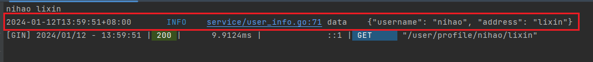

这是之前写的一个关于日志模块的小工具。

新建目录`wlog`，里面新建文件`log.go`

首先需要我们下载`zap`包：

```go
go get -u go.uber.org/zap
```

具体代码如下：

```go
package wlog

import (
	"fmt"
	"go.uber.org/zap"
	"go.uber.org/zap/zapcore"
)

const (
	LOG_LEVEL_INFO  = 1
	LOG_LEVEL_WARN  = 2
	LOG_LEVEL_ERROR = 3
)

var logger *zap.Logger

func Info(message string, fields ...zap.Field) {
	doLog(LOG_LEVEL_INFO, message, fields...)
}

func Warn(message string, fields ...zap.Field) {
	doLog(LOG_LEVEL_WARN, message, fields...)
}

func Error(message string, fields ...zap.Field) {
	doLog(LOG_LEVEL_ERROR, message, fields...)
}

func Infof(msg string, args ...any) {
	message := fmt.Sprintf(msg, args...)
	Info(message)
}

func Warnf(msg string, args ...any) {
	message := fmt.Sprintf(msg, args...)
	Warnf(message)
}

func Errorf(msg string, args ...any) {
	message := fmt.Sprintf(msg, args...)
	Error(message)
}

func InfofWithFields(fields []zap.Field, msg string, args ...interface{}) {
	message := fmt.Sprintf(msg, args...)
	Info(message, fields...)
}

func WarnfWithFields(fields []zap.Field, msg string, args ...interface{}) {
	message := fmt.Sprintf(msg, args...)
	Warn(message, fields...)
}

func ErrorfWithFields(fields []zap.Field, msg string, args ...interface{}) {
	message := fmt.Sprintf(msg, args...)
	Error(message, fields...)
}

func doLog(level int, message string, fields ...zap.Field) {
	switch level {
	case LOG_LEVEL_INFO:
		logger.Info(message, fields...)
	case LOG_LEVEL_WARN:
		logger.Warn(message, fields...)
	case LOG_LEVEL_ERROR:
		logger.Error(message, fields...)
	}
}

func init() {
	initLogger()
}

func initLogger() {
	config := zap.NewDevelopmentConfig()
	// 设置日志更多信息，让日志更加直观
	config.EncoderConfig.EncodeLevel = zapcore.CapitalColorLevelEncoder
	config.EncoderConfig.EncodeTime = zapcore.RFC3339TimeEncoder
	config.EncoderConfig.EncodeCaller = zapcore.ShortCallerEncoder
	config.DisableStacktrace = true
	logger, _ = config.Build()
	// 显示跳过两级调用后的调用处代码行数
	logger = logger.WithOptions(zap.AddCallerSkip(2))
	defer logger.Sync()
}
```

如何使用？先在要使用的模块导入这个logs包，然后例如这样：

```go
wlog.Info("data", zap.String("username", username), zap.String("address", address))
```

打印在控制台的结果就像这样：



点一下蓝色下划线的部分，可以直接跳转到代码中打印这条日志的地方。

也有些地方，不会有这个蓝色下划线，不是很方便，也可以复制这个代码位置信息全文查找。

20240305我又加了6个方法，支持字符串的格式化。

调用示例：

```go
wlog.ErrorfWithFields([]zap.Field{zap.Error(err)}, "io.ReadAll error, id: %s", id)
```

或者也可以把`[]zap.Field`部分单独写出来：

```go
fields := []zap.Field{
	zap.Error(err),
	zap.String("id", id),
}
wlog.ErrorfWithFields(fields, "queryVmDetail call io.ReadAll error, id: %s", id)
```

这个日志工具还有大量优化空间，我最近要参考下其他的写法，把日志工具完善一下。