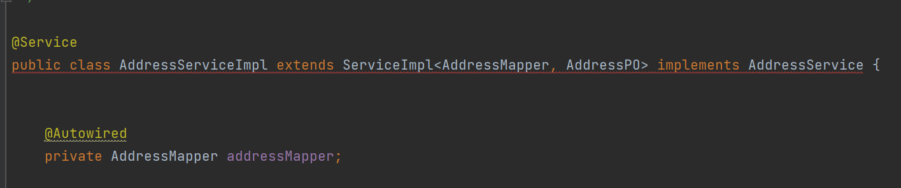
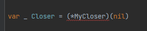
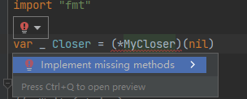

首先我们都明确的一件事情是：Go语言的接口是隐式实现的，它并不是像Java那样通过`implements`关键字把接口和类强绑定在一起，如果类没有实现接口的全部方法，会有编译错误。



例如这样，它会有一条红线。

但是在Go语言中，就没有这样的机制。Go语言只是默认了一条规则：如果一个结构体的方法集包含了接口中定义的所有方法，那么该结构体被视为实现了该接口。

也就是说如果结构体没有实现接口的某条方法，也仅仅是被认为没有实现该接口，并没有任何编译上的报错，程序也可以正常启动。但如果我们想在编译时就检测结构体有没有实现接口，可以通过下面这条命令：

```go
var _ InterfaceType = (*ConcreteType)(nil)
```

其中`InterfaceType`是接口类型，`ConcreteType`是具体实现类型，也就是结构体类型。这种语句的目的是确保 `ConcreteType` 类型实现了 `InterfaceType` 接口。这样的语句通常放在代码的开头或者包的初始化部分，用于在编译时检查接口的正确实现。如果有错误，编译器会报错。如果一切正常，这行代码在运行时不会有任何影响。

`(*ConcreteType)(nil)` 创建了一个 `ConcreteType` 类型的空指针，这个`_`表示我们不关心创建的变量的值，使用空白标识符来避免编译器报错。

这样，如果结构体没有实现接口的全部方法，这句代码会有编译错误，例如在下面的代码中：

```go
var _ Closer = (*MyCloser)(nil)

type Closer interface {
	Write(string)
	Close()
}

type MyCloser struct{}

func (m MyCloser) Write(data string) {
	fmt.Println("Writing:", data)
}
```

结构体`MyCloser`没有实现方法`Close`，所以那句代码会爆红：



我们可以把光标定位到爆红的位置上，快捷键`Alt+Insert`（Windows）来快速实现这个方法，或者按照下图方式点击，然后点击：实现缺失的方法



这样就可以避免结构体有漏实现接口的方法了。

这种方式，如果在接口中新增了一个方法，就可以直接快速生成这个方法的实现结构，完成具体逻辑的实现了。