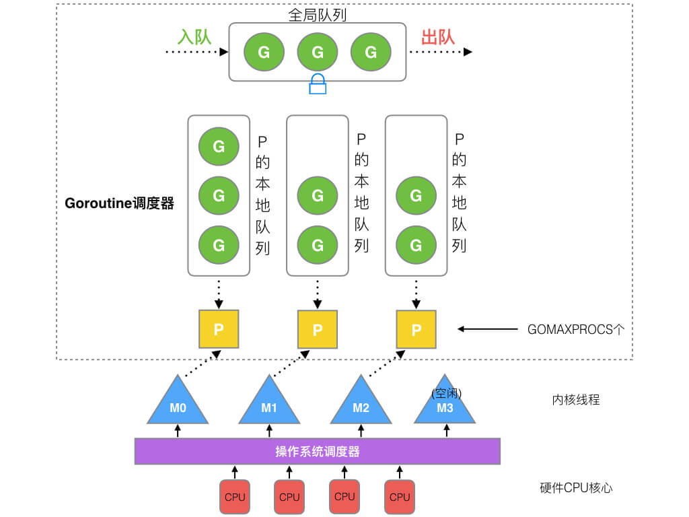

Go语言的GMP模型是指G（协程）、M（机器线程）和P（调度上下文）的组合。这个模型是Go语言并发编程的核心，它负责协程的调度和执行。

**G（Goroutine，协程）**，是Go语言中并发的执行单位，可以看做轻量级线程。Goroutine相较于传统线程，创建和销毁的开销较小。Go应用程序通常同时运行着成千上万个Goroutine，每个Goroutine都是一个独立的执行单元。

**M（Machine，机器线程）**，是Go语言中的机器线程，是操作系统线程和Goroutine之间的中介。每一个M都与一个操作系统线程关联，M负责将Goruntine映射到操作系统线程上。 M的数量是由Go运行时调度器（Scheduler）动态管理的，它会根据负载自动增减M的数量，以保证最优的并发性能。

**P（Processor， 处理器）**，是Go语言中的调度上下文。由GOMAXPROCS环境变量设置，决定了可以并行执行的Goroutines的数量。P的作用是持有Goroutine队列和调度器状态，控制着Goroutine的在M上的执行。新建 G 时，G 优先加入到 P 的本地队列，如果队列满了，则会把本地队列中一半的 G 移动到全局队列。如果P的某一本地队列为空，则会从全局队列或者其他P队列中窃取可运行的G进行运行，减少空转，提高了资源利用率，这一过程使用到了Work Stealing（工作量窃取）算法。

P和M之间的关系是一种动态的、灵活的映射关系，可以根据系统的负载情况进行调整，并不是完全一一对应的。

通过这种GMP模型，Go语言实现了高效的并发和并行执行，使得开发者能够更轻松地编写并发安全的代码。这个模型的设计让Goroutines在大量并发任务中高效执行，同时充分利用多核处理器的优势。

进程、线程、协程的区别是什么？

**进程**：是程序执行的一个实例，它是操作系统分配资源的基本单位，相互独立，拥有独立的内存空间，通过进程间通信（IPC）来进行数据交换。进程创建和销毁进程的开销相对较大，因为需要分配和释放大量资源。

**线程**：线程是进程的一个执行流，一个进程可以包含多个线程，它们共享进程的资源，因此可以更高效地进行通信。线程的创建和销毁开销相对较小。一个进程中多个线程可以并发执行，提高程序的运行效率。

**协程**：协程是一种轻量级的线程，它由程序员控制，不受操作系统调度，在执行过程中可以根据代码逻辑被中断，暂停，恢复，并可根据需要手动调度。它通常用于异步编程，以提高程序的执行效率。协程的创建和切换开销比线程更小，因为它不涉及操作系统级别的资源分配。

GMP模型为什么要有P？

上面我们提到过，P的作用就是通过本地队列和全局队列，决定可以并行执行的Goroutines的数量。那就引起了一个思考，为什么我们不直接在M上面加这个本地队列组件呢？

通常情况下，M的数量都会多于P。在Go语言中，M的最大数量默认是10000，而P的默认最大数量是CPU核数。这样的设计允许更灵活地适应系统负载，并充分利用多核处理器的优势。

如果将P的功能整合到M上，本地队列会随着M的增加而增加。这会导致本地队列的管理变得复杂，并降低Work Stealing的性能，因为本地队列的增加可能导致调度的不均衡。

当M被系统调用阻塞时，期望的是将其尚未执行的任务分配给其他继续运行的M，而不是全部停止。P的存在使得调度器能够更好地管理阻塞情况，将未完成的任务分配给其他可用的P，提高系统的健壮性和性能。