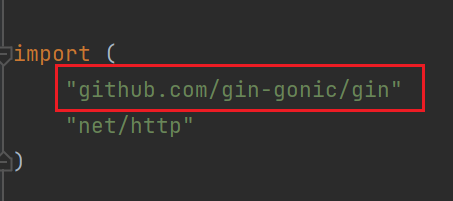

Gin框架非常好下载，它的GitHub路径是：github.com/gin-gonic/gin

使用 go get 命令下载

```bash
go get github.com/gin-gonic/gin
```

然后在主方法里创建Gin接口

```go
func main() {
	r := gin.Default()

	r.GET("/hello", func(c *gin.Context) {
		c.JSON(http.StatusOK, gin.H{
			"message": "hello world!",
		})
	})

	r.Run()
}
```



这一条正常导入，表示下载成功。