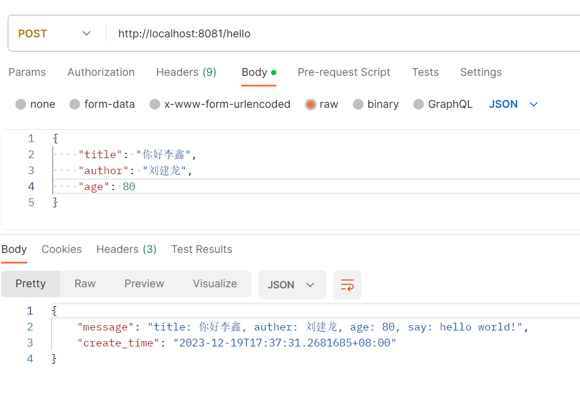

对于SpringBoot项目，我们可以定义VO、DTO这种类来定义请求参数、返回参数的数据结构，但是对于Gin框架，这些结构没有很明确的定义出来，也需要我们去定义结构体。

我们新建一个包structs，所有的结构体定义都放在这里面。

新建一个文件hello.go，定义一下hello接口的入参和出参结构，我们先把接口类型改为POST

```
r.POST("/hello", service.HelloService)
```

```go
type BookRequest struct {
	Title  string `json:"title"`
	Author string `json:"author"`
	Age    int    `json:"age"`
}

type BookResponse struct {
	Message    string    `json:"message"`
	CreateTime time.Time `json:"create_time"`
}
```

这里要注意，**json标签是必须加的**，不然无法以json格式传参。

接口的具体实现函数`HelloService`这样去写。

```
func HelloService(c *gin.Context) {
	req := &structs.BookRequest{}
	err := c.ShouldBindJSON(req)
	if err != nil {
		log.Fatalf("error: %s", err.Error())
	}
	message := fmt.Sprintf("title: %s, auther: %s, age: %d, say: hello world!", req.Title, req.Author, req.Age)
	createTime := time.Now()
	resp := &structs.BookResponse{
		Message: message,
		CreateTime: createTime,
	}
	c.JSON(200, resp)
}
```

这里的`c.ShouldBindJSON`就是把请求传参的json绑定到指定的结构体对象req上。

使用postman调用接口，成功！



