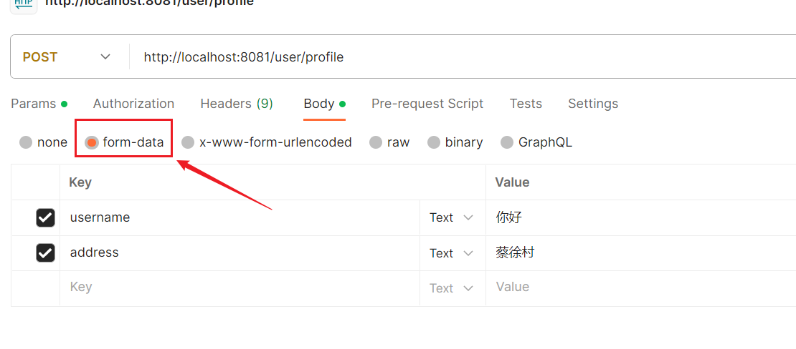
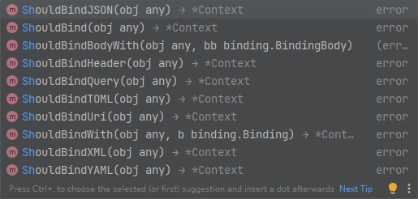

Gin框架获取参数都是通过函数的参数`c *gin.Context`的方法，进行显式获取。

### 获取Query String的参数

Query String的参数指GET请求的URL中 ? 后面携带的参数，例如：

```
/user/profile?user_id=12345&username=johndoe&status=active
```

在Gin框架中，接口的实现函数如何获取Query String的参数呢？有以下几种方法：

1. 最基本的获取参数方法就是：

```go
userId := c.Query("user_id")
```

2. 获取指定键的Query String的参数，如果参数不存在，返回默认值：

```go
userId := c.DefaultQuery("user_id", "default_user_id")
```

3. 获取指定键的查询字符串参数，返回一个`[]string`

例如请求格式是这样：

```
/user/profile?lang=go&lang=java&lang=python
```

这里lang参数被传递了多次，这样的传参，就用下面这个方法获取：

```go
langs := c.QueryArray("lang")
```

4. 获取指定键的查询字符串参数，返回一个`map[string]string`

例如请求格式是这样：

```
/user/profile?lang=go:goland&lang=java:idea&lang=python:pycharm
```

获取其参数的方法就是这样：

```go
langDicts := c.QueryMap("lang")
```

### 获取表单参数

表单参数通常用于POST请求中，请求以表单的格式放到请求体，获取请求数据的方式，就是这样



这种情况要使用下面的命令获取参数：

```go
username := c.PostForm("username")
```

同样，使用`c.DefaultPostForm("username", "default_username")`也可以对参数不存在情况赋默认值，使用`c.PostFormArray("username")`和`c.PostFormMap("username")`同理达到类似效果。

使用另一种方法也可以获取表单参数：`c.Request.FormValue`

它可以处理GET请求或者POST请求，读取URL中的查询参数或者请求体中的表单参数。如果使用POST请求，在URL查询参数或者请求体表单参数有同名的参数，它会优先读取URL的查询参数的值。

### 获取Path参数

这种情况要求我们的请求路径是这样的，参数名前面有个冒号：

```
/user/search/:username/:address
```

然后我们这么传参：

```
/user/profile/zhangsan/xinhua
```

在代码中这样获取参数值：

```go
username := c.Param("username")
address := c.Param("address")
```

`c.Query()`、`c.PostForm()`、`c.Param()`获取到的都是字符串`string`类型

### 使用 c.ShouldBind() 系列

这一系列方法有很多，可以灵活地把请求参数绑定在我们定义的结构体上，可以处理不同类型的请求。



需要注意的一点是，用哪种请求方式，都需要给结构体加上对应的标签，例如使用JSON请求，就加`json`标签，使用表单请求，就加`form`标签等。

这里定义的结构体可以是任意类型，不像上面的一样局限于`string`了。

这里我们注意，使用`c.ShouldBind`接收请求，Gin会根据请求的 Content-Type 自动选择适当的绑定方式。如果是 JSON，则会使用 JSON 绑定，如果是表单数据，则会使用表单绑定，等等。但是结构体上一定要有对应的标签。

这一部分内容在后面的实战章节里有明确讲解，举一反三即可。