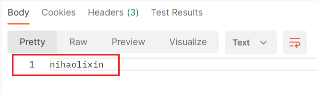

接口处理完请求了，想把响应结果返回给前端，该如何操作呢？

Gin框架的处理方式是调用函数的参数`c *gin.Context`的方法，往里写入响应数据，然后再显式调用`return`。

如果没有需要返回的数据或者message，可以直接写入一个状态码，例如：

```go
c.Status(http.StatusOK)
```

如果不设置状态码，直接return，Gin框架默认就会写入状态码200。这里建议手动写状态码。

还有一个写入状态的方法，`c.AbortWithStatus`，它相对于`c.Status`的不同之处是它会中断请求处理流程，即停止执行后续的中间件和处理函数，直接返回响应给客户端。

使用`c.AbortWithStatus`，就不需要再显式调用`return`了，后续的中间件逻辑不会执行。这和：

```go
c.Status(http.StatusOK)
return
```

逻辑是一样的，但是`return`语句要紧跟在`c.Status`语句之后才行。

最常用的返回方式就是下面这种了：

```go
c.JSON(http.StatusOK, gin.H{"message": "success", "data": yourData})
```

返回的格式是这样的（示例）：

```json
{
    "data": {
        "Username": "nihao",
        "Address": "lixin"
    },
    "message": "success"
}
```

使用这种方法，需要传入状态码，以及具体想返回的数据。

其中`gin.H`是这样的定义：`type H map[string]any`

如果只想返回普通文本，也可以使用下面这种方式：

```go
c.String(http.StatusOK, "Hello, Gin!")
```

返回的格式就是这样的：



除了以上的两种外，还有`c.XML`，传参结构和`c.JSON`一样，只是返回的格式不一样。

```
c.XML(http.StatusOK, gin.H{"message": "success", "data": yourData})
```

返回格式示例：

```xml
<map>
    <data>
        <Username>nihao</Username>
        <Address>lixin</Address>
    </data>
    <message>success</message>
</map>
```

还有更多方法，这里不再赘述，用到的时候查一下即可。

上面使用`c.JSON`时，发现一个问题，就是它把message放到了data下面，这是因为`gin.H`是一个map，它按照key的哈希顺序排列。我现在想让它返回更标准的结构，也方便我们写返回内容，该怎么做？

我们可以预定义一个返回结构的结构体：

```go
type Response struct {
	Message string      `json:"message"`
	Data    interface{} `json:"data"`
}
```

然后用这个结构体代替`gin.H`的内容。

```go
user := &User{
	Username: username,
	Address:  address,
}
response := resp.Response{
	Message: "success",
	Data:    user,
}
c.JSON(http.StatusOK, response)
```

或者我写了一份更加完善的小工具，放到了Go语法这一目录下，可以自行前去查看。