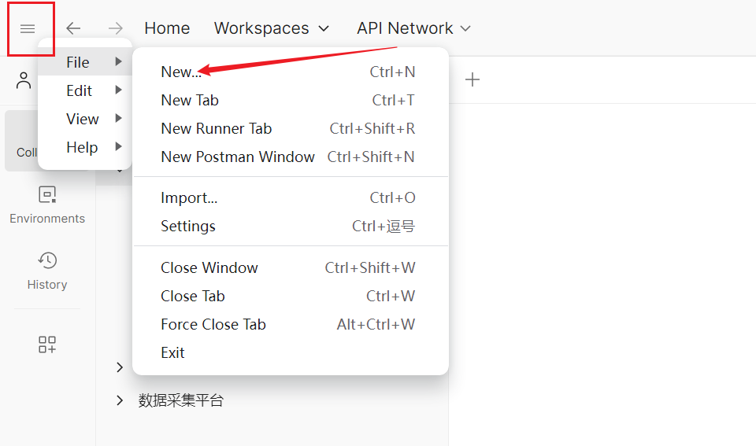
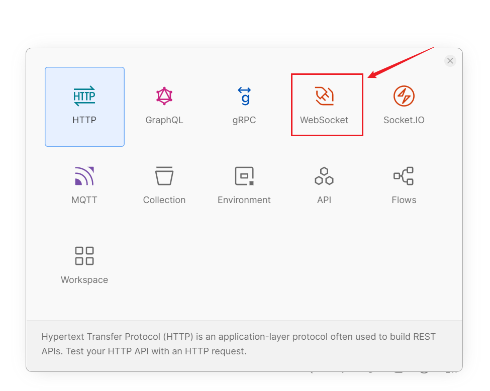
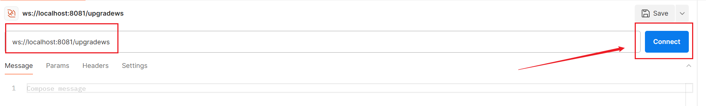
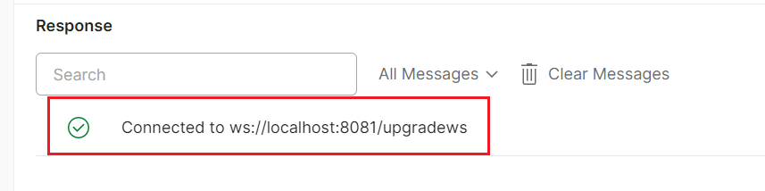
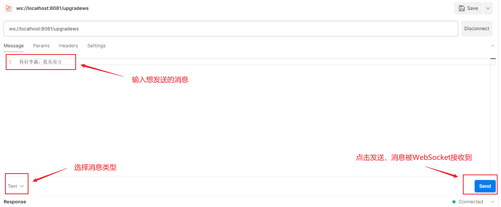
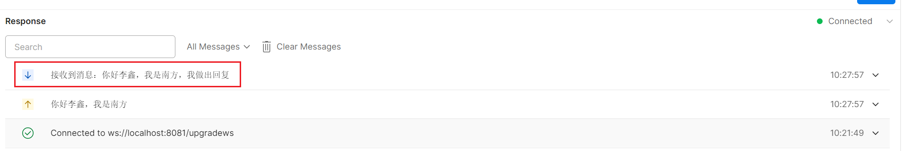

上一节我们讲了WebSocket的概念，与HTTP的区别，以及使用场景等。

这一节我们着重讲一下我们是如何把HTTP协议升级为WebSocket协议的，以及如何使用建立的WebSocket

首先我们需要引入WebSocket的包：

```bash
go get -u github.com/gorilla/websocket
```

我们定义一个全局变量`upgrader`，它是是一个 WebSocket 协议的升级器，负责将普通的 HTTP 连接升级为 WebSocket 连接。

```go
var upgrader = websocket.Upgrader {
	CheckOrigin: func(r *http.Request) bool {
		return true
	},
}
```

这里的`CheckOrigin`方法用于检查请求的来源，确保只有来自可信任的源才会进行升级，这是防范跨站请求伪造（CSRF）攻击的一种手段。我们这里直接`return true`，表示接受任何来源的WebSocket连接。

然后我们调用`upgrader.Upgrade()`方法进行协议升级，它的方法签名是这样的：

```go
func (u *Upgrader) Upgrade(w http.ResponseWriter, r *http.Request, responseHeader http.Header) (*Conn, error)
```

1. `http.ResponseWriter`：用于写入HTTP响应的接口，在WebSocket升级成功后，通过这个接口向客户端发送升级成功的响应。在Gin框架中，`c.Writer`即为这个参数的值。
2. `*http.Request`：包含了 HTTP 请求信息的结构体，包括请求的头部、URL、方法等信息。这个参数获取的信息，用于检验协议升级的条件，如检查来源是否合法。在Gin框架中，`c.Request`即为此参数的值。
3. `http.Header`：用于存储 HTTP 头部信息的映射，这个参数可以设置升级时的响应头部信息，包括协议协商、握手等。这里我们可以传一个`nil`进去，代表使用默认的头部设置。
4. `*Conn`：它的全称是`*websocket.Conn`，代表升级的WebSocket连接，它提供了对WebSocket通信的底层访问，允许进行消息的读取和写入。

所以，升级部分的代码就是这样的：

```go
func UpgradeWs(c *gin.Context) {
	conn, err := upgrader.Upgrade(c.Writer, c.Request, nil)
	if err != nil {
		c.AbortWithStatus(http.StatusInternalServerError)
	}
}
```

得到conn后，我们应该创建一个方法，去读取这个管道里的消息，处理消息并回复。：

```go
func handleWebSocket(conn *websocket.Conn) {
	defer conn.Close()

	for {
		// 从 WebSocket 读取消息（客户端发送到WebSocket的消息）
		messageType, p, err := conn.ReadMessage()
		if err != nil {
			return
		}

		receivedMessage := string(p)
		replyMessage := fmt.Sprintf("接收到消息：%s，我做出回复", receivedMessage)

		// 回复消息给客户端
		if err := conn.WriteMessage(messageType, []byte(replyMessage)); err != nil {
			return
		}
	}
}
```

这里面出现了两个方法，`conn.ReadMessage`和`conn.WriteMessage`，它们的方法签名如下：

```go
func (c *Conn) ReadMessage() (messageType int, p []byte, err error)
```

返回参数`messageType`为消息类型，`websocket.TextMessage`（1）代表文本消息，`websocket.BinaryMessage`（2）代表二进制消息。`p`是消息内容，是字节数组的形式。

`conn.ReadMessage`是阻塞的，如果没有可读取的消息，它会阻塞程序的执行，等待直到有消息到达为止。

```go
func (c *Conn) WriteMessage(messageType int, data []byte) error
```

和上面的一样，`messageType`为消息类型，`data`是消息内容，是字节数组的形式。

在上面的`UpgradeWs`函数里，使用一个go程开启`handleWebSocket`函数：

```go
func UpgradeWs(c *gin.Context) {
	conn, err := upgrader.Upgrade(c.Writer, c.Request, nil)
	if err != nil {
		c.AbortWithStatus(http.StatusInternalServerError)
	}
	
	go handleWebSocket(conn)
}
```

这样，一个WebSocket连接就建立好了。

然后我们使用Postman对这个接口进行测试，首先我们要知道如何访问WebSocket的接口。

例如使用HTTP访问上面这个接口，请求URL是这样的（使用GET方式）：

```
http://localhost:8081/upgradews
```

使用WebSocket访问这个接口，只需要把`http`改为`ws`即可，就像这样：

```
ws://localhost:8081/upgradews
```

进入Postman，按照下图顺序，新建一个请求：



也可以直接使用快捷键`Ctrl + N`

出现这样的页面，选择WebSocket即可：



在网址栏输入对应的请求URL，点击Connect



出现以下内容，代表连接成功：



这个连接一但建立，除非手动关闭，否则它是持久连接的。



这里发送信息后，就会被这个WebSocket连接的`ReadMessage`方法读取到。

然后我们就收到了来自服务端对我们的回复：



这里我们可以打开多个窗口，在这个接口建立多个WebSocket连接，它们之间是相互独立且隔离的，因为每个对接口的请求的`w http.ResponseWriter, r *http.Request`这两个参数都是不同的。