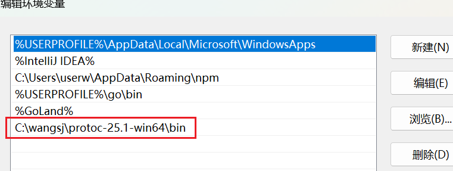
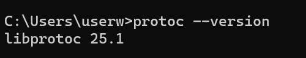
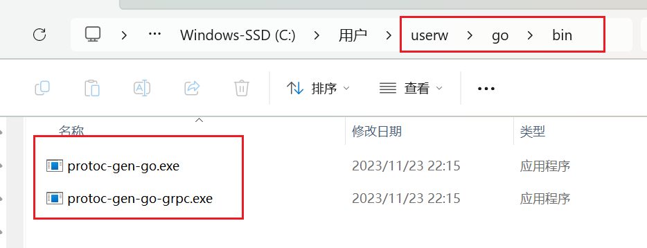
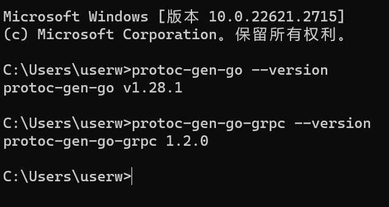
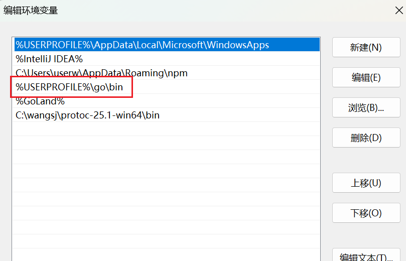

首先找到这个网站：https://github.com/protocolbuffers/protobuf/releases

然后下载你想要的版本，注意要对应本机的型号（win32、win64、Linux、Mac等）

下载后解压，放在想放置的目录，我这里放置在了`C:\wangsj\protoc-25.1-win64`，然后配置环境变量。

对于win11系统来说，要把bin目录下protoc.exe文件所在的目录放到用户环境变量Path里：



放这里，ok了，然后去终端测试一下：



成功！

然后我们需要安装protoc-gen-go和protoc-gen-go-grpc：

使用如下命令（这里版本先用这个，不用变）：

```shell
go get google.golang.org/protobuf/cmd/protoc-gen-go@v1.28
go get google.golang.org/grpc/cmd/protoc-gen-go-grpc@v1.2

go install google.golang.org/protobuf/cmd/protoc-gen-go@v1.28
go install google.golang.org/grpc/cmd/protoc-gen-go-grpc@v1.2
```

在这之前，先使用 go env 看看GOOS是否=windows，否则不会有exe文件。

执行后可以在GOPATH路径下的bin目录看到这两个exe文件：



执行后，查看它们是否安装成功：



成功了。



这一条就是GOPATH的bin的路径环境变量。