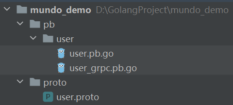

第一个文件安装了 protoc.exe 和 protoc-gen-go.exe 这两个可执行文件

讲一下这两个可执行文件分别都是干什么的。

我们一般都是在项目中去写一个proto文件，包括message和service，写完这个proto文件后，就要使用protoc.exe把proto文件的消息和服务的定义，转换成特定编程语言的代码。

那么，怎么指定这个特定的编程语言呢？就要使用 protoc-gen-go.exe 了，通过它，最终就能生成可用的Go语言代码了。

整个过程中，首先运行 `protoc.exe`，将 `.proto` 文件编译成一个中间表示，然后再运行 `protoc-gen-go.exe`，将这个中间表示转化为最终的 Go 语言代码文件。

假如这个proto的名字叫做 user.proto，是一个简单的proto文件：

```protobuf
syntax = "proto3";

package proto;

option go_package = "../pb/user";

message User {
  int32 id = 1;
  string username = 2;
  string email = 3;
}

service UserService {
  rpc GetUsers (GetUsersRequest) returns (GetUsersResponse);
}

message GetUsersRequest {
  int32 user_id = 1;
}

message GetUsersResponse {
  User user = 1;
}
```

我们先在终端切换到proto文件所在的目录，然后使用以下命令：

```shell
protoc --go_out=. --go-grpc_out=. user.proto
```

--go_out 参数负责生成pb.go文件，--go-grpc_out 参数负责生成grpc.pb.go文件。

在这里，它们都被指定为当前目录。

执行这个命令后，我们就可以看到有 pb.go 和 grpc.pb.go文件输出出来了，这里指定的层级关系是这样的：



这里，`user_grpc.pb.go`文件里的内容可能会爆红，如果爆红，使用`go mod tidy`进行处理。