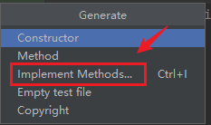
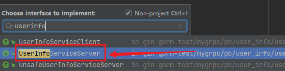
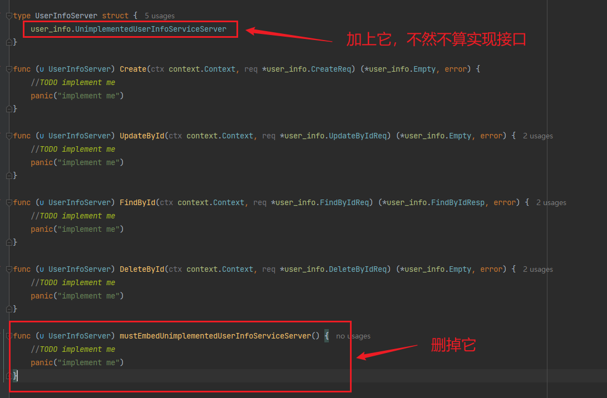

还是以这个简单的proto为例：

```protobuf
syntax = "proto3";

package proto;

option go_package = "../pb/user";

message User {
  int32 id = 1;
  string username = 2;
  string email = 3;
}

service UserService {
  rpc GetUsers (GetUsersRequest) returns (GetUsersResponse);
}

message GetUsersRequest {
  int32 user_id = 1;
}

message GetUsersResponse {
  User user = 1;
}
```

怎么去写它的server呢？代码和注释都写在下面：

```go
package main

import (
	"context"
	"fmt"
	"google.golang.org/grpc"
	"mundo_demo/pb/user"
	"net"
)

// UserServer 是实现了 grpc.pb.go 中 UserServiceServer 接口的结构体。
// 这里嵌入了 UnimplementedUserServiceServer
// 让 UserServer 不必要实现所有方法，就相当于实现了 UserServiceServer 接口
type UserServer struct {
	user.UnimplementedUserServiceServer
}

// GetUsers 是 UserServiceServer 接口中定义的方法的具体实现。
func (u *UserServer) GetUsers(ctx context.Context, req *user.GetUsersRequest) (*user.GetUsersResponse, error) {
	// 在这里处理获取用户的逻辑，这里简单返回一个示例用户
	response := &user.GetUsersResponse{
		User: &user.User{
			Id:       req.UserId,
			Username: "mundo",
			Email:    "mundo@example.com",
		},
	}
	return response, nil
}

func main() {
	// 监听在指定端口上
	listen, err := net.Listen("tcp", ":50051")
	if err != nil {
		fmt.Printf("Failed to listen: %v", err)
	}

	// 创建 gRPC 服务器
	server := grpc.NewServer()

	// 注册 UserServer 结构体为 gRPC 服务的实现
	user.RegisterUserServiceServer(server, &UserServer{})

	fmt.Println("gRPC server is running on port 50051")

	// 启动 gRPC 服务器，代码在这里阻塞
	if err := server.Serve(listen); err != nil {
		fmt.Printf("Failed to serve: %v", err)
	}
}
```

在我这个版本的grpc中，在`UserServer`里必须嵌入`UnimplementedUserServiceServer`结构体，否则就算`UserServer`实现了接口`UserServiceServer`的所有方法，也不算实现了接口。

`UnimplementedUserServiceServer` 结构体是 gRPC 编译器生成的一个空实现，它包含了接口 `UserServiceServer` 的所有方法，但这些方法都只是简单地返回错误，表明它们尚未被具体实现。

这是在保证什么？

为了确保在将来的 gRPC 版本中，即使服务接口有新增的方法，你的服务实现依然是“前向兼容”的。也就是说服务再有新增的方法，你也不用在这里对这些方法进行实现了。

这里有个快捷的方式可以实现上面结构体的所有方法，首先，先不嵌入`UnimplementedUserServiceServer`（**这一步很重要**，不然我们找不到`UserInfoServiceServer`），然后光标放到结构体上面，按`alt+insert`（Windows），选择下面一项：



然后输入你想实现的接口，就可以选择并实现了，这里因为是**后补充**的，我们以`UserInfoServer`结构体为例。注意，这个地方与上方代码内容不完全相同了。



按照下面步骤操作即可：



这样，我们就快捷地实现了接口的所有方法。