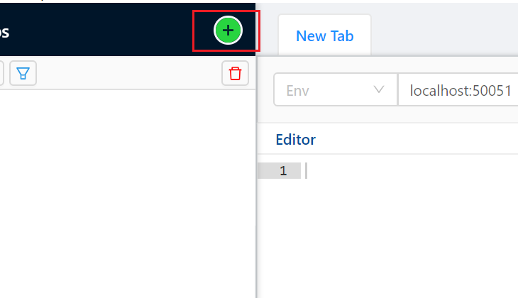
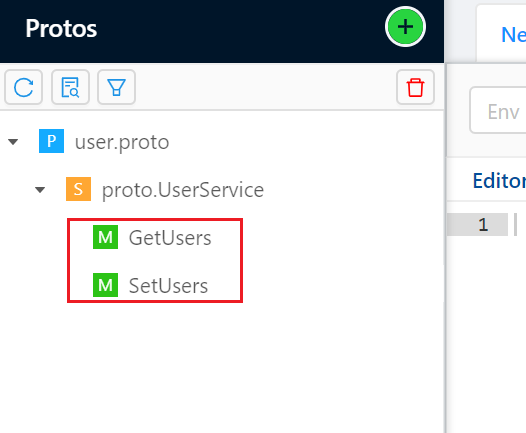
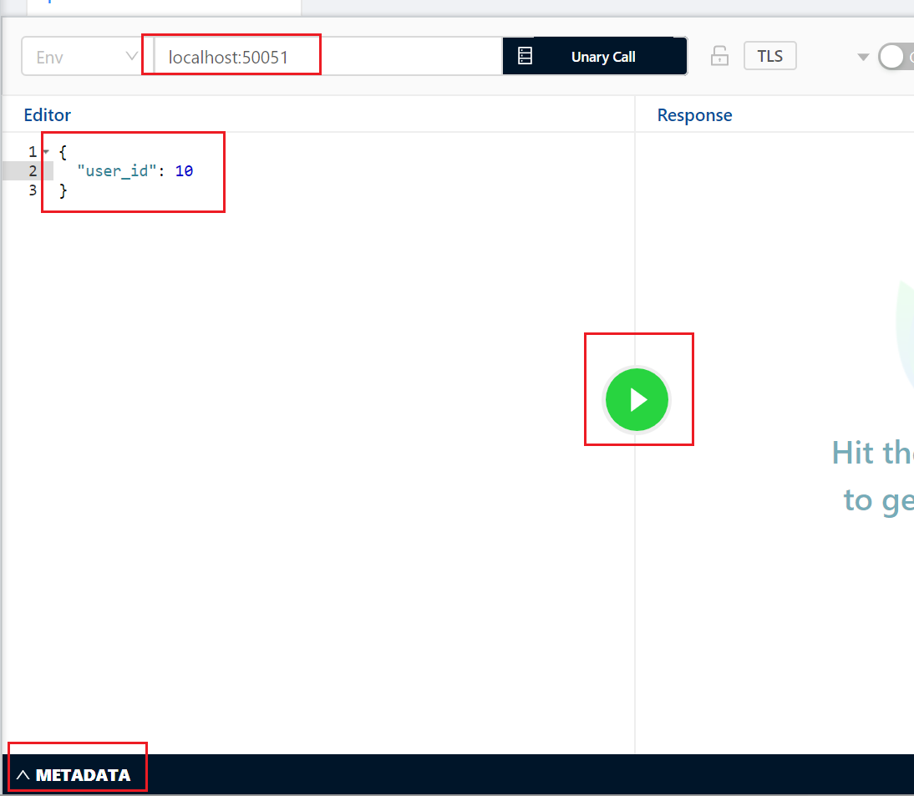
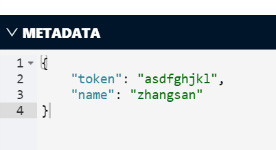
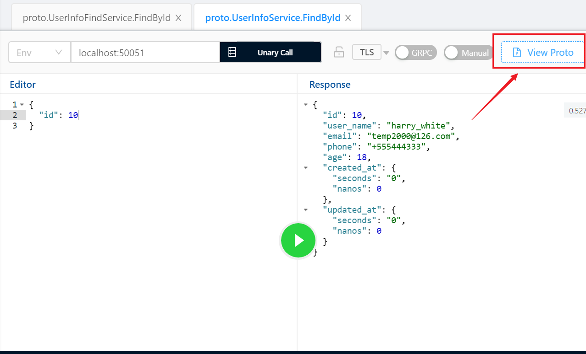
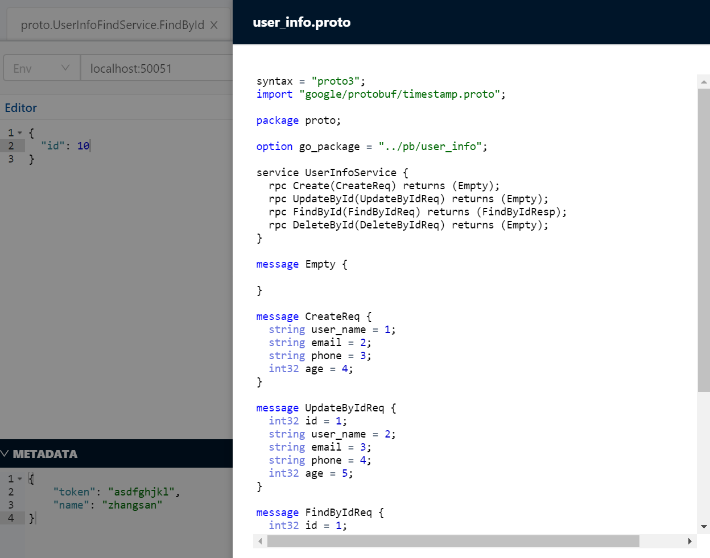

除了使用client，我们也可以使用一个好用的grpc调用工具：BloomRPC，完成grpc接口调用。

首先点击这个加号，把proto文件引入进来：

引入后就可以看到对应的方法了，点击方法：

这里我们写入对应的ip和端口，定义好参数，如果有metadata，需要写出。

metadata的格式是JSON字符串格式，例如这样：

然后按绿色按钮，即可完成接口调用。

点击`View Proto`，还可以查看这个proto文件的内容：

查看到了：

这个软件非常简单易用，界面没有Postman好看，但不限制功能，不像Postman一样需要付费解锁。